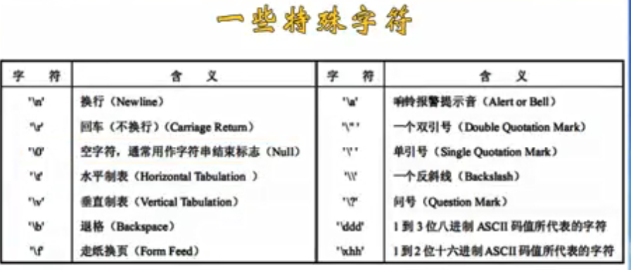
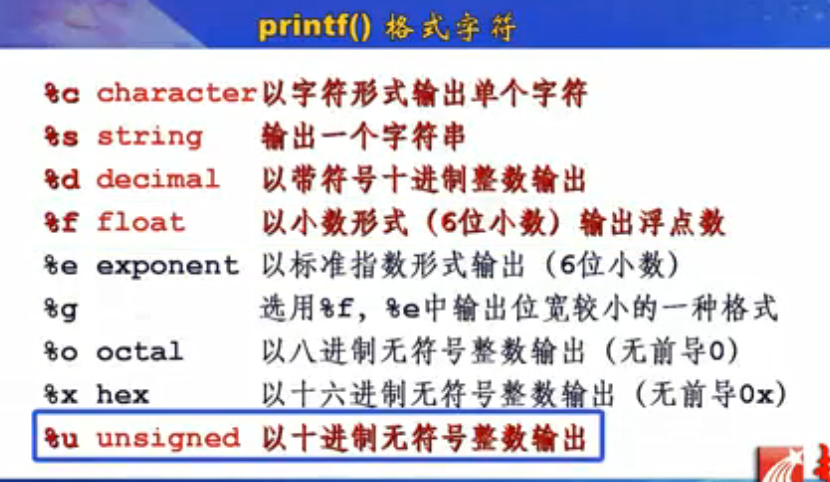
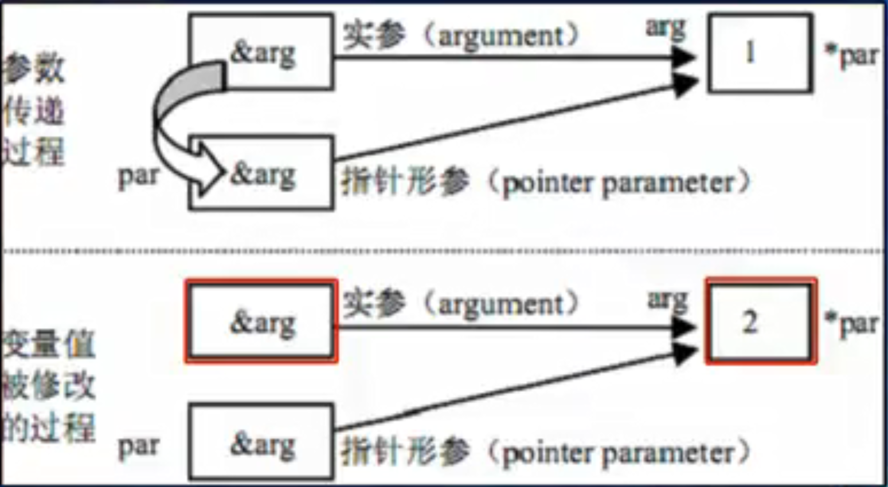
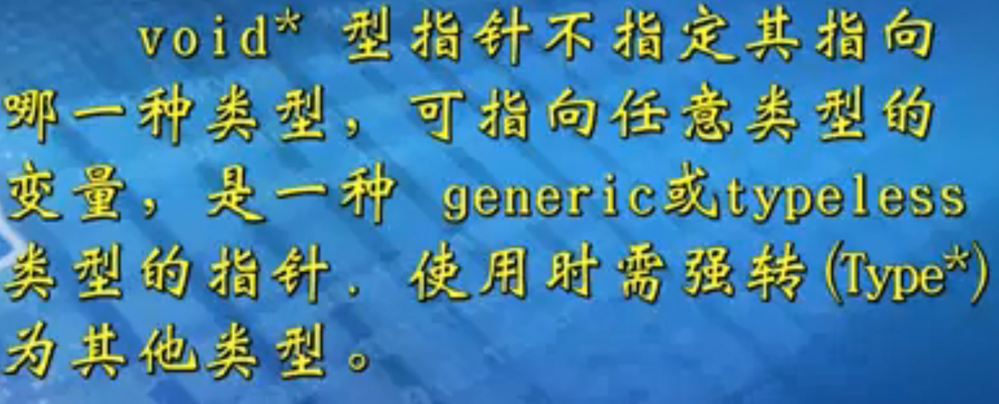
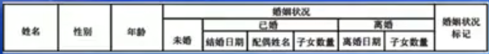

# 我的C语言——程序设计

​	**`C语言标准：C99、C89`**

## 一、数据类型

### 零）变量的类型决定了什么？

- 占用内存空间的大小
- 数据的存储形式
- 合法的取值范围
- 可参与的运算种类


### 一）基本类型

#### 1. 整型

- 基本整型：int（C标准为规定，系统相关——在目前大多数系统上占4个字节）
- 长整型：long int ，简写long（4个字节）
- 短整型：short int，简写short（2个字节）
- 无符号整型：unsigned，用来修饰 int、short、long（默认有符号）。无符号整数（正整数和0）。

- 字节大小：长整型不低于基本整型，短整型不高于基本整型。


- **数值溢出**的危害：编译器对他熟视无睹。
- **数值溢出**的对策：
  - 了解处理问题的规模，选择取值范围更大的变量类型。虽然会影响运行效率，但是数值溢出这个问题更严重。
  - 不要对变量所占的内存空间字节数想当然。
  - 用sizeof获得变量或者数据类型的长度，计算出规模大小。


#### 2. 实型

- 单精度实型：float，4个字节
- 双精度实型：double，8个字节
- 长双精度实型：long double，系统相关（VC++上占8个字节）

- VC++中，单精度占4个字节，双精度和长双精度占8个字节

- 实型没有求余，因为有小数精度，没有意义


**实型数：**

- 定点数（Fixed Point） ------------- 12.34567
- 浮点数（Floating Point）-----------12.34567*e2
  - N = S ✖ R^j。**实型数的存储如下：**没有规定阶码和尾码的宽度。


#### 3. 字符型

- char，1个字节

- 字符进行加减运算的时候，是ASCII码值进行运算。


### 二） 字符集

#### 1. 奇偶校验——ASCII（1个字节）

​		指校验代码输出过程中是否出现错误。奇校验规定，如果一个字节编码序列中1的个数是技术则校验位置是1，否则是0.偶校验与其正好相反。（ASCII最高位就是奇偶校验位）


#### 2. 汉字编码

​		为了兼容ASCII码，连续的2个字节，仅在其第7位均为1时认为是汉字。


#### 3. Unicode（16进制——2个字节）

​		国际标准化组织（ISO）制定了Unicode字符集。

​		为各种语言中的每个字符设定了统一且唯一的数字编号，所有字符统一用2个字节保存，宽字节字符65536个字符。


## 二、运算符

### 一） sizeof

- sizeof(类型)：结果为类型占用的字节数

- sizeof(表达式)：结果为表达式值所属类型占用的字节数

- sizeof(变量)：结果为变量所占用的字节数

  ```C
  #include<stdio.h>
  main(){
      printf("Data type Number of bytes\n");
      prinft("--------------------------------\n");
      printf("char:           %d\n", sizeof(char));   //1
      printf("int:            %d\n", sizeof(int));    //4
      printf("short int:      %d\n", sizeof(short));  //2
      printf("long int:       %d\n", sizeof(long));   //4
      printf("float:          %d\n", sizeof(float));  //4
      printf("double:         %d\n", sizeof(double)); //8
  }
  ```


### 二） 连续赋值

​		**Syntax：**

```
变量1 =  变量2 = 表达式;
变量1 = (变量2 = 表达式);
从右往左依次赋值。
因为从左往右的话，赋值过去是没有意义的，赋值过去的是乱码。
```

​		**Example：**

```C
int a,b;
float x,y;
a = b = 0;
x = y = 100.0;
// int a=b=0; 在同时声明两个变量的时候，必须用逗号分隔开，不能这样连续初始化和赋值。
```


### 三）二目运算符

- '*'：乘法
- '/'：除法
  - 两个操作数都是整数的时候，就是做整除，除得的商还是还是整数，并且向下取整。（**11/5=2**）
  - 两个操作数中只要有一个是浮点数，则是商是一个浮点数，会有小数部分。（**11.0/5=2.5**）
- '+'：加法
- '-'：减法
- '%'：求余
  - 求余数要求操作数必须是整数。
  - **11%5=2……1**
  - **-11%5=-2……-1**
  - **11%-5=-2……1**
  - **-11%-5=2……-1**

- 优先级：'*', '/', '%' > '+', '-'
- 相同优先级时，**算术运算符**是**从左到右**进行结合，**赋值运算符**是**从右往左**。
- **加括号的最高优先级**，优先计算。


#### 运算符的小案例

```C
#include<stdio.h>
void main(){
    int x,b0,b1,b2,num;
    x = 153;
    b2 = x/100;
    b1 = (x-b2*100)/10;
    b0 = x%10;
    sum = b2 + b1 + b0;
    printf("b2=%d,b1=%d,b0=%d,sum=%d\n", b2, b1, b0, sum);
}
```


### 四）复合赋值

#### 1. 简写赋值

​		**Syntax（语法）：**

```
变量x 运算符op = 表达式;  # 简写
变量x		    = 变量x 运算符op 表达式;
#简写(Shrothand)形式更直观，且执行效率也更高一些。
如：num = num+5;  --->  num += 5;
----------------------------------------
例一：
    int a=3;
    a += a -= a * a; a = ?
# 里面由两个赋值运算符，一个算术运算符，且算术运算符优先级高于赋值运算符
# 所以第一步：a += a -= (a * a)  --- >  a += a -= 9
# 然后赋值遵循从右至左的原则，第二步：a += (a -= 9)  ---> a += -6(且a-=9的时候，把a的值变成了-6)
# 所以最终：a = -12
----------------------------------------
例二：
	int a=3;
	a += a -= (a *= a);
	---> a=9; a += (a -= 9);
	---> a=0; a += 0;
	---> a=0;
```


#### 2. 自增自减

​		**Syntax（语法）：**

```
n++,n--,++n,--n;
----------------------------------------
n++, n--
1. 作为后缀(postfix)运算符的时候，先取n的值，然后加/减1
如：m=n++; ---> m=n; n++;
----------------------------------------
++n, --n
2. 作为后缀(postfix)运算符的时候，先加/减1，先取n的值
如：j = ++i-2 ---> ++i; j=i-2;
----------------------------------------
异：j = i++-2 ---> j=i-2; i++;
----------------------------------------
例子：int a=3;
printf("%d", -a++);
---> printf("%d", -a); a++;
---> -3  (a++变成4)
```


#### 小案例——计算圆的面积和周长

```C
#include<stdio.h>
/*
	在程序中直接使用的常数，称为幻数
	直接使用常数会出现的问题：
		- 程序的可读性变差
		- 容易发生书写错误
		- 当常数需要改变时，要修改素有引用它的代码，工作量大，还可能遗漏
*/
// 宏常量：#define 宏名 值(这个值是当作字符串直接替换进去的，不会检查里面的类型是否合适)
// 宏常量一般全部采用全大写字母表示
// 宏定义不是语句，而是一种编译预处理指令，所以后面没有分号
// #define PI 3.14159
void main(){
    // const常量，有类型，不必全大写
    const double pi = 3.14159;
    double r;
    double circum;
    double area;
    printf("Input r:");
    scanf("%lf", &r);  // lf双精度实型，接受输入的值，存入r中
    
    //area = 2 * 3.14159 * r;
    //circum = 3.14159 * r * r;
    
    //area = 2 * PI * r;  // 宏替换
    //circum = PI * r * r;
    
    area = 2 * pi * r;  // const常量替换
    circum = pi * r * r;
    
    printf("area = %f\n", area);  // f单精度实型
    printf("circumference = %f\n", circum);
}
```


#### 3. 常量

##### 3.1 宏常量

- 宏常量：#define 宏名 值(这个值是当作字符串直接替换进去的，不会检查里面的类型是否合适)
- 宏常量一般全部采用全大写字母表示
- 宏定义不是语句，而是一种编译预处理指令，所以后面没有分号
- #define PI 3.14159


##### 3.2 const常量

- const常量，有类型，不必全大写
- const double pi = 3.14159;


#### 4. 取值范围大小

- double > float > long > int > short > char
- 转换如下：

```
double  <----  float
   ↑ (高)
   |
 long
   ↑
   |				(低)
   unsigned  <---- int <---- char,short
赋值过程中，如果把取值范围小的赋值给取值范围大的，这时候是安全的；反之容易出现数值溢出。

```

```C
#include<stdio.h>
void main(){
    int n=256;
    float f=3.6;
    double d=2.5;
    n = f;
    f = n;
    d = f;
    printf("n = %d\n", n);
    printf("n = %d\n", n);
    printf("n = %d\n", n);
}
===> 输出
    n = 3
    f = 3.000000
    d = 3.000000
// 双精度浮点数转单精度浮点数，可能因为有效数字位数不够而出现精度损失，即舍入。
// 浮点数转整数，小数部分直接没有。
```

```C
#include<stdio.h>
void main(){
    float a = 123456.789e4;  //10的4次方
    double b = 123456.789e4;
    printf("%f\n%f\n", a, b);
}
===> 输出
	1234567936.000000  ---> 单精度的有效位数不会超过7，所以这里有精度损失
    1234567890.000000
// 从高精度转换为低精度，容纳不下高精度所有信息，就会丢失信息，出现按舍入，有称为截断。
```


#### 5. 类型转换——(类型)表达式

​		**Example：**

```C
int x = 10;
float y;
y = (float)x;
---> y = 10.000000; x不变。
```

```C
int total, number;
float average;
average = (float)total / number;
```

```C
#include<stdio.h>
void main(){
    int m=5;
    printf("m/2=%d\n", m/2);  // 2
    printf("(float)m/2=%f\n", (float)m/2);  // 2.000000
    printf("(float)(m/2)=%f\n", (float)(m/2)); // 2.500000
    printf("m = %d\n", m); // 5
}
```


#### 6. 数学常见函数


```
计算三角形的面积：
area = sqrt(s*(s-a)*(s-b)*(s-c))
s = 1.0/2*(a+b+c)
// 还要判断三边是否能构成三角形
```

```C
#include<stdio.h>
#include<math.h>
#include<malloc.h>

int* sort(int a, int b, int c){
    int arr[] = (int*)malloc(sizeof(int)*3);
    if(a>b){
        if(a>c){
            arr[0] = a;
			if(b>c){
                arr[1] = b;
                arr[2] = c;
            }else{
                arr[1] = c;
                arr[2] = b;
            }
        }else{
            arr[0] = c;
            arr[1] = a;
            arr[2] = b;
        }
    }else if(b>c){
        arr[0] = b;
        arr[1] = c;
        arr[2] = a;
    }else{
        arr[0] = c;
        if(a>b){
            arr[1] = a;
            arr[2] = b;
        }else{
            arr[1] = b;
            arr[2] = c;
        }
    }
}

void main(){
	float a, b, c, s, area;
    printf("Input a,b,c");
    scanf("%f, %f, %f", &a, &b, &c);
	int arr[];
    arr[] = sort(a,b,c);
    if(arr[0]>(arr[1]+arr[2]) || arr[1]<(arr[0]+arr[2])){
        return;
    }
    s = (float)(a+b+c)/2;
    area = sqrt(s*(s-a)*(s-b)*(s-c));
    printf("area = %f\n", area);
}
```


#### 7. 键盘输入和屏幕输出

##### 7.1 单个字符的输入输出

- 字符常量是用单引号括起来的一个字符。(ASCII码值)
  - 'a' 是字符常量，而a是一个标识符。
  - '3' 是字符常量，而3是一个整数。
- 一些特殊字符（无法从键盘输入或者另有他用），我们称之为转义字符。
  - 如：putchar('\n') 不能写成putchar("\n")
  - 回车不换行：指的是移动到本行的起始位置，会覆盖掉本行原来的信息。



- putchar(ch)
  - (字符输出函数)向屏幕输出**一个字符**，字符型变量ch的值。
- getchar()
  - (字符输入函数)无参数，函数值从输入设备接收的**一个字符**。

```C
#include<stdio.h>
void main(){
    char ch;
    printf("Press a key and then press Enter:");
    ch = getchar();// 从键盘输入一个字符，传入ch中
    //ch = ch+32;
    ch = ch + ('a'-'A'); // 对应字母小写-大写，可以得到差值
    putchar(ch);   // 输出ch
    putchar('\n'); // 输出一个回车
}
--> 输出
    Press a key and then press Enter:B
    b
    (大写字母比对应的小写字母相差32)
```


##### 7.2 数据的格式化屏幕输出

- printf(格式控制字符串，除数列表);

- printf("a=%d, b=%f", a, b);

  



- `%%` ---> 输出一个 `%`
- printf("Value is: %10f", 32.678428)  --->  Value is:_32.678473
  - f 格式只能输出6为小数，所以第七位被四舍五入了。（那个10是正数，所以是右对齐）
- printf("Value is: %-10f", 32.678428)  --->  Value is:32.678473_
  - -10是负数，所以是左对齐，小数规则同上。
- 上面两个例子我用下划线表示那里有一个空格。
- printf("Value is: %10.4f", 32.678428)  --->  Value is:\___32.6785
  - 宽度为10.小数位有4位。（右对齐）
- printf("Value is: %.3f", 32.678428)  --->  Value is: 32.678
  - 没有指定宽度，小数位有3为。（右对齐）
- l 长整型整数，加在d、o、x、u前。
- L 长双精度实型数，加在f、e、g前。
- printf是没办法区分单精度还是双精度的，因为在输出的时候，会自动转换为双精度输出。


##### 7.3 数据的格式化键盘输入

- scanf(格式控制字符串，输入地址表)
- scanf("%d, %f", &a, &b);


---


- scanf()在输入的时候，必须要指定确定的类型，因为在输入的时候，要把值存入到一个地址里面，而这个地址是有明确的类型的，如果输入类型小于地址类型，那么就会有数值缺失，所以scanf是可以识别数据类型的，也就是可以区分单精度和双精度。（占的字节数不一样）

- scanf函数通过地址指向变量，%f告诉scanf在该地址上存储一个float数，%lf告诉scanf在该地址上存储一个double数。

  ```C
  // 1. 跳过了中间的2d宽度的输入  
  scanf("%2d %*2d %2d", &a, &b);
  printf("a=%d, b=d\n", a, b);
  比如：Input：123456;
       Output：a=12, b=56;
  
  // 2. %c会读取到字符，包括换行符
  scanf("%d",&a);
  getchar(); // 上面输入一个数字后，会按回车表示输入结束，但是这个回车被存入了缓存区，会被下面的%c读取到，这样就不能读取到我们想要读取的%c，所以这里加一个getchar()把那个换行符读取掉了后，再进行下面的scanf操作，%c就不会读取到换行符了。
  scanf("%c",%c);
  // 也可以把上面的scanf换成下面的scanf，达到读取掉那个多余换行符的作用：在%c前面加一个空格，可以读取掉一个空白的字符，也就是匹配掉原样输入的值。
  scanf(" %c", &c);
  
  // 3. scanf中的非特殊字符要一起原样输入
  scanf("a=%d,b=%d", &a, &b);
  这时候，Input:a=12,b=34;
  这样才能让scanf的值读取正常，对于里面的非特殊字符也要一字不落
  
  // 4. 当两个特殊字符的中间是空格的时候，我们可以以空格、tab、回车进行分隔。
  scanf("%d %d", &a, &b);
  
  // 5. 以任意字符隔开进行输入
  scanf("%d %*d %d", &a, &d);
  // 这样中间就会跳过一个宽度的字符，然后两边分别赋值给a和b
  
  // 6. 当输入的内容和特殊字符格式不匹配的时候，会自动结束读取
  scanf("%d %d", &a, &b);
  printf("a=%d, b=%d\n", a, b);
  Input: 123a;
  Output: a=123, b=乱码;
  // 因为在输入123之后，输入了字母a和%d不匹配，系统默认以为输入内容已经停止了，也就停止值的读取了，所以b就是缓冲区里面随便赋值的一个值，这个值因为不确定性，也就是一个乱码。
  ```

  

## 五、选择控制结构


```C
伪码：
    step a;
    if(条件为真){  // 0为假，非零为真
        step m;
        step n;
    }
    step b;
```


**Syntax：单分支语句**

```C
if(表达式){
    语句;
    ...
} // 大括号里面的会被当做一个整体看待
```

**例子：**

```C
#include<stdio.h>
void main(void){
    int a, b, max;
    printf("Input a, b:");
    scanf("%d,%d", &a, &b);
    if (a>b) max = a;
    if (a<=b) max = b;
    printf("max=%d\n", max);
}
```


**Syntax：双分支语句**

```C
Step a;
if(条件为真){
    语句;
    ...
}
else{ // 条件为假
    语句;
    ...
}
```


**Syntax：三元运算符**

```C
max = a>b?a:b;
// 如果a>b为真，则去冒号前面的a赋值给max；否则就把冒号后面的b赋值给max

// 等价于
if(a>b){
    max = a;
}else{
    max = b;
}

// 等价于
if(a>b) max = a;
if(a<=b) max = b;
```


**Syntax：多分支语句**

```C
// 连续执行多个条件判断
if(表达式1){
    ...
}else if(表达式2){
    ...
}else if(表达式3){
    ...
}
... // 零个或多个else if
else{  // 最后一个就是排除前面所有的情况后的最后一个情况
    ...
}
```


**例子1：**

```C
// 计算一元二次方程的根
#include<stdio.h>
#include<math.h>
#include<stdlib.h>
```


**例子2：**

```C
// 猜数游戏：猜对了就说right
// 猜错了就是猜大了还是猜小了
```


### 课堂小案例：包含与不包含

```C
#include<stdio.h>
#include<math.h>

void main(void){
    float a,b,c;  // 三角形的三边
    int flag = 1;  // 判断是否是特殊三角形
    printf("请分别输入三边a,b,c(以空白字符隔开)：");
    scanf("%f %f %f", &a, &b, &c);
    if(a+b>c && a+c>b && b+c>a)  /* 三角形的基本条件 */
    {
        // 等边是等腰的特殊情况，所以用 if-else if，先判断小范围，再判断大范围
        if(a==b && a==c){
            printf("等边");
            flag = 0;
        }
        else if(a==b || b==c || c==a){
            printf("等腰");
            flag 0;
        }
        // 直角和上面的是并列关系，所以用两个if进行分别的判断
        // 比如：等腰直角三角形
        // 因为有浮点误差，所以用误差来判断近似相等
        if(fabs(a*a+b*b-c*c)<=EPS || fabs(a*a+c*c-b*b)<=EPS || fabs(b*b+c*c-a*a)<=EPS)  // eps是差值足够小
        {
            printf("直角");
            flag = 0;
        }
        if(flag){  // 如果flag非零，说明不是上面的特殊三角形
            printf("一般");
        }
        printf("三角形\n");
    }
    else{
        printf("不是三角形\n");
    }
}
```


## 六、开关语句

**Syntax：**

```C
switch(表达式){  // 表达式只能是整型或字符型
    case 值1:  // 值只能是常量
        ...;
        break;
    case 值2:  // case和常量之间一定要有空格
        ...;
        break;  // break就是符合这个条件后，把这个块的语句执行完了就退出switch判断
    ...
    default:
        ...;
        break;
}
// 就像坐电梯，在哪儿下，就点哪一楼的按钮
// 如果没有break，就会一直往下执行，case起不到判断的作用，只是一个标号，标记着你可能会在哪里停下，但是停下后是否继续往下走，是由break决定的。
// default就是当前面的case都没有停下的时候，就会走到default这里，执行default后面的语句。
// default最好不要省略，可以用来处理特殊的紧急情况。
```


**Example：**

```C
switch(month){
    case 1:
        printf("January\n");
        break;
    case 2:
        printf("February\n");
        break;
    default:
        printf("others!\n");
        break;
}
```


**Example：**

```C
#include<stdio.h>
void main(void){
    int data1, data2;
    char op;
    
    printf("Please enter the expression:");
    scanf("%d%c%d", %data1, %op, %data2);
    
    switch(op){
        case '+':
            printf("%d %c %d = %d\n", data1, op, data2, data1+data2);
            break;
        case '-':
            printf("%d %c %d = %d\n", data1, op, data2, data1-data2);
            break;
        case '*':
            printf("%d %c %d = %d\n", data1, op, data2, data1*data2);
            break;
        case '/':
            if(0==data2){
                printf("Division by zero!\n");
            }else{
                printf("%d %c %d = %d\n", data1, op, data2, data1+data2);
            }
            break;
        default:
            printf("Invalid operation!\n");
            break;
    }
}
```


### 小总结

```
1. 两个浮点数判断是否相等的时候，用math.fabs(a-b)的差是否足够小
2. 条件运算符是唯一的三元运算符
3. 进行复杂判断的时候用逻辑运算符
4. 表达式：0为假，非零为真
5. 算法的表示方法：流程图、伪码
6. 单分支if、双分支if-else、多分支if-else if-else
```


## 七、循环语句

### 一）for循环

**Syntax：**计数控制——Loop is controlled by a counter.

```C
for(表达式1; 表达式2; 表达式3){
    语句1;
    ...
}
// 表达式1：循环初始条件
// 表达式2：循环结束条件（控制循环次数）
// 表达式3：循环转化条件（改变循环变量的值）
```


**Example：**

```C
int i, sum, n;
sum = 0;
for(i=0; i<5; i++){
    scanf("%d", &n);
    sum = sum+n;
}
printf("sum = %d\n", sum);
```


**Example：**

```C
int i, n, sum;
sum = 0;
scanf("%d", &n);
for (i=1; i<=n; i++){
    sum+=i;
}
printf("sum = %d\n", sum);
```


### 二）while循环

**Syntax：**

```C
语句0;
while (表达式){
    语句1;
    ...
}
// 语句0：循环初始条件
// 表达式：循环结束条件
// 语句1：循环变量增值
```


**Example：**

```C
int i, sum, n;
sum = 0;
i = 1;
scanf("%d", &n);
while(i<=n){
    sum += i;
    i++;
}
printf("sum = %d\n", sum);
```


### 三）do...while语句

**Syntax：**

```C
语句0; // 循环初始条件
do{
    语句1;  // 变量增值
    ...
}while(表达式); // 循环结束条件
```


**Example：**

```C
int i, sum, n;
i = 1;
sum = 0;
scanf("%d", &n);
do{
    sum += i;
    i++;
}while(i<=n);
printf("sum = %d\n", sum);
```


#### 优化案例：从1加到n

```C
int i, j, n, sum=0;
scanf("%d", n);
for(i=1, j=n; i<=j; i++, j--){
    sum = sum +i +j;  // 从两头往中间加
}
printf("sum = %d\n", sum);
```


**Example：**

```C
// n的阶层
int i, n, p;
i = 1;
p = 1;
scanf("%d", n);
for(; i<=n; i++){
    p = p*i;
}
printf("%d! = %d\n", n, p);
```


### 四）计数控制的循环

**Example：**猜数字，猜一次

```C
#include<stdio.h>

void main(void){
    int guess, magic=rand()%10+1; // magic范围[1,10]
    scanf("%d", &guess);
    if(guess>magic){
        printf("Too high!\n");
    }
    else if(guess<magic){
        printf("Too low!\n");
    }
    else(guess==magic){
        printf("Right!\n");
    }
}
```


**Example：**猜10次

```C
#include<stdio.h>

void main(void){
    int i, guess, magic=rand()%10+1;
    for(i=1; i<=10; i++){
        scanf("%d", &guess);
        if(guess>magic){
        	printf("Too high!\n");
        }
        else if(guess<magic){
            printf("Too low!\n");
        }
        else(guess==magic){
            printf("Right!\n");
            break;
        }
    }
}
```


**Example：**无限猜，直到猜对

```C
#include<stdio.h>

void main(void){
    int count, guess, magic=rand()%100+1;
    scanf("%d", &guess);
    while(guess!=magic){
        if(guess>magic){
        	printf("Too high!\n");
        }
        else if(guess<magic){
            printf("Too low!\n");
        }
        else(guess==magic){
            printf("Right!\n");
            break;
        }
        scanf("%d", &guess);
    }
    printf("counter = %d\n", count);
}
```


### 五）标记控制循环

**Example：**输入数据，显示每次累加的结果，直到输入0时为止。（循环次数为止）

```C
#include<stdio.h>

void main(void){
    int num;
    int sum = 0;
    do{
        printf("Input num:");
        scanf("%d", &num);
        sum += num;
        printf("sum = %d\n", sum);
    }while(num!=0);
    printf("输入num等于0，累加结束。");
}

void main(void){
    int num;
    int sum = 0;
    scanf("%d", &num);
    while(num!=0){
        sum += num;
        printf("sum = %d\n", sum);
        scanf("%d", &num);
    }
    printf("输入num等于0，累加结束。");
}

void main(void){
    int num;
    int sum = 0;
    printf("Input num:");
    scanf("%d", &num);
    for ( ; num!=0; scanf("%d", &num)){
        sum += num;
        printf("sum = %d\n", sum);
        printf("Input num:");
    }
    printf("输入num等于0，累加结束。");
}

void main(void){
    int num;
    int sum = 0;
    for ( ; ; ){
        printf("Input num:");
        scanf("%d", &num);
		if(num==0){
            break;
        }
        sum += num;
        printf("sum = %d\n", sum);
    }
    printf("The num equals zero, program is over!");
}
```


**Syntax：**goto语句和语句标号配合使用。（一般配合if使用，并且往后跳）

```C
if(表达式) goto 语句标号;
...;
...;
语句标号:
	...;
```

**Example：**韩信点兵（求余---余数）


```C
#include<stdio.h>
#include<stdlib.h>

void main(void){
    int x;
    for (x=11; ; x++){
        if(x%5==1 && x%6==5 && x%7==4 && x%11==10){
            printf("人数为：%d\n", x);
            goto END;
            // break;
            // break和continue其实本质上是一种受限的goto语句
            // exit(0); 终止整个程序的执行
        }
    }
    END: ;
}
```

**这个标记控制语句导致for有两个出口：一个是标记的位置，一个是循环退出条件的位置。**

**Example：**设置标志变量，使得符合单入口单出口。

```C
#include<stdio.h>
void main(void){
    int x;
    int find = 0;  // 标志为假
    for (x=11; !find; x++){ // !find的boolean取反
        if(x%5==1 && x%6==5 && x%7==4 && x%11==10){
            printf("人数为：%d\n", x);
            find = 1;  // 标志为真，找到了
        }
    }
}
// 使用标志变量使得可读性更好
```


### 六）结构化程序设计

- 只用顺序、选择、循环就可以实现任何单入口单出口的程序。
- 结构化程序语句应该只有一个入口和一个出口。
- 自顶向下，逐步求精。
  - 结构清晰
  - 容易修改
  - 容易验证
  - 容易阅读
- goto语句本身并不糟糕，糟糕的是混乱的使用goto语句的标号。
- **两种**适合使用goto语句的情况：
  - 跳向**共同的出口**位置，进行退出前的处理工作。
  - 调出**多重循环**的一种捷径。


### 七）良好的Coding Style

- 良好的注释：为什么这么干，想干什么。
- 整齐的缩进
- 适当的空行：前一部分是干什么，后一部分是干什么。
- 见名知意的变量名：尽量用英文单词，不要用拼音。
- 行内空格：增加单行的清晰度。
- 变量名：多个单词的时候，用驼峰式或下划线隔开


### 八）调试的基本方法

- 粗分细找，定位大致的范围：一半一半的进行排查。
- 采用注释的办法切掉一些代码，减少有关的代码区域。
- 缩减输入数据，设法找到能导致失败的最小输入，进而逆向思考。
- 直接设置断点，进行debug。
- 插入关键位置的打印语句，查看程序过程中的变量值。


### 九）循环的空语句

```C
// 空语句：一般用于延时
for(i=0; i<=100; i++);

// 死循环或不循环
while(i<100);
```


### 十）流程转移控制的注意事项

- goto 标记标号

- 主张少用、慎用，而不是禁用goto。
- 保证使用之后，程序仍然是单入口、单出口。
- 最好不要使用一个以上的goto语句标号。
- 不要往回调，最好往后调。
- 不要让goto制造出永远不会被执行的代码：跳过了初始化的语句。
- break和continue其实本质上是一种受限的goto语句。
- exit(0); 终止整个程序的执行。


### 十一）循环的嵌套

**Example：**打印九九乘法表

```C
#include<stdio.h>

void main(void){
	int i, j;
    for(i=1; i<=9; i++){
        for(j=1; i<=i; j++){
            printf("%d*%d=%d\t", i, j, j*i);
        }
        printf("\n");
    }
}
```


### 十二）例题


```C
#include<stdio.h>
#include<math.h>

int main(){
    float sign, sum;
	int i;
    sum = 0.0;
    sign = 1.0;
	i = 1;
    while((float)fabs(sign/i)>=1e-4){
		sum += (sign/i);
        sign = -sign;
		i++;
	}
    printf("sum = %f\n", sum);
    return 0;
}

```


```C
#include<stdio.h>

int fn(int n){
    int res = 1, i;
    for (i=2; i<=n; i+=2){
        res *= (n*n/((n-1)*(n-2)));
    }
    return res;
}
```


```C
#include<stdio.h>
int fn(int n){
    int res=1, i;
    for (i=1; i<=n; i+=2){
        res *= i*(i+1)*(i+2);
    }
    return res;
}
```


```C
#include<stdio.h>

int Fact(int n){
    if (n==1) return 1;
    else return n*Fact(n-1);
}

int fn(int n){
    int res=0, i;
    for (i=1; i<=n; i++){
        res += Fact(i);
    }
    return res;
}
```


```C
#include<stdio.h>

int Exponentiation(int x, int n){
    if(n==0) return 1;
    else if(n==1) return x;
    else return x*Exponentiation(x, n-1);
}

int fn(int n, int x){
    int res=0, i;
    for (i=0; i<=n; i++){
        res += Exponentiation(x, i);
    }
    return res;
}
```


```C
// aa = a0+a=a*10+a;
// term = term*10+a;
#include<stdio.h>

int Multiplication(int a, int n){
    if (n==1) return a;
    else return a*10+Multiplication(a, n-1);
}

int fn(int a, int n){
    int res = 0, i;
    for (i=1; i<=n; i++){
        res += Multiplication(a, i);
    }
    return res;
}
```


```C
#incldue<stdio.h>

int Factorial(int n){
    if (n==1) return 1;
    else return n*Factorial(n-1);
}

int fn(int n){
    int res=1, i;
    for (i=1; i<=n; i++){
        res += 1/(Factorial(i));
    }
    return res;
}
```


```C
#include<stdio.h>
// 正负号函数
int Symbol(int i){
    if (i%2==1) return 1;
    else return -1;
}
// 连乘函数
int Multiplication(int x, int n){
    if (n==1) return x;
    else return x*x*Multiplication(x, n-2);
}
// 阶乘函数
int Factorial(int n){
    if(n==1) return 1;
    else return n*Factorial(n-1);
}
int fn(int n, int x){
    int res = 0, i;
    for (i=1; i<=n; i++){
        res += Sympol(i)*Multiplication(x, 2*i-1)/Factorial(2*i-1);
    }
    return res;
}
```


## 八、函数

### 1. 计算阶乘

```C
#include<stdio.h>

long Fact(int n){
    int i;
    long result = 1;
    if(n<0){
        return -1;
    }
    for(i=2; i<=n; i++){
        result *= i;
    }
    return result;
}

int main(){
    int n;
	long res;
    scanf("%d", &n);
	res = Fact(n);
    printf("%d! = %d\n", n, res);
    return 0;
}
```

### 2. assert断言

- 没有返回值，参数为表达式。
- 在断言里面的内容为真的时候，就没有影响，如果为假，则会终止程序。
- 用来测试某种不可能发生的状况确实不会发生。
- 断言在Debug版下有效Release版下失效，它仅用于调试程序，不能作为程序的功能。
- 检查函数入口参数的合法性。
- 在一段计算的结果处检验计算结果是否在合理的范围内。
- 检验程序中的各种假设的正确性。
- 证实或测试某种不可能发生的状况确实不会发生。

```C
#include<stdio.h>
#include<assert.h>

long Fact(int n){
    int i;
    long result = 1;
	assert(n>=0);
    for(i=2; i<=n; i++){
        result *= i;
    }
    return result;
}

int main(){
    int n;
	long res;
    scanf("%d", &n);
	res = Fact(n);
    printf("%d! = %d\n", n, res);
    return 0;
}
```


### 3. 嵌套

- 函数不能嵌套定义，但是可以嵌套调用。


### 4. 递归调用

#### 4.1 阶乘

```C
long Fact(int n){
    if(n<0){
        return -1;
    }
    else if(n==0 || n==1){
        return 1;
    }
    else{
        return n*Fact(n-1);
    }
}

unsigned long Fact(unsigned int n){
    // 当无符号的时候，n<0的判断就可以去掉了，always false.
    if(n==0 || n==1){ // 基本条件：终止条件。
        return 1;
    }else{  // 一般条件
        return n*Fact(n-1);
    }
}
```


#### 4.2 Fibonacci数列

```C
long Fib(int n){
    if(n==1 || n==2){
        return 1;
    }else{
        return Fib(n-1)+Fib(n-2)
    }
}
```


#### 4.3 适用递归

- 数据结构本身是递归的，如：单向链表
- 问题本身是递归的，如：汉诺塔问题、骑士游历问题、八皇后问题
- 定义的本身是递归的，如：计算阶乘


#### 4.4 汉诺塔问题

```C
// n个圆盘
// 三个柱子A B C
// 从A，借助B，移动到C
void hanoi(int n, char A, char B, char C){
    if(n==1){
        printf('%c--->%c\n',A ,C);  // 只有一个盘子的时候，直接从A移动到C
    }else{
        hanoi(n-1, A, C, B);  // 把前n-1个盘子借助C，从A移动到B
        printf('%c--->%c\n',A ,C); // 把第n个盘子从A移动到C
        hanoi(n-1, B, A, C);  // 把前n-1个盘子借助A，从B移动到C
    }
}
```


### 5. 变量的定义域

- 全局变量（global variable）：

  - 在所有函数之外定义的变量。有效范围是从定义变量开始到程序结束。
  - 静态的全局变量只在自己的源文件有效。
  - 非静态则是在所有的源文件都可以有效，就会出现多个源文件的全局变量同名冲突的情况。

- 局部变量（local variable）：

  - 有效范围仅为该语句块（函数，复合语句），仅能由语句块内语句访问，退出语句块时释放内存，不再有效。
  - 动态局部变量也称为缺省局部变量，离开函数，值就消失。
  - 静态局部变量从编译的时候分配内存，一直到程序结束才会释放，在离开作用域的时候，虽然不能访问他，但是值还是被保留了，下次再来的时候，值还是上次离开的时候的值。

- 变量同名的情况

  - 并列语句块内各有定义（不同作用域）的变量同名。

  ```C
  #include<stdio.h>
  void Function(int x, int y);
  void Function(int x, int y){
      x = 2;
      y = 1;
      printf("x=%d, y=%d\n",x, y);
  }
  int main(){
      int x=1;
      int y=2;
      Function(x, y);
      printf("x=%d, y=%d\n", x, y);
      return 0;
  }
  Input:
  x=2, y=1
  x=1, y=2
  ```

  - 局部变量和全局变量同名。

  ```C
  #include<stdio.h>
  void Function();
  // 全局变量如果没有初始化的话，初始值默认为零
  int x, y;
  void Function(){
      int x = 2;
      int y = 1;
      printf("x=%d, y=%d\n", x, y);
  }
  int main(){
      x = 1;
      y = 2;
      Function();
      printf("x=%d, y=%d\n", x, y);
      return 0;
  }
  
  Input:
  x=2, y=1  // 这里使用的局部变量
  x=1, y=2  // 这里使用的全局变量
  ```

- 假如变量同名，只要作用域不同，新的声明将隐藏旧的声明。也就是在一个函数中，全局变量和局部变量都一样的时候，函数会优先使用局部变量，从近处开始找。

- 把全局变量和局部变量的例子中的 `Function()` 改为 `Function(int x, int y)` ，输出结果不变，因为形参的改变不会改变实参，传进去的是值不是地址。

- **局部变量分配在动态存储区中，全局变量分配在静态存储区中。**


### 6. 全局变量尽量少用——用参数和返回值进行数据传递更好

- 因为全局变量的作用域是全局的，所有的函数里都可以改写它，所以很难确定是谁改写了它，在哪里修改了它。
- 很难在其他程序中复用。
- 修改程序时，若改变全局变量（如类型），则需检查同一文件中的每个函数，已确认该变化对函数的影响程度。


### 7. 存储空间

- 内存中供用户使用的存储空间可分为：
  - 代码区
  - 常量区
  - 静态存储区
    - **“静态”** 表示事情发生在程序构建的编译时和链接时，而非程序实际开始运行的载入时和运行时。
  - 动态存储区
    - **“动态”** 表示事情发生在程序载入时和运行时。


### 8. 变量的存储类型

- 值在内存中（编译器为变量分配内存）的方式。

- 静态存储方式，指在程序运行期间分配固定的存储空间的方式。

- 如何声明变量的存储类型？

  - **`存储类型 数据类型 变量名;`**

    - auto：自动变量。也称为动态局部变量，是缺省值。

    - static：静态变量。程序运行起，就占用内存，程序结束后，才释放内存。

      - 可以在函数内，语句块内定义，称为**静态局部变量**。

      ```C
      #include<stdio.h>
      long Func(int n);
      int main(){
          int i, n;
          printf("Input n:");
          scanf("%d", &n);
          for (i=1; i<=n; i++){
              printf("%d = %d\n", i, Func(i));
          }
          return 0;
      }
      long Func(int n){
          // 定义静态变量实现阶乘
          // 静态变量只在编译时初始化一次
          // 在第一次进入的时候值为1
          // 第二次进来的时候，保留第一次的值，并且继续使用
          // 虽然是个局部变量，但是这个这个代码块里面，你这次离开的时候他是多少值，下次再回来的时候他还是多少值，具备“记忆功能”。
          static long p = 1;
          p = p * n;
          return p;
      }
      ```

      ```C
      #include<stdio.h>
      long Fib(int n){
          static int count = 0;
          count++;
          if(n==1 || n==2){
              return 1;
          }else{
              return Fib(n-1)+Fib(n-2);
          }
      }
      ```

      - 也可以在函数外，语句块外定义，称为**静态外部变量**。
      - 上面两个的作用域是不同的。局部变量只在语句块内，外部变量是整个文件。

    - extern：外部变量。比如：如果想要定义全局变量之前使用全局变量的话，需要在前面声明一下，说后面有定义这个全局变量，我要使用一下。

    - register：寄存器变量。存储位置是在CPU的寄存器中。生存期与程序共存亡。


### 9. 模块化程序设计

- 模块各司其职：每个模块只负责一件事，一个模块一个模块地完成，最后将他们集成起来。
- 这样便于进行单个模块的设计、开发、调试、测试和维护。
- 高内聚，低耦合。
- 便于复用。


#### 9.1 模块分解

- 自顶向下，逐步求精的过程。如：把复杂的问题分解成很多的子问题，直到某一个问题可以用一个模块来解决的时候。
- 由不断的自底向上修正所补充的自顶向下的程序设计方法。
- 模块分解的基本元素
  - 保证模块的相对独立性。
  - 模块的实现细节对外不可见。

```C
// 猜多个数：10次猜不对就猜下一个数
// 自顶向下模块化设计

#include<stdio.h>
#include<time.h>
#include<stdlib.h>

#define MAX_NUMBER 100
#define MIN_NUMBER 1

// 参数被声明为const，可以保护参数在这个函数里面不被改写
// 因为这个函数里面不需要改写，只需要使用
int IsRight(const int number, const int guess){
    if(guess>number){
        printf("too high!");
    }else if(guess<number){
        printf("too low!");
    }
    return number==guess;
}

int IsValidNum(const int number){
    if(number>=MIN_NUMBER && number<=MAX_NUMBER){
        return 1;
    }else{
        return 0;
    }
}

int MakeNumber(){
    int number;
    number = (rand()%(MAX_NUMBER-MIN_NUMBER+1))+MIN_NUMBER;
    return number;
}

void GuessNumber(int number){
    int count = 0, guess, flag, right;
    do{
        // 读取用户输入的数据
        printf("Try %d:", count);
        flag = scanf("%d", &guess);
        
        // 处理错误输入的数据
        while(flag != 1 || !IsValidNum(guess)){ // 重复输入，直到输入的数据合法
            printf("Input error!Please enter again.\n");
            while(getchar()!='\n'); /*清除缓冲区中的错误数据*/
            // continue;  // 退出本次循环，重新输入
        	printf("Try %d:", count);
        	flag = scanf("%d", &guess);
        }
        
        // 猜的次数加一
        count++; 
        
        // 如果猜的不对，给出提示
        right = IsRight(number, guess)
    }while(!right && count>=10);
    
    // 判断退出循环的方式
    if(guess==number){
        printf("Guess success!");
    }else{
        printf("Mission failed after 10 attempts.")
    }
}

int main(){
    int number;
    char reply;
    srand(time(NULL));
    do{
        number = MakeNumber();  // 计算机生成数字
        GuessNumber(number);  // 用户猜数字
		printf("Do you want to continue(Y/N or y/n)?");
        scanf("%c", &reply);
    }while(reply=='Y' || reply=='y');
    return 0;
}
```


#### 9.2 函数设计的原则

- 函数规模要小。
- 函数功能要单一，一个函数做一件事。
- 函数接口要定义清楚，并且进行注释，增加可读性。
- 入口参数有效性检查。
- 敏感操作前的检查。如开方、求对数...
- 调用成功与否的检查。
- 有适当的空行和注释。
- 命名风格
  - Linux/UNIX风格的函数名命名：function_name
  - Windows风格的函数名命名：FunctionName
  - 变量名形式为“名词”或“形容词+名词”：oldValue、newValue
  - 函数名形式为“动词”或“动词+名词”(动宾词组)：GetMax()


## 九、数组

- 为什么使用数组？
- **例子**：要读入10人成绩，然后求平均成绩。

```C
int score[10], i;
for(i=0; i<10; i++){
    scanf("%d", &score[i]);
}
```


- 数组是一种保存大量同类型的相关数据的数据类型。

**`数据类型 数组名字[长度]  --->  int a[10]   --->  定义了一个有10个int类型的一位数组，10个连续的int空间。`**

- 下标从0开始，数组名代表数组的起始位置。

- 数组大小必须是值为正的常量，不能为变量，一旦定义，不能改变大小。
- 数组大小最好用宏定义，以适应未来的变化。 **#define N 10**
- 一位数组的引用：数组名[下标]  ---> 下标值允许是变量或者表达式。
- 允许对数组的元素进行快速的随机访问。
- 可以向普通变量一样使用。a[0]、a[1]、a[2]、...、a[9]
- 可以直接初始化：int a[5] = {12,53,5,13,1};
- 给出的初值长度可以小于等于声明的长度，未给出的位置自动赋值为0：int a[5] = {52};
- 没有给出长度的声明的时候，初始化的值有多少，就会默认长度为多少：int a[] = {14,15,12,31,2,22};


### 一）如何使两个数组的值相等

```C
int a[4] = {1,2,3,4};
int b[4];
b = a;
// 错误：数组名表示数组的首地址，其值不可改变

// 方法：逐个元素赋值
for (int i=0; i<4; i++){
    b[i] = a[i];
}

// 更高效的数组初始化和赋值方法
// 1. 更高效的数组初始化方法：memset(a, 0, sizeof(a));  ---> memory set
// 2. 更高效的数组赋值的方法：memcpy(b, a, sizeof(a));  ---> memory copy
// 用 sizeof(a) 来获取数组a所占的内存字节数。上面两个大小都是a大小的数组。
// 使用以上两个函数需要包含相应的头文件：#include<string.h>
```


**例：编程实现显示用户输入的月份（不考虑闰年）拥有的天数。**

```C
#include<stdio.h>
#define MONTHS 12
int main(){
    int days[MONTHS] = {31,28,31,30,31,30,31,31,30,31,30,31};
    int month;  // 1-12
    do{
        printf("Input a month:");
        scanf("%d", &month);
    }while(month<1 || month>12);  // 处理不合法数据
    printf("The number of days is %d\n", days[month-1]);  // days数组是从0-11
    return 0;
}
```


```
    这里的数组 b 只有5个元素，然而在 for 循环中，进行了12次赋值，当 i 超过4后，计算机还会接着往后写，这时候就会把后面跟着的 a 和 c 的值给覆盖了，也就导致了数据出错，这就是数组越界的问题。

    一维数组：int a[5] 用一个下标确定各元素在数组中的顺序。可用排列成一行的元素来表示。
    二维数组：int b[3][4] 用两个下标确定各元素在数组中的顺序用排列成 i 行， j 列的元素来表示。
```


```
数据类型决定存储的空间大小。
存储类型决定是动态存储还是静态存储。
```

```
对于多维数组，是按行存储。从上至下，从左至右。
必须知道数组每行列数才能从起始地址开始正确的取出数组元素。
起始地址加上偏移量，可以找到确定的位置的元素值。
```


例：以下程序的运行结果是什么？（二维数组可以给定列数，不给行数）

```C
int main(){
    int a[][3] = {{1,2,3}, {4,5}, {6}, {0}};  // 没有指定的位置，自动赋值为0
    printf("%d, %d, %d\n", a[1][1], a[0][2], a[2][1]);
    return 0;
}
// 1   2   3
// 4   5   0
// 6   0   0
// 0   0   0
```


例：若 int a\[][3] = {1,2,3,4,5,6,7}，则a数组的第一维大小是多少？ 

```C
// 1  2  3
// 4  5  6
// 7  0  0
// 没有括号，所以会这样依次赋值，没有赋值的依然赋值为0
// 所以第一维是3行。
```


### 二）二维数组越界情况

```C
/*
	在一个二维数组 a[4][6]中，a[0][6]和a[1][0]指的是同一个地址，因为每一个元素都可以用首地址加上偏移量进行表示，所以上面这两个的偏移量最终都指向了同一个位置，虽然a[0][6]看着越界了，但是由于是二维数组，还有下一行可以走，所以就偏移到下一行了。
	a[0][6] = 0*6 + 6 = 6
	a[1][0] = 1*6 + 0 = 6
	// a[i][j] = i*(一行的元素个数) + j  第i行走完，到第i+1行偏移j个位置。
	// 看着是越界了，但是其实是不检查下标是否越界了，只是顺着偏移量进行移动。
*/

#include<stdio.h>
int main(){
    int i, j;
    char a[6][4] = {(char)0x00};
    printf("%p\n", a);  // 输出首地址
    a[0][0] = 0x01;  // 16进制
    a[1][0] = 0x10;
    a[0][4] = 0x04; // a[1][0]
    a[1][4] = 0x05; // a[2][0]
    a[5][4] = 0x20; // 完美刚好越界
    a[5][5] = 0x30; // 越界
    for (i=0; i<6; i++){
        for (j=0; j<4; j++){
            printf("%d\t", a[i][j]);
        }
        printf("\n");
    }
    return 0;
}
Input:
88FF53
1    0    0    0
4    0    0    0
5    0    0    0
0    0    0    0
0    0    0    0
0    0    0    0

/*
Local variables:
	i = 2354832
	j = 3733135
	a = 
		'\000\000\000'
		'\000\000\000'  8进制
		'\000\000\000'
		'\000\000\000'
		'\000\000\000'
		'\000\000\000'
    6行4列，最后一个是字符串结束的标志——'\0'
*/
    
// C语言的越界是不会被编译器提示的。
```


例子：二维数组实现输入的月数的天数的输出

```C
#include<stdio.h>
#define MONTHS 12
int main(){
    int days[MONTHS] = {{31,28,31,30,31,30,31,31,30,31,30,31},  // 平年
                       {31,29,31,30,31,30,31,31,30,31,30,31}};  // 闰年
    int year, month;  // 1-12
    
    do{
        printf("Input a month:");
        scanf("%d, %d", &year, &month);
    }while(month<1 || month>12);  // 处理不合法数据
    
    if (((year%4==0) && (year%100!=0)) || (year%400==0)){  /* 闰年 */
    	printf("The number of days is %d\n", days[1][month-1]);  // days数组是从0-11
    }else{  /* 平年 */
        printf("The number of days is %d\n", days[0][month-1]);
    }
    
    return 0;
}
```


### 三）函数传值

#### 1. 按值传参

- 普通变量做函数参数
- 拷贝实参的副本给形参，实参和形参占不同的存储内存空间，地址不同
- 当离开函数后，形参地址就被释放了，不能再访问了


#### 2. 按引用传参

- 数组作函数参数
- 拷贝一个地址比拷贝全部数组元素高效
- 实参和形参数组占同一段内存
- 形参数组的值改变，也会改变实参


**例子：计算平均分，从键盘输入学生人数。**

```C
#include<stdio.h>
#include<assert.h>
#define N 40     // 人数最多40人

// 计算n个学生的平均分
// 加上const保证score的值不会被改变，一旦进行了修改，编译器就会提示错误
float AverageScore(const int score[], int n){
    float sum;
    int i;
    // assert(n>0);
    for (i=0; i<n; i++){
        sum += score[i];
    }
    return n>0?sum/n:0;
}

// 输入n个学生的成绩存入数组score中
void ReadScore(int score[], int n){
    int i;
    for (i=0; i<n; i++){
        printf("Please input %d-th score:", i);
        scanf("%d", &score[i]);
    }
}

// 用标记进行ReadScore循环的退出，在不知道有多少学生的时候
int ReadScore(int score[]){
    int i = -1;
    do{
        i++;
        printf("Please enter %d-th score:", i);
        scanf("%d", &score[i]);
    }while(score[i] >= 0); // 以负数成绩作为结束标志
    return i+1; // 返回学生的人数
}

// 计算最高分
int FindMax(const int score[], int n){
    int i, max = score[0];
    assert(n>0);
    for (i=1; i<n; i++){
        if(score[i]>max){
            max = score[i];
        }
    }
    return max;
}

int main(){
    int score[N], n;
    float aver;
    printf("Input n:");
    scanf("%d", &n);
    ReadScore(score, n);
    aver = AverageScore(score, n);
    printf("Average score is %d\n", aver);
    return 0;
}
```


### 四）交换排序

```C
#include<stdio.h>

void SwapSort(int arr[], int n){
    int i, j, temp;
    for (i=0; i<n-1; i++){ // 第i轮，选出第i大的值
        for (j=i+1; j<n; j++){
            if(arr[i]<arr[j]){  // 降序
                temp = arr[i];
                arr[i] = arr[j];
                arr[j] = temp;
            }
        }
    }
}
```


### 五）选择排序

```C
#include<stdio.h>

void SelectSort(int arr[], int n){
    int temp, key = 0, i, j;
    for (i=0; i<n-1; i++){
        key = i;
        for (j=i; j<n; j++){
            if(arr[j]>arr[key]){  // 降序，大的放前面	
                key = j;
            }
        }
        if (i !=key){
        	temp = arr[key];
            arr[key] = arr[i];
            arr[i] = temp;
        }
    }
}
```


### 六）顺序查找

```C
#include<stdio.h>

int LineSearch(int arr[], int n, int key){
    int i;
    for (i=0; i<n; i++){
        if (arr[i]==key){
            return i;
        }
    }
    return -1;
}
```


### 七）折半查找——数组有序

```C
#include<stdio.h>
// 假设升序
int HalfSearch(int arr[], int n, int key){
    int high=n-1, mid, low=0;
    while(low<=high){
        // 数组元素非常非常庞大的时候，low + high容易大于 int 整数极限值，溢出，除2就会变成负值。
        // mid = (high+low)/2; 
        
        // 解决溢出问题
        mid = (high-low)/2 + low;
        
        if(arr[mid]<key){
            low = mid+1;
        }else if(arr[mid]>key){
            high = mid-1;
        }else{
            return mid;
        }
    }
    return -1;    // 上面循环以low>high结束
}
```


### 八）二维数组

- `short arr[M][N]`：元素arr[i]\[j]在数组arr中的位置是 i*N + j。（首地址+偏移量）

**例子：计算每一门课的平均分和总分**

```C
// score:course_n门课，n个学生
// C语言不支持返回数组类型
// sum存储每门课的总分
// aver存储每门课的平均分
void AverforCourse(int score[][COURSE_N], int sum[], float aver[], int n){
    int i, j;
    for (i=0; i<COURSE_N; i++){ // 对每一门进行外层循环
        sum[i] = 0;
        for( j=0; j<n; j++){ // 对每一门课的n个学生的成绩进行循环
            sum[i] += score[i][j]; // 不断累加
        }
        aver[i] = (float)sum[i]/n;  // 计算平均值
    }
}
```


## 十、指针

**`Nothing is impossible!`**

**指针是存放地址的特殊的数据类型。**


### 一）直接寻址法——&

是指按变量的地址直接访问。

```C
#include<stdio.h>
int main(){
    int a=0, b=1;
    char c = 'A';
    printf("a is %d, &a is %p\n", a, &a);
    printf("b is %d, &b is %p\n", b, &b);  // %p输出地址，&b取地址
    printf("c is %d, &c is %p\n", c, &c);
    return 0;
}
```

```C
int i;
scanf("%d", i); // 如果没有&，则会把i的值当作地址去存。

char c;
scanf("%d", &c); // char占一个字节，%d占四个字节，这时候就数据溢出了，会损失数据，覆盖后面空间的值。
```


**`一维数组：&a==&a[0]`** 

**`二维数组：虽然我们在逻辑结构上是看作几行几列的，但是在计算机中依然是线性存储的，是按行线性存储。`** 


### 二）指针一个特别的例子——输出和源码一样

```C
// 源程序
main(){char *a = "main(){char *a=%c%s%c;printf(a,34,a,34);}";printf(a,34,a,34);}

// 输出
main(){char *a = "main(){char *a=%c%s%c;printf(a,34,a,34);}";printf(a,34,a,34);}
```


### 三）间接寻址法——指针

- 通过存放地址的变量间接访问。
- 也就是把一个变量的地址存放到另一个变量里面，然后通过访问另一个变量的值，达到间接访问这个变量的效果。
- 存放别人变量地址的变量就是——**指针**。
- **用指针变量来存储某一个变量的地址。**
- 指针的**基类型**就是决定了这个指针指向的地址，一个元素位置占了多少字节。如：`int *pa` 里面的 `int` 。
- **指针变量使用之前必须初始化。**
- 当不确定指针指向哪里的时候，可以让指针指向NULL，NULL的值被定义为0的，可以防止**野指针**。

```C
#include<stdio.h>
int main(){
    int a = 0; b = 1;
    char c = 'A';
    int *pa, *pb;  // int 指针变量 
    char *pc;      // char 指针变量
    // 初始化：用另外一个变量的地址对他进行初始化
    pa = &a;  // pa指向a的地址
    pb = &b;  // pb指向b的地址
    pc = &c;  // pc指向c的地址
    printf("a is %d, &a is %p, pa is %p, &pa is %p\n", a, &a, pa, &pa);
    printf("b is %d, &b is %p, pb is %p, &pb is %p\n", b, &b, pb, &pb);
    printf("c is %d, &c is %p, pc is %p, &pc is %p\n", c, &c, pc, &pc);
}
Input:
a is 0, &a is 0023FF74, pa is 0023FF74, &pa is 0023FF68
// 指针变量也有自己的地址，他的地址里面存的值存的是其他变量的地址。
```

- 指针变量只能指向同一基类型的变量。因为在声明的时候需要对占多少空间的变量存储地址，可能会有数据错乱损失溢出等问题。
- 在同一行如果需要定义多个指针变量的话，需要对每个变量名前面都加一个 **`*`** 号，因为 **`*`** 会就近原则的定义指针变量，不会一连串连锁定义。 **`*`** 称为指针运算符，指的是取出指针变量存储的地址所指向的内存单元的值。

 

**例子：使用指针变量，通过间接寻址输出变量的值。**

```C
#include<stdio.h>
int main(){
    int a = 0; b = 1;
    char c = 'A';
    int *pa = &a, *pb = &b;  // int 指针变量，定义的同时进行初始化
    char *pc = &c;           // char 指针变量，定义的同时进行初始化
    printf("a is %d, &a is %p, pa is %p, *pa is %p\n", a, &a, pa, *pa);
    printf("b is %d, &b is %p, pb is %p, *pb is %p\n", b, &b, pb, *pb);
    printf("c is %d, &c is %p, pc is %p, *pc is %p\n", c, &c, pc, *pc);
}
```


- 指针变量的值可以在过程中进行更改，也就是原来的值是存的这个变量的地址，后来存的另一个变量的地址。
- **牢记两点：**
  - 指针变量指向了哪里。
  - 指针变量指向的内存单元的内容是什么。
- 在指针变量指向一个值后，如果通过 `*p` 修改了指针存的地址的内存单元的内容，那么这个被存放地址的变量的内容也会被跟着改变，因为是通过地址进行的更改。
- 通过引用指针指向的变量的值，称为指针的解引用。**如：*p = 9;**


**例子：普通变量传值和指针传值**

```C
#include<stdio.h>
// void Fun(int par); //1 普通传值
void Fun(int* par);   //2 传入地址
int main(){
    int arg = 1;
    printf("arg = %d\n", arg);
    // Fun(arg);  //1
    Fun(&arg);    //2
    printf("arg = %d\n", arg);
    return 0;
}
// void Fun(int par){ //1
void Fun(int* par){   //2
    //printf("par = %d\n", par); //1
    //par = 2;  //1
    printf("par = %d\n", *par);  //2
    *par = 2;   //2
}

//1:Input
arg = 1
par = 1
arg = 1
    
//2:Input
arg = 1
par = 1 // par得到了arg的地址
arg = 2
    
// 对于得到修改后的值，也可以不用指针变量，可以用return返回出去也行。
```




### 四）错误的例子

**例子：用指针实现两个数的交换**

```C
// 通过对地址的值进行修改，实现了外面两个传参数字的交换。
void Swap(int *x, int *y){
    int temp;
    temp = *x;
    *x = *y;
    *y = temp;
}
// 传参要传入实参的地址
Swap(&a, &b);
// 这里传参进来就相当于：
int *x = &a;
int *y = &b;
```


**例子：一个错误的代码**

```C
void Swap(int *x, int *y){
    int *pTemp;  // pTemp不知道指向了哪里
    *pTemp = *x; // 往不知道的地址进行存值，就会出问题
    *x = *y;
    *y = *pTemp;
}
// 非法内存访问：对不知道的地址进行操作。
// 始终记住：1. 指针指向哪里  2. 指向的内容是什么

void Swap(int *x, int *y){
    int *pTemp;  
    pTemp = x; // 这里是把x里面存的地址存到了pTemp里面
    x = y;  // 然后下面进行了x 和 y存放的地址的交换，但是地址里面的值交换并没有实现
    y = pTemp;
}
// 这个代码只是交换了两个变量存的地址
// 比如x最开始存的&a，y最开始存的&b，然后交换后x存的&b，y存的&b，但是&a和&b地址的值没有交换。
```


### 五）实际的例子——计算最高分的学生的学号和成绩

```C
#include<stdio.h>
#include<stdlib.h>
#define N 20  // 最多20个学生

/*函数功能：计算最高分及其相应的学生的学号*/
void FindMax(const int score[], const int num[], const int n, int *pMaxScore, long *pMaxNum);

void FindMax(const int score[], const int num[], const int n, int *pMaxScore, long *pMaxNum){
    int i;
    *pMaxScore = score[0];
    *pMaxNum = num[0];
    for (i=1; i<n; i++){
        if(score[i]>*pMaxScore){  // 如果当前分数大于最高分
            *pMaxScore = score[i]; // 修改存放的地址存放最高分的地址
            *pMaxNum = num[i];     // 修改存放的地址存放最高分对应学生的学号的地址
            // * 是取这个地址的值
        }
    }
}
    
int main(){
    int score[N], maxScore;
    int n, i;
    long num[N], maxNum;
    printf("How many students?");
    scanf("%d", &n);
    printf("Input student's ID and score:\n");
    for (i=0; i<n; i++){
        scanf("%ld %d", &num[i], &score[i]);
    }
    // 传入地址给函数，就相当于这个函数运行完了后，把我需要的东西放进我给你的地址里面就行了
    FindMax(score, num, n, &maxScore, &maxNum);
    printf("maxScore=%d, maxNum=%ld\n", maxScore, maxNum);
    return 0;
}

// 计算最高分和最高分的学号，可以不用指针，可以返回一个该学生的下标
// 返回值是最高分的学生的学号
// 传参是成绩数组和学生人数
int FindMax2(int score[], int n){
    int i, k;
    k = 0;
    for (i=1;i<n;i++){
        if(score[i]>score[k]){
            k = i;
        }
    }
    return k;
}
```


### 六）函数指针

- 数据结构  (*指针名)  (形参列表);
- **函数指针**（Function Pointer）：就是**指向函数的指针**。
  - 例如：int (*f) (int a, int b);
    - 函数指针 f **指向的函数原型**为： int 函数名(int a, int b);
    - 令 f = fun，就是让 f 指向函数 fun() 
  - 输入函数指针时常见的错误：
    - int (*f) (int a, int b); （正确）
    - 忘了写一个 ()
      - 如：int *f (int a, int b);
      - 如：int (*f);
    - 定义时后一个括号的参数类型与指向的函数参数累心不匹配。
      - 如：int (*f) (float a, float b); 却指向了 float xxx...  或  int xxx(int ...)
- 所以不建议将函数指针写成：int (*f)();
  - 参数列表写上，编译器会帮你检查是否匹配；如果不写，是空的，编译器既不会检查。


#### 1. 函数指针小例子

```C
#include<stdio.h>
#include<stdlib.h>

int max(int x,int y);
int min(int x,int y);
int add(int x,int y);
void process(int x, int y, int (*fun)());

int max(int x, int y){
    printf("max=");
    return x>y?x:y;
}

int min(int x, int y){
    printf("min=");
    return x<y?x:y;
}

int add(int x, int y){
    printf("sum=");
    return x+y;
}

// 最后一个参数是函数指针，传入一个函数名，也就是函数的地址
void process(int x, int y, int (*fun)()){
    int result;
    result = (*fun)(x, y);  // 通过函数指针来访问指向的函数，传入参数 x y
    printf("%d\n", result);
}

int main(){
    int a, b;
    scanf("%d %d", &a, &b);
    process(a, b, max);
    process(a, b, min);
    process(a, b, add);
    return 0;
}
```

- 函数指针的**应用**：可以直接调用返回值和参数列表都一样的多个函数。（通用性强的多个函数）
- 函数指针的**指向**：**除了名字不一样，其他都应该和被指向的函数是一样的。**
- **函数名代表了函数的入口地址。**
- **应用一：**在**计算定积分**的时候，被积函数可能会改变，在被积函数发生变化的时候，积分的函数就会变化，但是大体上都是几个类型，所以在用指针函数的时候，传入哪个被积函数，就用哪个函数进行积分。
- **应用二：**编写一个**通用的排序函数**，升序降序就是大于号小于号的问题


#### 2. 函数指针实现通用排序函数

```C
int AscendingSort(int a, int b){
    return a<b;  // 为真，按升序
}
int DecendingSort(int a, int b){
    return a>b;  // 为真，按降序
}
void SelectionSort(int arr[], int n, int (*compare)(int a, int b)){
    int i, j, k, temp;
    for (i=0; i<n-1; i++){
        k = i;
        for (j=i+1; j<n; j++){
            if ((*compare)(a[k], a[j])){
                k = j;
            }
        }
        if (k!=i){
            temp = a[k];
            a[k] = a[i];
            a[i] = temp;
            // Swap(&a, &b);
        }
    }
}

int main(){
    int arr[N], *(fun)(), choice;
    printf("Please Input num: 1-ASC / 0-DESC\n");
    scanf("%d", &choice);
    if(choice==1){
        SelectionSort(arr, N, AscendingSort);
    }else if(choice==0){
        // 利用函数指针传函数的时候，不用加括号，直接传函数名就行
        // 因为函数名就是函数的入口地址
        // 里面的函数指针会接收到你传入的地址，进行调用
        SelectionSort(arr, N, DecendingSort);
    }
}
```


### 七）指针变量和其他类型的变量的异同

#### 1. 共性

- 都是在内存中占据一定大小的内存单元；32位机上占4个字节
- 先定义后使用


#### 2. 个性

- 指针变量里面存的内容只能是地址值。
- 指针变量必须初始化之后再使用，否则容易导致程序异常终止，出现野指针。
- 指针变量只能指向同一基类型的变量。
- 可参与的运算种类有限。


#### 3. 指针变量的使用原则

- 明确指针指向哪里。
- 明确指针指向的存储内容是什么。
- 不要使用没有明确初始化的指针变量。
- 指向的基类型一定要和指针类型一样。


## 十一、字符串

- 一串以 `\0` 结尾的字符，在C语言被看做了一个字符串。
- 用双引号括起来的一串字符是字符串常量，C语言会自动在后面添加 `\0` 。
- 创建字符串的方式：**字符数组**和**字符指针** 。
- 如果用字符数组表示字符串的时候，后面要加上 `\0`，否则是不代表一个字符串的，也就是说数组的最后一个元素必须是 `\0` 才表示字符串。


### 一）字符数组

#### 1. 初始化

- 在定义时直接初始化： `char str[6] = {'C', 'h', 'i', 'n', 'a', '\0'};` 长度为6，实际使用的长度只有5，要给 `\0` 留一个位置。
- 用字符常量直接对数组进行初始化：系统会自动添加字符串结束标志。
  - char str[6] = {"China"};
  - char str[6] = "China";
  - char str[] = "China";


- 字符数组是在函数内定义的，则保存在动态存储区中的，这时候里面的内容是可以修改的。
- 在函数外定义的或定义为静态数组(static)，则保存在静态存储区，也可以修改，但是数组名不可修改，代表数组的首地址，是地址常量。**如：**`char str[] = "Hello China"; str = "Hello"; (✖)`

- 但是我们可以修改数组里面的内容。**如：**`str[0] = 'W';  (✔)`
- `scanf("%s", &str);  (✔)`


### 二）字符指针

- `char *pStr = "Hello China";` 用字符串常量的首地址给指针进行初始化，也就相当于这个指针指向了后面常量的首地址。**等价于：**`char *pStr; pStr = "Hello China";`

- 字符串是保存在常量存储区中的，只读不能写。

- pStr 的值(指向)可以修改，但它所指向的字符串常量的内容是不可修改的。**如：**`*pSr = 'W' (✖)`

- `scanf("%s", pStr) (✖)` 指针指向了常量存储区，这里进行读取修改是不允许的。

  - 

  ```C
  char *pStr;
  pStr = str;  // 等价于 pStr = str[0]，就是把数组的首地址赋值给指针
  ```

  - 这时候指针不是指向了一个常量区，这时候指针变量的值（指向）是可以修改的，它所指向的字符串也可以修改。**如：**`*pStr = 'W';  ====(✔)===>  str[0] = 'W';`

- 正确使用和区分字符数组和字符指针的基本原则：
  
  - 明确字符串被保存到了哪里。（**常量存储器、静态存储区、或别的地方**）


### 三）字符的输入输出

```C
// 字符串的结尾标志是 \0，因为我们不知道字符串的长度
for (i=0; str[i]!='\0'; i++){
    putchar(str[i]);
}
putchar('\n');
```

```C
scanf("%s", str); // 字符串名字就是字符串的首地址，所以不用&
printf("%s\n", str);

gets(str);
puts(str);

// scanf:不能输入带空格的字符串。
// gets:可以输入带空格的字符串。

// scanf:用%d和%s输入数据的时候，忽略空格、回车、制表符等空白字符，系统是当做分隔符来对待的，所以在识别到这些信息的时候，系统认为读入结束。空格后面的没有被读取的字符，就还保留在缓冲区中。并且scanf不会把回车符读走，回车符会留在缓冲区。
// gets:只能输入一个值，所以输入的内容都当做了要输入的一部分，也就是空格和制表符也当做了字符串的一部分。以回车作为字符串的终止符，同时将回车从缓冲区中读走，但不会存储到字符串中。

// getchar()是读取回车符并且会进行存储的。

// printf和puts完全等价。
```

```C
#include<stdio.h>
int main(){
    char c[80];
    printf("Input a string:");
    scanf("%s", c);
    printf("%s\n", c);
    
    printf("Input a string:");
    gets(c);  // 前面scanf输入完数据后，留下了回车符，这里还没来得及输入，因为读取了前面的回车符，所以系统默认为读取结束，就没有让我们输入，直接输出了。
    printf("%s\n", c);

    return 0;
}

/*
Input:  // 下面加的单引号只是为了方便看是否前后有空格被输出，在计算机中输出，是不会有单引号的，除非是你在输入语句中自己加的。
	Input a string:'hello world'
	'hello'
	Input a string:  // 前面的缓冲区还剩下 ' world'，并且最后还有一个回车，所以这里系统就没让输入信息就结束了 
	' world'
	 end---

Input:
	Input a string:hello
	hello
	Input a string:  // scanf输入结束后，剩下了一个回车符，这里直接读取到缓冲区的回车符，然后结束输入了。
	end---

如果把gets()换成getchar()
Input:
	Input a string:hello
	hello
	Input a string:
					// 前面缓冲区剩下的一个回车符，被getchar读取并存储了，所以这里输出的时候，输出了换行。
	end---
*/
```


#### 1. 输入的小bug

```C
#include<stdio.h>
int main(){
    int n, res;
    char ch;
    // 这个do...while循环是为了保证用户输入的信息是合理的，如果不合理就重新输入
    do{
        printf("Input n:");
        res = scanf("%d", &n);
        if(res != 1){  // 判断scanf成功返回读取的数据的个数，可以避免死机问题，但还需要清空缓冲区
            // 循环读取掉缓冲区里面的非数字字符，否则上面的scanf会一直死循环的读取缓冲区里面的非数字字符
            // 如果读取到的ch是换行，说明里面的内容读完了，就可以退出清理了
            while((ch=getchar())!='\n');  
            // 上面的while不加里面的小括号的话，由运算符优先级有：ch=(getchar()!='\n')
        }
    }while(res != 1);  // 保证用户输入的信息是合理的。
    printf("n=%d\n", n);
    return 0;
}
```


#### 2. 清空空白符

```C
#include<stdio.h>
int main(){
    char ch, c[80];
    printf("Input a string:");
    scanf("%s", c);
    // 上面的scanf改成gets，那么下面就不需要清空缓冲区l
    printf("%s\n", c);
    
    printf("Input a string:");
    scanf(" ");  // 清空缓冲区中的空白符
    scanf("%c", &ch);
    // 上面两个scanf合在一起等价于：scanf(" %c", &ch);
    printf("%c\n", ch);
    
}
```


#### 3. 指针变量进行输入输出

```C
#include<stdio.h>
#define N 40
int main(){
    char name[N];
    char *pStrName = name;
    printf("Please enter your name:");
    gets(pStrName);  //输入字符串存入字符指针所指向的内存
    printf("Hello %s!\n", pStrName);
    return 0;
}
```


#### 4. fgets()的小案例

```C
#include<stdio.h>
#define N 20
int main(){
    char name[N];
    char str = "I said to";
    printf("Please enter your name:");
    fgets(name, sizeof(name), stdin);  // stdin读取
    printf("%s %s\n", str, name);
    return 0;
}
```


### 四）string.h

#### 1. 常用方法

- strlen(字符串);   返回字符串的实际长度。

  - ```C
    char str[10] = {"China"};
    printf("%d", strlen(str));
    // 打印结果:5，\0不读取。
    // C h i n a \0 \0 \0 \0 \0
    
    // ----------------------------
    
    len = strlen(str);
    for (i=0; i<len; i++){
        putchar(str[i]);
    }
    putchar('\n');
    ```

- strcpy(tag, src);  把src拷贝到tag字符串。

  - ```C
    // str2 = str1  ✖
    // str1 和 str2 都是数组名，都是数组首地址
    strcpy(str2, str1);  // 把 str1 复制到 str2 里。
    // 对str2的要求是长度大于等于str1的总长度，最好足够大。
    ```

- strcat(tag ,src);   把src和tag字符串连在一起。

  - ```C
    strcat(str2, str1);  // 把 str1 连接到 str2 的后面，要求str2足够大。
    // 连接的位置是从第一个 \0 开始连接。
    ```

- strcmp(str1, str2);  比较两个字符串的大小。

  - ```C
    // 字符串不能用关系运算符进行比较
    // str2 == str1  ✖
    // 因为他们比较的是两个字符串首地址的大小。
    if(strcmp(str1, str2)==0);  // 等于0就相等。
    /*
    strcmp()里面比较是两个字符串挨个挨个进行比较，比较对应位置的ASCII码值，如果两个str的前面n个都相等，并且其中一个str的所有字符串都比较完了，那么就是更长的那个更大。
    */
    ```


#### 2. 字符串的排序

```C
#include<stdio.h>
#incldue<string.h>
#define MAX_LEN 10
#define N 150

void Sort(char str[][MAX_LEN], int n);
int main(){
    int i, n;
    char name[N][MAX_LEN];  // i个国家，每个国家的名字长度为j
    printf("How many countries:");
    scanf("%d", &n);
    getchar();// 读取掉缓冲区的换行符
    printf("Input their names:\n");
    for (i=0; i<n; i++){
        gets(name[i]);
    }
    Sort(name, n); // 排序
    printf("Sorted results:\n");
    for (i=0; i<n; i++){
        puts(name[i]);
    }
    return 0;
}

void Sort(char str[][MAX_LEN], int n){
    int i, j;
    char temp[MAX_LEN];
    for(i=0; i<n-1; i++){
        for (j=i+1; j<n; j++){
            if(strcmp(str[i], str[j])>0){ // 前面的比后面的大，升序	
                strcpy(temp ,str[i]);
                strcpy(str[i] ,str[j]);
                strcpy(str[j] ,temp);
            }
        }
    }
}
```


#### 3. 缓冲区溢出攻击

- 易引起缓冲区溢出攻击、不安全的函数：

  - ```
    gets()、scanf()、stycpy()等不限制字符串长度，不对数组越界进行检查和限制，导致有用的堆栈数据被覆盖，给黑客攻击以可乘之机。
    ```

- 对缓冲区溢出的漏洞进行攻击的后果：

  - 程序运行失败、系统崩溃、程序重启
  - 利用缓冲区溢出，执行非授权指令，甚至取得系统特权，进而进行各种非法操作。


##### 存在漏洞的小程序

```C
#include<stdio.h>
#incldue<string.h>
int main(){
    char password[8] = "secret", input[8];
    while(1){
        printf("Enter your password:");
        
        gets(input);
        // fgets(input ,sizeof(input), stdin); 用这一句代替上面的gets()，限制输入的内容长度，保证不会数据越界溢出
        // 在你指定密码的长度的时候，你也可以用scanf("%8s", input);但是密码一般是不知道其长度的。
        
        if(strcmp(input, password)==0){  // 用 "n族" 代替，指定拷贝的字符个数，解决数据溢出的问题，更安全。
            printf("Welcome!\n");
            break;
        }else{
            printf("Sorry\n");
        }
    }
    return 0;
}

/*
Enter your password:12345678me
Sorry!
Enter your password:me
Welcome!
// 第一次输入密码的时候，输入了超过8个字节，后面的me内容覆盖了password的secret内容。
// 第二次我输入me后，由于password的内容已经被上次的me给覆盖了，所以这次输入的内容就密码正确了。
*/

/*
"n族"
	- strncpy(tag, src, n)
	- strncmp(str1, str2, n)
	- strncat(tag, src, n)
*/
```


- 向函数传递字符串的时候，既可以用**字符数组**作函数参数，也可以用**字符指针**作函数参数。这俩都是**传引用**，传的都是字符串的**首地址**。


#### 4. MyStrcpy

```C
void MyStrcpy(char *tag, char *src){
    while(*src != '\0'){  // 识别到字符串结束标志的时候就结束复制
        *tag = *src;
        tag++;
        src++;
    }
    *tag = '\0';  // 然后给我们的target加上字符串结束标志，保证只是一个字符串，如果不加字符串结束标志，最后一个位置就是之前的随机值，是一个乱码，我们加了字符串结束标志后，保证后面的乱码不会被读取输出。
}
void MyStrcpy2(char tag[], char src[]){
    int i=0;
    while(src[i]!='\0'){
        tag[i] = src[i];
        i++;
    }
    tag[i] = '\0';
}
```


#### 5. MyStrlen

```C
unsigned int MyStrlen(const char str[]){
    int i;
    unsigned int len = 0;
    for (i=0; str[i]!='\0'; i++){
        len++;
    }
    return len;
}

unsigned int MyStrlen(const char *str){
    unsigned int len = 0;
    while(*str!='\0'){
        len++;
        str++;
    }
    return len;
}
```


#### 6. MyStrcat()  ---- 返回字符指针

```C
#include<string.h>
char* MyStrcat(char *tag, char *src){
    int i = strlen(tag);  // 返回字符串的有效字符个数
    char *res = tag;  // 保存字符串首地址之战
    tag = tag+i;  // 移动到字符串结尾
    while(*src!='\0'){ // 这里对进行连接的字符串进行移动和连接，不会影响前面的res
        *tag = *src;
        tag++;  // 这里自增是进行了指针后移，有一个赋值的操作
        src++;
    }
    *tag = '\0';  // 在链接后的字符串结尾加一个结束标志
    return res;  // 返回连接后的指针首地址
}
```

- **假设有一个字符数组 int arr[];  那么arr是不能用++自增的，因为arr是地址常数，自增不会有指针的效果，只能通过 +i 进行地址的后移。**

  


### *五）字符数组和字符指针

- 明确字符串被保存到了哪里。
  - char *pStr = "China";  ---> 被保存到了**常量存储区（只读）。**
  - char str[] = "China";
    - 如果是在函数内定义的，则是保存在动态存储区。
    - 如果是函数外，是一个全局变量，则是在静态存储区。
    - 前面加上一个static，也是静态存储区。
    - **无论是动态存储区还是静态存储区，都是可以修改的。**
  - char *pStr = str; (str是一个字符数组)
    - 由于**字符数组是在静态或动态里面存储**，所以是可修改的。

- 明确字符指针指向了哪里。


### 六）指针和数组的关系

- **`一个 x 型的指针，指向一个 x 型变量的地址。`**


- 图中模糊处：
  - **b[i] <==> *(p+i)**：p指向了第一个元素地址，然后移动i格，找到第i个元素的地址，再取值。
    - **四种等价形式：b[i] == *(b+i) == p[i] == *(p+i)**
  - **d[i]\[j] <==> \*(*(p+i)+j)**：p指向了第一行的首地址，然后按照行移动i格，取第i行的地址，再按列移动j
    - 这里面的 ***(p+i)** 通过一维数组的理解可以看做 **d[i]**，然后 **d[i]** 的基础上再 **d[i]\[j]** ，也就是 ***(p+i)** 的基础上再 ***(\*(p+i)+j)**。
  
  
  
  

#### 小例子

```C
#include<stdio.h>
int main(){
    //int a[5], i; //1
    //int a[5], *p;  //2
    int a[5], *p = NULL, i; //3  养成习惯，在使用之前，先对p进行初始化
    p = a; //3
    printf("Input five numbers:");
    
    // 1
    /*for (i=0; i<5; i++){
        // scanf("%d", &a[i]);
        scanf("%d", a+i);
    }
    for (i=0; i<5; i++){
        // printf("%d", a[i]);
        printf("%d", *(a+i));
    }*/
    
    //2
    /*for (p=a; p<a+5; p++){
        scanf("%d", p);  // p本身就是地址
    }
    for (p=a; p<a+5; p++){
        printf("%d", *p);
    }*/
    
    //3
    for(i=0; i<5; i++){
        scanf("%d", &p[i]);
    }
    for(i=0; i<5; i++){
        printf("%d", p[i]);
    }
    
    printf("\n");
    return 0;
}

// 综上所述：a[i] = *(a+i) = *(p+i) = p[i]    取值
//		   &a[i] = a+i = p+i = &p[i]        取地址  *p = NULL; p = a;
```

```C
void InputArray(int *pa, int n){
    int i;
    for (i=0; i<n; i++, pa++){
        scanf("%d", p);
    }
}
void OutputArray(int *pa, int n){
    int i;
    for (i=0; i<n; i++, pa++){
        printf("%d", *pa);
    }
    printf("\n");
}
// 数组传参类似
```


### 七）指针和二维数组

- 可将二维数组 a[2]\[3] 看做一维数组，这个一维数组中的每个元素本身又是一个一维数组，暂记为 int[3]。

- 此时，&a[0] 不再是一个 int 型变量的地址。

- 而 a[0] 才是一个 "int[3]" 型一维数组 a 的首地址，其元素类型为 "int[3]"。

- 若要让一个指针指向它，则应定义为 "int[3]" 型的指针。**如：int (*p)[3]**

- 如果写成了 **int *p[3]**，则此时应是一个有三个元素的数组，基类型的整型指针，即**指针数组**。

  


- **int *p;** 也可以指向二维数组，但是不能通过 p[i]\[j] 来进行初始化。

- **a+i = &a[i] = a[i] = *(a+i) = &a[i]\[0]，值相等，含义不同。**
- a —— 二维数组首地址，即第0行的首地址。
- a+i —— 第i行的首地址
- a[i] —— *(a+i) —— 第i行第0列的元素地址
- a[i]+j —— *(a+i)+j —— 第i行第j列的元素地址
- *(a[i]+j) —— *(\*(a+i)+j) —— a[i]\[j]


#### 1. 行指针

```C
// 二维数组的行指针
int (*p)[3];  // 每一行有3个元素
p = a;  // 用行地址初始化
// p+1 是指向了下一行
// 逐行查找 -> 逐列查找
for (i=0; i<m; i++){
    for (j=0; j<3; j++){
        printf("%d", *(*(p+i)+j));
        // p+i 走到第i行首地址，然后取*号
        // +j 走到第j列，再取*号
        // 得到a[i][j]
    }
}
// a[2][3]  行指针时，看作有两个元素的一维数组
```


#### 2. 列指针

```C
// 二维数组的列指针
int *p;
p = *a; // 用列地址进行初始化  *a=a[0]  相当于取第一列的地址
// 逐个查找——相对偏移量
for (i=0; i<m; i++){
    for (j=0; j<n; j++){
        printf("%d", *(p+i*n+j)); // 用偏移量来取
        // 一行n个，走到i行第j个，进行地址的移动
        // 然后*号取值
        // p始终是首地址
    }
}
// a[2][3]  列指针时，看作有6个元素的一维数组。
// a[i][j] = *(p+i*n+j) = p[i*n+j]
```


#### 3. 二维数组的输入输出

```C
// 形参声明为二维数组，列数须为常量，不能省略，这里用变量写只是做个示范，也是不合法的。
void InputArray(int p[][N], int m, int n){
    int i, j;
    for (i=0; i<m; i++){
        for (j=0; j<n; j++){
            scanf("%d", &p[i][j]);
        }
    }
}
void OutputArray(int p[][N], int m, int n){
    int i, j;
    for (i=0; i<m; i++){
        for (j=0; j<n; j++){
            printf("%d ", p[i][j]);
        }
        printf("\n");
    }
}

// 形参声明为行指针
void InputArray(int (*p)[N], int m, int n){
    int i, j;
    for (i=0; i<m; i++){
        for (j=0; j<n; j++){
            scanf("%d", *(p+i)+j);
        }
    }
}
void OutputArray(int (*p)[N], int m, int n){
    int i, j;
    for (i=0; i<m; i++){
        for (j=0; j<n; j++){
            printf("%d ", *(*(p+i)+j));
        }
        printf("\n");
    }
}

// 形参声明为列指针
void InputArray(int *p, int m, int n){
    int i, j;
    for (i=0; i<m; i++){
        for (j=0; j<n; j++){
            scanf("%d", &p[i*n+j]);
        }
    }
}
void OutputArray(int *p, int m, int n){
    int i, j;
    for (i=0; i<m; i++){
        for (j=0; j<n; j++){
            printf("%d ", p[i*n+j]);
        }
        printf("\n");
    }
}

// 当不知道有多少个列数，那个二维数组的列常量N无法写的时候，我们就可以用列指针。
// 当使用列指针的时候，二维数组传参要传入首列的首地址，如 *a 或 a[0]
// InputArray(*a, 3, 4);
```


### 八）指针数组

- char *ptr[5];  一个5个指针的指针数组，指向5个字符串。

```C
char name[N][MAX_LEN];  // 对各个名字进行排序
for (i=0; i<n-1; i++){
    for (j=i+1; j<n+1; j++){
        if(strcmp(str[j], str[i])<0){
            // 交换字符串
            strcpy(temp, str[i]);
            strcpy(str[i], str[j]);
            strcpy(str[j], temp);
        }
    }
}
```


```C
char *ptr[N];
for (i=0; i<n-1; i++){
    for (j=i+1; j<n; j++){
        if (strcmp(ptr[j], ptr[i])<0){  // 前面的比后面的小
            temp = ptr[i];
            ptr[i] = ptr[j];
            ptr[j] = temp;
            // 交换的地址，也是变相的排序
            // 这是一种索引排序，交换地址比交换里面的内容要快
            // 因为如果里面的内容很大，那么交换就很费事儿
        }
    }
}
```


```c
int main(){
    int i, n;
    char name[N][MAX_LEN];
    char *pStr[N];  // 指向N个字符串的指针数组
    printf("How many countries?");
    scanf("%d", &n);
    getchar(); // 读取掉回车
    printf("Input their names:\n");
    for (i=0; i<n; i++){
        // gets(pStr[i]);  // 没有初始化，不能直接这么用，还不知道这个指针数组指向哪儿
        gets(name[i]);
        pStr[i] = name[i];
    }
    SortString(pStr, n);
    printf("Sorted results:\n");
    for (i=0; i<n; i++){
        puts(pStr[i]);
    }
    return 0;
}
```


#### 1. 指针数组的用处

- 用于存储多个字符串的地址，对多个字符串进行排序等操作，比较有优势，速度快，不需要像正常变量那样交换值，比较省事。

- 用于表示命令行参数。在图形用户界面出现之前，都是字符界面

- 在C语言中实现命令行参数的方式：  **`main(int argc, char* argv[])`**

  - **argc：**表示参数的数目+1，+1表示当前可执行程序的名字。
  - **argv[0]：**为指向命令名的字符指针。
  - **argv[x]\(x>1)：**命令行里面每个参数看做一个字符串，存储的每个参数的首地址的字符指针。
  - 这两个名字只是一个习惯，也可以不用这两个名字。

  ```C
  int main(int argc, char* argv[]){
      int i;
      printf("The number of command line arguments is:%d\n", argc);
      printf("The program name is:%s\d", argv[0]);
      if (argc>1){
          printf("The other arguments are following:\n");
          for (i=1; i<argc; i++){
              printf("%s\n", argv[i]);
          }
      }
      return 0;
  }
  ```

  - 如何输入命令行参数：**`echo.exe programming is fun`** 
    - **echo.exe** 就是可执行文件
    - programming is fun 就是参数列表，有三个参数
    - 还可以通过DOS命令行进行输入：进入当前 **C文件的根目录下**，然后在当前路径下输入 **`echo.exe programming is fun`** 
  - 在 project下面有一个设置程序的命令行参数，在里面输入你要输入的参数就行。
  - 在输入了相应的参数后，直接运行 **echo.c** 文件就行，那些参数已经存入 **main** 的参数列表里面了。


#### 2. 定长数组使用的原则

- 存储长度固定的数据集合时，使用定长数组。
- 无法确切知道需要多大的存储空间，直到程序运行时才能得到答案时，使用**动态分配内存**的方法。


- 一个向低位扩展，一个向高位扩展，容易发生溢出，也就是说动态存储区的内存是有限的。
- **栈的内存分配**：在函数调用的时候，由编译器负责，函数调用结束后，会把内存释放掉。
  - **优点：编译器自动分配和释放。**
- **堆的内存分配**：**由程序员自己负责**，只要程序结束，操作系统就会自动收回，如果程序不结束，就会有内存不够的请看看，发生内存泄漏。在频繁申请和释放内存的时候，在内存区中会很零碎，出现内存碎片。（因为是顺序随意的）


#### 3. 动态分配

##### 3.1 malloc

```C
#include<stdilb.h>
void *malloc(unsigned int size);  
/*
	在堆上进行申请空间的分配，得到分配空间的地址，返回一个指针。
	当没有空间分配到时，会返回NULL，这时候也就是说内存中没有空间可用了。
*/
```


##### 3.2 calloc

```C
#include<stdilb.h>
void *calloc(unsigned int num, unsigned int size);
/*
	也就是num个size的大小的内存块，总的大小就是 num*size。
*/
```


##### 3.3 void*



```C
p = (int *)malloc(n*sizeof(int)); // 申请n个int字节的内存大小，并且指向整型指针
```


##### 3.4 空指针

- 值为NULL的指针，也称为无效指针，NULL是被定义为0的宏常量。

- 但并不能说空指针就一定是指向地址为0的单元的指针，这不一定。

  - 有些编译器会用0地址来表示空指针。
  - 有些编译器也会用的别方式来表示空指针。

- 但不管怎样，直接使用和访问空指针都是非法的。

- **空指针的用处：**

  - 在定义指针的情况下，进行初始化NULL，让我们知道他指向了哪里，避免对未赋值的指针进行操作。

  -  在程序中作为一个状态比较。指针不能和非指针进行比较，但是可以和NULL（即0值）进行比较。

    ```C
    p = (int *)malloc(n*sizeof(int));
    if (p==NULL){  // 说明堆里面没有足够的空间给予分配了
        printf("No enough memory!\n");
        return Error;
    }
    ```


##### 3.5 free

- Method of deallocating memroy:

  ```C
  void *free(void *p);
  free() 释放由 malloc() 和 calloc() 申请的内存块。 p 是指向此块内存的指针。
  free() 是系统将此块内存标记为未占用，可被重新分配。
  ```


##### 3.6 一维动态数组

```C
#include<stdio.h>
#include<stdlib.h>
int main(){
    int *p = NULL, n;
    scanf("%d", &n);
    p = (int *)malloc(n*sizeof(int));
    if(p==NULL){
        printf("No enough memory!\n");
        return -1;
    }
    printf("Ok!");
    free(p);  // 有分配有释放，虽然后面程序已经没有了，也会自动释放
    return 0;
}
```


##### 3.7 二维动态数组

```C
#include<stdio.h>
#include<stdlib.h>
void InputArray(int *p, int m, int n);
void OutputArray(int *p, int m, int n);
int main(){
    int *p=NULL, n, m;
    scanf("%d %d", &n, &m);
    p = (int *)calloc(m*n, sizeof(int));
    if(p==NULL){
        printf("No enough memory!\n");
        return -1;
    }
    InputArray(p, m, n);
    OutputArray(p, m, n);
    free(p);
    return 0;
}

void InputArray(int *p, int m, int n){
    int i, j;
    for (i=0; i<m; i++){
        for (j=0; j<n; j++){
            scanf("%d", &p[i*n+j])
        }
    }
}
void OutputArray(int *p, int m, int n){
    int i, j;
    for (i=0; i<m; i++){
        for (j=0; j<n; j++){
            printf("%d ", p[i*n+j]);
        }
        printf("\n");
    }
}
```


##### 3.8 常见的内存错误分类

- 内存分配未成功，却使用了它。

  - 起因：没有意识到内存分配会不成功。

  - 解决方案：在使用内存前检查指针是否为空指针。（是否分配成功）

    ```C
    if(p==NULL) return Error;
    ```

- 内存分配成功，但尚未初始化就使用了它。

  - 起因：没有初始化的概念，误以为内存的默认值为0，其实是随机值。
  - 解决方案：即使是赋0值，也不可省略。

- 内存分配成功，且已初始化，但操作越界。

  - 例如：使用数组时常发生下标“多1”或“少1”的操作。

  - 解决方案：

    - 用循环语句遍历数组元素时，注意下标从0开始。

    - 使用strcpy()、gets()以及memcpy()等函数时要小心。（memcpy()把一个元素的值赋值给另一个元素）

      ```C
      char a[100], b[50];
      memcpy(b, a, sizeof(b));
      memcpy(b, a, sizeof(a)); // 越界，a的大小大于b
      ```

- 释放了内存，却继续使用它。

  - 起因：指针所指的内存被释放，并不表示指针会消亡。其地址仍然不变（非NULL），只是该地址对应的内存是垃圾。（无效内存块，给他加了个flag标记一下）

    ```C
    free(ptr);
    if(ptr!=NULL){  // 不起作用
        strcpy(ptr, "abc"); // 试图修改已释放的内存会引起程序崩溃。
    }
    ```

  - 指向垃圾内存的指针是**野指针（悬空指针）**。

    ```C
    // 隐秘的bug
    #include<stdio.h>
    char *GetInput(void);
    int main(){
        char *ptr=NULL;
        ptr = GetInput();
        puts(ptr);
        return 0;
    }
    char *GetInput(void){
        char s[80];
        scanf("%s", s);
        puts(s);
        return s;   // 返回局部变量的地址
    }
    // 	warning:function return address of local variable
    //  警告：函数返回了一个局部变量的地址
    /*
    	不能把局部变量的地址作为函数返回值返回。
    	函数返回后，局部变量地址被释放，其中的数据有可能被应用程序或堆分配管理器修改。
    */
    ```

    ```C
    #include<stdio.h>
    void GetInput(char *s);
    int main(){
        //char *ptr = NULL;  // 空指针
        // 空指针修改
        char str[80];
        char *ptr = str;  // 这时候就不是空指针了，而是指向了str的首地址，我们就是向这个首地址写入数据
        GetInput(ptr);
        puts(ptr);
        return 0;
    }
    void GetInput(char *s){
        scanf("%s", s);
        puts(s);
    }
    /*
    不能向空指针指向的地质单元写数据，空指针是无效指针，代码访问了不该访问的内存地址。
    */
    ```

    ```C
    #include<stdio.h>
    #include<stdlib.h>
    void GetInput(char *s);
    int main(){
        char *ptr = NULL;
        GetInput(ptr);
        printf("%p\n", ptr);
        puts(ptr);
        return 0;
    }
    void GetInput(char *s){
        s = (char*)malloc(80);
        scanf("%s", s);
        printf("%d\n", s);
        puts(s);
    }
    /*
    	在函数里面分配了内存空间，但是并没有返回给外面的ptr。
    	外面的依然是空指针，出现了非法访问数据的问题，printf("%p", p)结果是0，也就是NULL。
    	并且在函数里面动态分配的内存没有被释放。
    */
    ```

  - 解决方案：

    - 不要把局部变量的地址作为函数返回值返回。因为该内存在函数结束时自动释放了。

    - 尽量把free集中在函数的出口处。若不能，则指针free后立即将其置为NULL，这时候我们就可以检查指针是不是NULL了。

      ```C
      free(ptr);
      ptr=NULL;  // 置为NULL
      if(prt!=NULL){  // 起作用
      	strcpy(ptr,"abc");
      }
      ```

- 没有释放内存，造成内存泄漏。

  - 什么样的程序对内存泄漏比较敏感？
    - 需要长时间运行的服务程序：操作系统、网络服务程序。
    - 频繁对内存操作，每一次操作消耗的内存也比较大：图像处理。（每调用一次，会丢失一次内存，溢出的垃圾）
  - 严重程度取决于：
    - 每次遗留的内存垃圾的多少
    - 代码被调用的次数

  ```C
  void Init(void){
      pszMyName = (char*)malloc(256);
      if(pszMyname==NULL){
          return;
      }
      ...
      pszHerName = (char*)malloc(256);
      if(pszHername==NULL){
          // 修改：如果分配失败，在函数返回之前，把前面分配的空间释放掉
          free(pszMyName);
          return;
      }
      ...
      pszHisName = (char*)malloc(256);
      if(pszHisname==NULL){
  		// 修改
          free(pszMyName);
          free(pszHerName);
          return;
      }
      ......
          
      free(pszMyName);
      free(pszHerName);
      free(pszHisName);
      return;
  }
  /*
  	内存泄漏问题：
  		当第一个被分配空间的时候，分配成功。
  		如果这时候第二个分配失败了，那么就直接return了。
  		后面的配对的free就没有执行，就在内存里面留下了垃圾。
  		久而久之就内存泄漏了。
  */
  
  // 上面的代码并不优雅，我们现在优雅的改一下
  void Init(void){
      pszMyName = (char*)malloc(256);
      if(pszMyname==NULL){
          goto Exit;
      }
      ...
      pszMyName = (char*)malloc(256);
      if(pszMyname==NULL){
  		goto Exit;
      }
      ...
      pszMyName = (char*)malloc(256);
      if(pszMyname==NULL){
          goto Exit;
      }
      ......
      Exit:
      	if(pszMyName){  // 为真就是不为NULL，分配成功，我们释放掉
              free(pszMyName);
          }
      	if(pszHerName){
              free(pszMyName);
          }
      	if(pszHisName){
              free(pszMyName);
          }
      return;
  }
  ```

  - 常见原因：

    - 程序分配了内存块，然后又丢失了这些内存块的追踪路径。

      - 例如：在调整内存块大小的时候，若realloc函数调用失败并返回NULL，则原来的内存块地址就丢失了。

      ```C
      void realloc(void *p, unsigned int size);
      // 调整p所指向的内存块的大小为size
      // 函数返回值是新分配的内存首地址，与原来分配的首地址不一定一样。
      ```

      ```C
      char *ptr, *qtr;
      ptr = (char*)malloc(256);
      qtr = (char*)malloc(256);
      qtr = ptr; // 使得qtr原来指向的内存块丢失追踪路径
      // 就没办法释放了，就会发生内存泄漏
      ```

      

    - 小心重复释放同一地址

      ```C
      char *ptr, *qtr;
      ptr = (char*)malloc(256);
      qtr = ptr;
      ...
      free(ptr);
      free(qtr); // 重复释放，因为他和ptr指向了同一个地址，ptr被释放了，qtr也就被释放了，这里不需要再手动释放一次了。程序异常终止。  
      ```

  - 解决对策：在需要时才malloc，并尽量减少malloc的次数。malloc的效率并不是很高，使用过多会导致性能下降。能用自动变量解决的问题就不用动态内存解决。

    - 在大块内存分配和动态内存分配是才使用malloc。
    - 如果知道数组长度，那最好不要用malloc。
    - 重复使用malloc申请到的内存。尽量让malloc和与之配套的free在一个函数或模块内。


### 指针总结


```C
void f(const int *p){} // 可以改变p的指向，但不能改变p指向的内容

void f(int * const p){}  // 可以改变p指向的内容，但不能修改p的指向：常量指针——数组名

void f(const int * const p){}  // 指向整型常量的常量指针，内容和指向都不能修改

// 从左往右看，依次看const是修饰谁
```


**指针应用：**

- 做函数参数，传引用调用
- 动态内存分配，实现动态数组和动态数据结构


**数组使用原则：**

- 永远清楚每个数组有多大
- 永远不要让下标越界
- 字符数组永远留意结束标志'\0'


**指针使用原则：**

- 永远清楚指向了哪里
- 永远清楚指向的内容是什么
- 永远让一个x型指针指向x型变量的地址
- 永远清楚正在操作哪一块内层


## 十二、结构体和共用体

### 一）结构体——自定义数据类型

```C
// 1. 结构体模版
struct student{
    char studentDI[10];  // 学号
    char studentName[10];  // 姓名
    char studentSex;  // 性别
    int yearOfBirth;  // 出生年
    int score[4]; 	  // 四门课的成绩
}stu1;  // 结尾一定要有分号，这是一条语句
// 定义类型的同时定义变量stu1


// 2. 定义结构体变量
struct student stu1;

// 3. 直接定义结构体变量：这种方式不建议
// 因为没有标签名字，在别的地方还想定义的时候，就不方便了
struct {
    char studentDI[10];  // 学号
    char studentName[10];  // 姓名
    char studentSex;  // 性别
    int yearOfBirth;  // 出生年
    int score[4]; 	  // 四门课的成绩
}stu1;
```


### 二）typedef

```C
// 为一种已存在的类型定义一个别名，并为定义新的类型。
typedef struct student STUDENT;
typedef struct student{
    char studentDI[10];  // 学号
    char studentName[10];  // 姓名
    char studentSex;  // 性别
    int yearOfBirth;  // 出生年
    int score[4]; 	  // 四门课的成绩
}STUDENT; // 别名
struct student stu1, stu2; // It works
student stu1, stu2;  // no works
struct stu1, stu2;   // no works
STUDENT stu1, stu2;  // It works
```


### 三）结构体初始化

```C
STUDENT stu1 = {1001, "王刚", 'M', 1991, {72,88,33,68}};
// 等价于
struct student stu1 = {1001, "王刚", 'M', 1991, {72,88,33,68}};
```


### 四）结构体内还有结构体

```C
typedef struct student{
    char studentDI[10];  // 学号
    char studentName[10];  // 姓名
    char studentSex;  // 性别
    DATE birthday;  // 出生日期
    int score[4]; 	  // 四门课的成绩
}STUDENT;

typedef struct date{
    int year;
    int month;
    int day;
}DATE;
```


### 五）结构体变量名.成员名

```C
stu1.studentID = 1001;

// 当出现结构体嵌套的时候，必须以级联的方式访问结构体成员
stu1.birthday.year = 1999;
stu1.birthday.month = 4;
stu1.birthday.day = 25;

// 字符数组赋值
strcpy(stu1.studentName, "王刚"); // 不能直接=赋值，因为名字是一个常量指针，要用copy

// 同类型结构体的成员之间的赋值
// 顺序逐一相应成员进行赋值
STUDENT stu1 = {...};
STUDENT stu2;
stu2 = stu1;

// 格式符'%02d'中2d前面的前导符0表示输出数据时，若左边有多余位，则补0
printf("stu1.month:%02d\n", stu1.birthday.month);

// 通过一系列的scanf语句进行键盘初始化
// 字符型在输入的时候，%c前面加一个空格，把前面scanf留下的回车给读走

// 结构体变量的地址就是他第一个成员的首地址
// 结构体成员的地址与该成员在结构体中所处的位置及其所占内存的字节数相关

```


### 六）sizeof

```C
// 用sizeof来计算一个结构体所占的内存大小
sizeof(变量或表达式);
sizeof(类型);
sizeof(struct student);
sizeof(STUDENT);

struct {
    char a;
    int b;
    char c;
}STAMPLE;
sizeof(STAMPLE) == 12;
// 在不同的机器里面，对齐的要求不一样的。
// 32位系统中，要求4字节的对齐，并且顺序排列。
// 计算机组成原理：每一次读取的字节数，要求多个字节的对齐要求。
// 从这个图我们看出来，这个字节占用大小其实和字节顺序有关。
// 比如：char char int  --->  就是8个字节
```


```C
struct sample{
    short i;
    char c;
    float f;
};
```


### 七）共用体

```C
union sample{
    short i;
    char c;
    float f;
};
// 共用体以最长的那个成员为占用的字节数
```


```C
struct person{
    char name[20];
    char sex;
    int age;
    union maritalState marital;  // 婚姻状况
    int marryFlag;  // 婚姻情况标记
};

union maritalState{
    int single;   // 单身
    struct marriedState married; // 已婚
    struct divorceState disvorce; // 离婚
};

struct marriedState{
    struct date marryDay;  // 结婚日期
    char spouseName[20];   // 配偶姓名
    int child;   // 孩子数量
};

struct divorceState{
    struct date divorceDay;  // 离婚日期
    int child;  // 孩子数量
};

struct day{
    int year;
    int month;
    int day
};
```




### 八）枚举类型

- Enumeration：是描述一组有限个数据组成的整型值的集合。

```C
enum weeks {SUN, MON, TUE, WED, THU, FRI,SAT};  // 0-6：对应整数值
enum weeks today;  // 定义一个枚举变量
enum response {no, yes, none};
enum response answer;

today = TUE; // 赋值，相当于 today=2  因为TUE在weeks中的位置
answer = yes;

enum response {no = -1, yes = 1, none = 0}; // 显示赋值，不赋值的时候默认0开始，自增1
```


## 十三、文件操作

### 一）文件概念

​		文件：存储在外部介质中的有名字的集合。

​		不止指磁盘文件，还指中断显示器、打印机等。


#### 1. 使用文件的好处

- 使程序和数据分离。
- 实现数据共享。
- 可实现长期保存数据。


#### 2. 文件分类

- 逻辑结构分类
  - 记录文件：由一定的结构记录组成，可以是定长或不定长。
  - 流失文件：有一个一个的字符/字节数据来顺序组成的。（如C语言的文件——字符流/字节流）
    - 输入流：通过一个流（通常和键盘相关）获得全部的输入
    - 输出流：通过一个流（通常和屏幕相关）写出全部的输出
    - 较大规模的程序：
      - 可能需要额外的流
      - 如：磁盘文件、网络端口、打印机等
- 按数据组织形式分类
  - 文本文件（Text file）：C程序的源代码。
  - 二进制文件（Binary file）：可执行的C程序。
  - 文本文件和二进制文件的区别：
    - 文本文件用字节表示字符的字符序列，存储每个字符的ASCII码值
      - 如整数123，在文本文件中占3个字节，分别保存着三个字符的ASCII码值
    - 二进制文件
      - 如短整型123，在内存中占2个字节，在二进制中也占2个字节
      - **节省空间**
      - 字节不一定表示字符，没有字符变换，读写速度快
      - 按照数据在内存中的存储形式（二进制）存储到文件
      - 可以保存很多类型的数据，但是都是按照二进制存储的
      - **数据按照按照存入的类型读出，才能恢复原来的样貌**
        - 先按int类型读，为0x0064，是100
        - 而按float读，将读出0x00000064，对应的float值为1.4012985e-43，近似于0
      - **可移植性差**：比如int，在不同的系统中，存储的字节不一样


#### 3. 公开的标准的文件格式

​		如bmp、tif、gif、png、jpg、mp3等类型的文件，有大量软件能生成和使用这些类型文件。


### 二）常用函数

#### 1. C语言的stdio.h提供的三种标准流


- scanf()、getchar()、gets()等通过stdin获得输入。
- printf()、putchar()、puts()等通过stdout获得输出。


#### 2. 重定向

- 某些操作系统允许重定向标准输入和输出	
  - **DOS与UNIX**允许程序从文件获得输入或向文件写数据
  - 这种重定向，程序本身是感觉不到的（在DOS中进行运行）

##### 2.1 输入重定向

- **`D:\>demo<infile.txt`**
- 从终端（键盘）输入数据改成从文件infile.txt中读取数据

##### 2.2 输出重定向

- **`D:\>demo>outfile.txt`**
- 从终端（显示器）输出数据改成向文件outfile.txt中写入数据
- 文件不存在则会自动创建

##### 2.3 输入输出重定向


### 三）C语言中的流——FILE*

```
C程序中流的打开和关闭是通过文件指针实现的，文件指针的类型为FILE*。
```


#### 1. 文件的打开

```C
FILE* fopen(const char *filename, const char *mode);
FILE *fp;
fp = fopen("test.txt", "r"); // r 读取的方式
- filename:文件名
    包含路径。如果不包含路径，表示打开当前目录下的文件
    - fp = fopen("D:\newproject\test.txt", "r");
	- 编译器会把\n和\t当做转义字符
    - fp = fopen("D:\\newproject\\test.txt", "r");
	- 里面要用双反斜杠，表示转义
    - 文件损坏或文件不存在，返回值是NULL
    - 所以在文件打开后，一定要检查是否是NULL
    - 测试fopen的返回值
    if(fp==NULL){
        printf("failed to open test.txt\n");
        exit(0);
    }
- mode:
	- r: 只读-->必须是已存在文件
    - w: 只写-->不存在时会新建，存在时会清空文件内容，然后覆盖的写
    - a: 追加-->向文件尾添加数据，该文件必须存在。
    - r+: 读写-->已存在
    - w+: 读写-->可不存在
    - a+: 读写-->追加，已存在
    - 在上面的模式后面加一个'b'，就是以二进制形式打开文件
```


#### 2. 文件的关闭

```C
关闭文件用: int fclose(FILE *fp);
1. 会把遗留在缓冲区的内容全部写入文件，然后执行关闭操作;
2. 还会释放遗留的文件控制块，以便以后重复使用;
3. 成功执行关闭操作：返回值为0;
4. 关闭失败的时候：返回值是非零值;
    - 驱动器没有盘或盘空间不够
5. 为什么关闭文件？
- 引起数据丢失、程序破坏等;
- 操作系统不允许打开的文件数量过多，会有一个上限; 
```


#### 3. 常用方法


##### 3.1 按单个字符读写——fgetc、fputc

```C
int fgetc(FILE *fp);  // 读取
- 从fp读取一个字符，将位置指针指向下一个字符
- 若读取成功，则返回该字符（返回值为int，非char）
- 若读取到文件尾，则返回EOF
- 因为EOF在stdio.h中定义为-1，读文件时自动添加到缓冲区。所以读取的返回值是int，便于判断
    
- int fputc(int c, FILE *fp);  // 写入
- 向fp中写入c
- 若写入错误，则返回EOF，否则返回c
```


**例子：从键盘输入一串字符，转存到磁盘文件上**

```C
#include<stdio.h>
#include<stdlib.h>
int main(){
    FILE *fp;
    char ch;
    if((fp=fopen("demo.txt", "w")) == NULL){  // 判断是否打开成功
        printf("Failure to open demo.txt\n");
        exit(0);
    }
    ch = getchar();
    while(ch!='\n'){  // 循环读取，直到换行
        fputc(ch, fp);
        ch = getchar();
    }
    fclose(fp);  // 关闭文件流
    return 0;
}
```


**例子：将0-127之间的ASCII字符写到文件中，然后从文件中读出并显示到屏幕上**

```C
#include<stdio.h>
#include<stdlib.h>
int main(){
    FILE *fp;
    char ch;
    int i;
    if((fp=fopen("demo.txt", "wb")) == NULL){  // 判断是否打开成功
        printf("Failure to open demo.txt\n");
        exit(0);
    }
    for(i=0; i<=127; i++){
        fputc(i, fp);
    }
    fclose(fp);  // 关闭文件流
    if((fp=fopen("demo.txt", "rb")) == NULL){  // 判断是否打开成功
        printf("Failure to open demo.txt\n");
        exit(0);
    }
    while((ch=fputc(fp))!=EOF){  // 也可以用feof(fp)检查，如果是eof则是非零值，所以用 while(!feof(fp))
        putchar(ch);
    }
    fclose(fp);
    return 0;
}
```


##### 3.2 按行字符读写——fgets、fputs

```C
char *fgets(char *s, int n, FILE *fp);
// 从fp所指文件中读取字符串，并在字符串末尾添加结束标志'\0'，然后存入s中，最多读取n-1个字符。
// 当读取到回车换行符、文件末尾、或读满n-1个字符时，函数返回该字符串的首地址。
// gets(str)是从键盘读取数据存入str
// fgets是从文件fp中读取数据存入str

// 特例
fgets(buf, sizeof(buf), stdin);
// 从键盘中输入字符串，存入buf中
```

```C
int fputs(const char *s, FILE *fp);
// fputs不会写入换行符，除非这里面有换行符
// puts会写入换行符
// fputs写入错误会返回EOF
```


**例子：从键盘输入一串字符添加到文件demo.txt末尾**

```C
#include<stdio.h>
#include<stdlib.h>
#define N 40
int main(){
    FILE *fp;
    char str[N];
    int i;
    if((fp=fopen("demo.txt", "a")) == NULL){  // 判断是否打开成功
        printf("Failure to open demo.txt\n");
        exit(0);
    }
    gets(str);
    fputs(str, fp);  // 文件追加不会影响文件原来的内容
    fclose(fp);  // 关闭文件流
    if((fp=fopen("demo.txt", "w")) == NULL){  // 判断是否打开成功
        printf("Failure to open demo.txt\n");
        exit(0);
    }
    fgets(str, N, fp);
    puts(str);
    fclose(fp);
    return 0;
}
```


##### 3.3 fprintf、fscanf

- fprintf()：最普遍的应用

  - 向标准错误流写出错信息

    ```C
    fprintf(stderr, "Error: file can't be opened\n");
    // 即使用户重定向stdout，向stderr写入的信息也保证会出现在屏幕上
    ```

  - 输出调试信息，报告程序运行到了哪里，那里的状态是什么，因为不管怎么样都会输出到屏幕上。

    ```C
    int Add(int para1, int para2){
        int a, b;
        fprintf(stderr, "DEBUG: Call foo() with %d and %d \n", para1, para2);
        a = para1;
        b = para2;
        return a+b;
    }
    ```

    


**例子：计算每个学生的4门课的平均分，将各科成绩及平均分输出到文件score.txt中**

```C
#include<stdio.h>
#include<stdlib.h>
#define N 40

typedef struct student{
    long studentID;
    char studentName[10];
    char studentSex;
    DATE birthday;
    int score[4];
    float aver;
}STUDENT;

typedef struct {
    int year;
    int month;
    int day;
}DATE;

void ReadScore(STUDENT stu[], int n, int m);
void AverScore(STUDENT stu[], int n, int m);
void WriteScore(STUDENT stu[], int n, int m);

int main(){
    STUDENT stu[N];
    int n;
    printf("How mant student?");
    scanf("%d", &n);
    InputScore(stu, n, 4);
    AverScore(stu, n, 4);
    WriteScore(stu, n, 4);
}

void InputScore(STUDENT stu[], int n, int m){
    int i, j, sum[N];
    for (i=0; i<n; i++){
        sum[i] = 0;
        for (j=0; j<m; j++){
            sum[i]+=stu[i].score[j];
        }
        stu[i].aver = (float)sum[i]/m;
    }
}

void WriteScore(STUDENT stu[], int n, int m){
    FILE *fp;
    int i, j;
    if ((fp=fopen("score.txt", "w"))==NULL){
        printf("Failure to open score.txt\n");
        exit(0);
    }
    for (i=0; i<n; i++){
        fprintf(fp, "%10ld%8s%3c%6d/%02d/%02d",stu[i].studentID,
               stu[i].studentName,
               stu[i].studentSex,
               stu[i].birthday.year,
               stu[i].birthday.month,
               stu[i].birthday.day);
        for (j=0; j<m; j++){
            fprintf(fp, "%4d", stu[i].score[j]);
        }
        fprintf(fp, "%6.1f\n", stu[i].aver);
    }
    fclose(fp);
}

void ReadScore(STUDENT stu[], int m){
    FILE *fp;
    int i, j;
    if ((fp=fopen("score.txt", "r"))==NULL){
        printf("Failure to open score.txt\n");
        exit(0);
    }
    for (i=0; !feof(fp); i++){
        fscanf(fp, "%10ld", &stu[i].studentID);
        fscanf(fp, "%8s", &stu[i].studentName);
        fscanf(fp, " %c", &stu[i].studentSex);
        fscanf(fp, "%6d%2d%2d", 
               &stu[i].birthday.year,
               &stu[i].birthday.month,
               &stu[i].birthday.day);
        for (j=0; j<m; j++){
            fscanf(fp, "%4d", &stu[i].score[j]);
        }
        fscanf(fp, "%6.1f", &stu[i].aver);
    }
    fclose(fp);
    printf("Total students is %d.\n", i);
    return i;  // 返回学生人数
}
```


##### 3.5 按数据块读写——fread、fwrite

```C
num = fread(buffer, size, count, fp);
// fp：所指文件中读取数据块到buffer所指的内存中。
// buffer：是存储数据块的内存首地址，如数组的地址。
// size：是每个数据块大小（元素的大小，字节数）。
// count：是要读入的数据块个数，如数组元素的个数。
// 返回值num：实际读入的数据块个数，应等于count，除非到了文件末尾或出现错误。

num = fread(a, sizeof(char), n, fp);
// n个块，每个块一个字节

num = fread(a, sizeof(a[0]), sizeof(a)/sizeof(a[0]), fp);
// sizeof(a[0])：一个元素的大小
// sizeof(a)/sizeof(a[0])：总的字节数除以一个元素的字节数，就是元素个数

num = fread(a, sizeof(a), 1, fp);
// 读取一个块，一个块的大小就是a的大小
```


```C
num = fwrite(buffer, size, count, fp);
// buffer：是存储数据块的内存首地址，如数组的地址。
// size：是每个数据块大小（元素的大小，字节数）。
// count：是要写入的数据块个数，如数组元素的个数。
// 返回值num：实际写入的数据块个数，应等于count，除非到了文件末尾或出现错误。

num = fwrite(a, sizeof(a[0]), sizeof(a)/sizeof(a[0]), fp);
```


**例子：平均分**

```C
void WriteFile(STUDENT stu[], int n){
    FILE *fp;
    if((fp=fopen("demo.txt", "w")) == NULL){  // 判断是否打开成功
        printf("Failure to open student.txt\n");
        exit(0);
    }
    fwrite(stu, sizeof(STUDENT), n, fp);  // 把stu里面的信息以一个学生为单位依次写入fp中，代替了原来的n次循环
    fclose(fp);
}

int ReadFile(STUDENT stu[], int n){
    FILE *fp;
    int i;
    if((fp=fopen("demo.txt", "r")) == NULL){  // 判断是否打开成功
        printf("Failure to open student.txt\n");
        exit(0);
    }
    for (i=0; !feof(fp); i++){
        fread(&stu[i], sizeof(STUDENT), 1, fp);  // 读取的数据依次存入stu[i]的位置
    }
    fclose(fp);
    printf("Total students is %d.\n", i);
    return i;
}
```


##### 3.6 不建议同时读写

- 每次读写都会移动文件指针，会很蒙蔽
- 并且同时读写会破坏原来的内容
- 不能随便在读和写进行转换
  - 从读变成写：调用文件定位函数
  - 从写变成读：调用文件定位函数和缓冲区清空函数
- 输入缓冲区和输出缓冲区是公用一个缓冲区的


##### 3.7 文件定位函数

- void rewind(FILE *fp)：把文件指针重新定位到开头
- long ftell(FILE *fp)： 返回当前文件指针的位置，返回值是指针的偏移量
- int fseek(FILE *fp, long offset, int fromwhere)：改变文件指针的位置，
  - 将文件指针从 `fromwhere` 位置移动 `offset` 字节，指示下一个要读取数据的位置。
  - `fromwhere + offset`
  - `fromwhere` 起始位置的取值：
    - SEEK_SET或0——文件开始——这时候偏移量只能是正的
    - SEEK_CUR或1——当前位置
    - SEEK_END或2——文件末尾——这时候偏移量只能是负的


##### 3.8 缓冲区

在反复读取磁盘的时候，提升读取速度。

- 输出缓冲：先写入文件缓冲区，然后再写入文件（缓冲区满了或者关闭输出流）。
  - 实现了批量操作，批量输出。
  - `fflush()`：把缓冲区的内容全部输出。
- 输入缓冲：来自输入的数据，都存入输出缓冲区，从缓冲区读数据代替从设备读数据，提高了效率。

- 缓冲是发生在屏幕后台的，从缓冲区读写是不花费时间的，只是在从磁盘批量读取或写入的时候会花费时间。


- 缓冲文件系统：有设定对应的缓冲区
  - 带f的函数，比如fopen、fgets等
  - 由stdio来提供
  - 效率要低一点儿（走缓冲）
  - 比较适合处理文本文件或结构比较单一的文件
- 非缓冲文件系统：缓冲区由程序员自己设定
  - 不带f函数，比如open、gets等
  - 由操作系统提供
  - 直接反应文件的真实情况，不假定文件的结构

