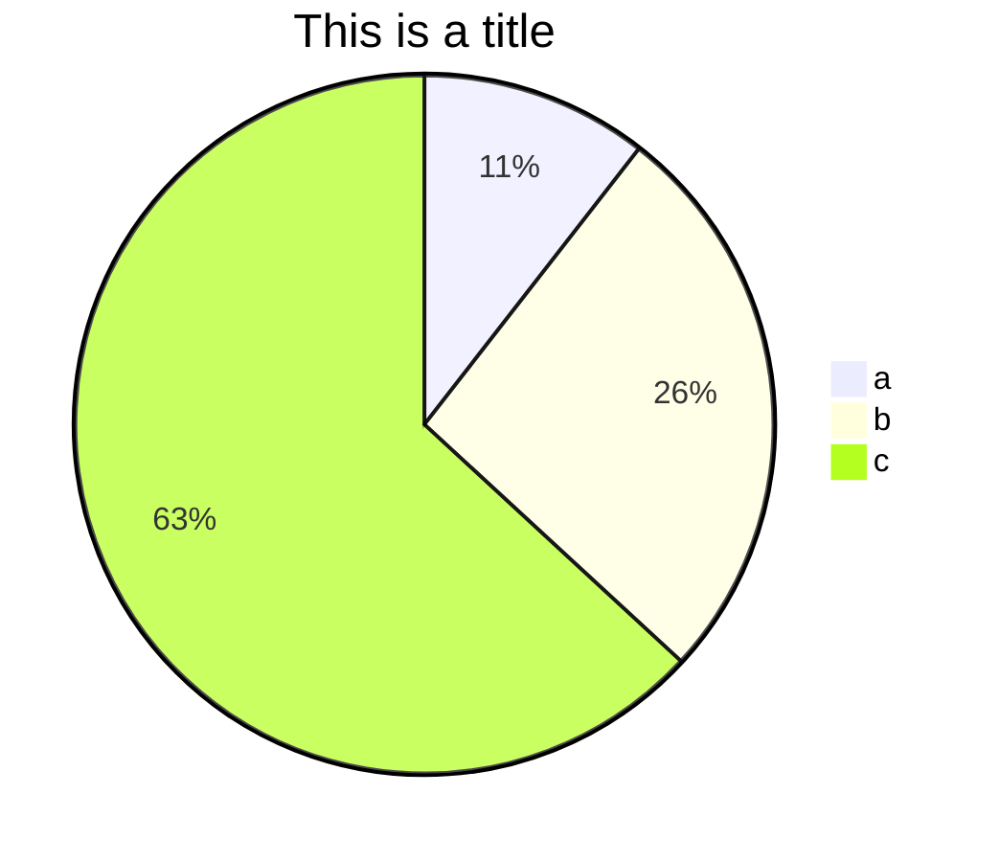
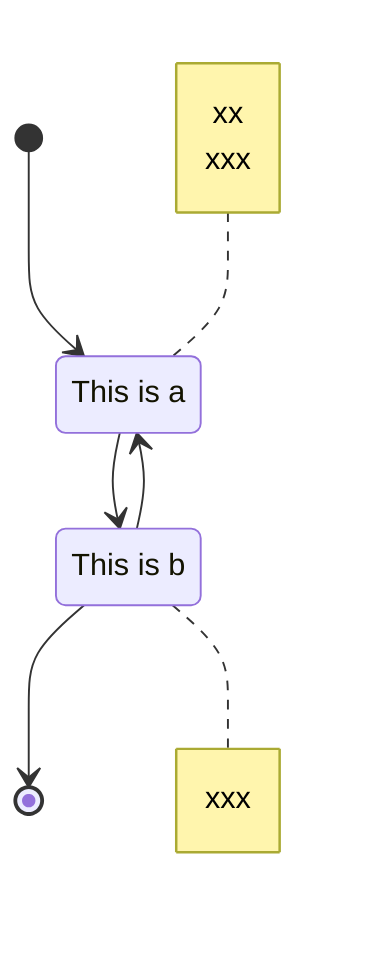
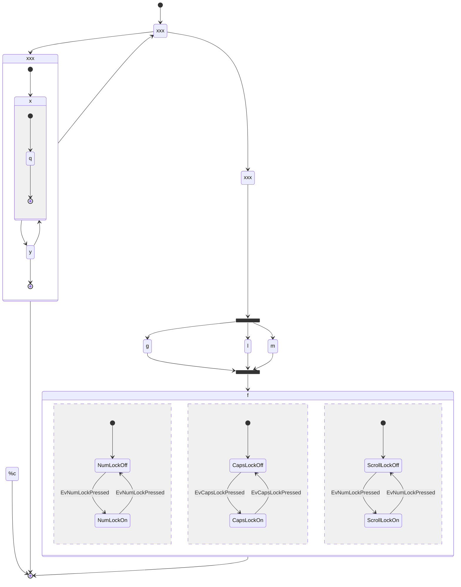
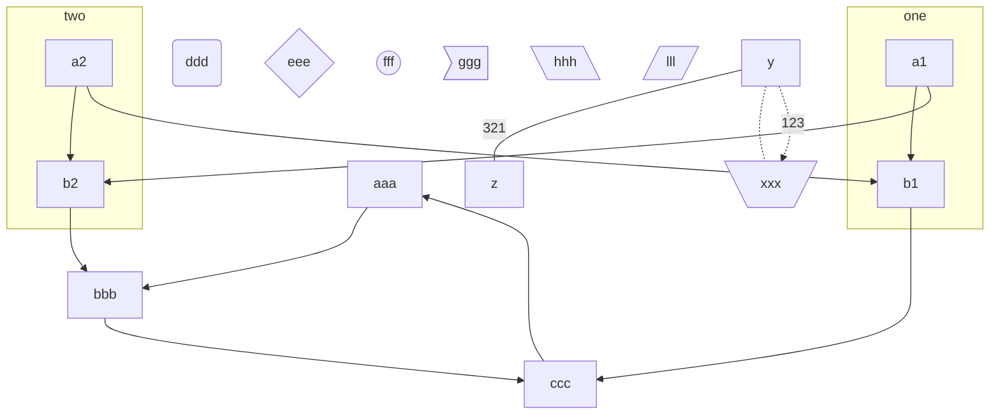

# Markdown富文本

## 二级标题

...

###### 最多六级标题


**`ctrl + ?` 查看源码**


**Black 黑体**

*Italic 斜体*

<u>Underline 下划线</u>

**<u>*混合使用*</u>**

~~删除线，你说我说的对吗~~


鲁迅曾说过：

> 他说：
>
> > 他说了什么呢？？？
> >
> > > 俺也不知道。
>
> 哈哈哈哈哈


**有序列表**

大象装进冰箱需要几步：

1. 打开冰箱门
2. 把大象放进去
3. 关闭冰箱门


**无序列表**

人类的本质是什么：

- 复读机
- 真香
- 豆瓣


1. 今天要上什么课
   - 数学
   - 语文
2. 明天要上什么课
   - 体育
     1. 乒乓球
     2. 篮球
     3. 足球
   - 体育


这是一段文字

---

这是另一端文字

+++

这又是一段文字

***


表格快捷键：

|  a   |    b | c    |
| :--: | ---: | :--- |
|  a   |    b | c    |
|  aa  |   bb | cc   |


网址：

https://www.baidu.com

<https://www.baidu.com>

隐藏网址：

[百度](https://www.baidu.com "https://www.baidu.com")


图片：

)


**链接：**
[百度][baidu]

[baidu]:https://www.baidu.com

**图片同理：**

![表单选择器][表单选择器]

[表单选择器]:F:\桌面\jQuery\表单选择器.png


这正如地上的路，其实地上本没有路，走的人多了，也便成了路。  [^luxun]
[^luxun]:xxx


这是一个普通文本

`这是一个代码块`

```python
# 只是一个代码块  python
```


**公式：**
$$
a+b+\frac{c}{d}
$$

$$
\iiiint{a+c*b}
$$


$$

$$


**画图：**

**饼图**




**状态图：**

- 状态图
- 节点的描述
- 笔记
- 子图
- 分支
- 并行






**流程图：**

- 流程图
- 形状
- 文字
- 子图




