# 一、MySQL简介

## 1. 介绍

### 1.1 什么是数据库？

​		数据库：Database，按照数据结构来组织、存储和管理数据的仓库，简单来说就是存储数据的仓库。

​		数据库管理系统：用来管理数据库的软件系统，常见：`MySQL`、 `Oracle`、` SQL Server`、`DB2`、`Access`、`Sybase` 等。

### 1.2 什么是MySQL

​		MySQL：是一个开源的 **`关系型`** 数据库管理系统，有瑞典MySQLAB公司开发，后来由Oracle收购，所以目前属于Oracle公司。

​		特点：体积小、速度快、成本低、开源，中小型网站都使用MySQL数据库。

​		版本：企业版Enterprise、社区版Community。

​		岗位：DBA --- Database Administrator  数据库管理员。


## 2. 安装MySQL

### 2.1 版本

​		分平台：Windows  Linux  Mac

​		分版本：5.x  6.x  7.x  8.x

### 2.2 安装

​		安装位置：/usr/local/mysql (Mac)

	文件夹 bin  可执行文件
  - data：数据库文件
  - my.cnf：核心配置文件 -- 对数据库进行配置修改。

### 2.3 服务

​		安装MySQL后，会在操作系统中添加一个MySQL服务。

​		需要先启动服务才能使用MySQL：(Mac)

		- 系统偏好设置 ---> MySQL
		- Automatically Start MySQL Server on Startup  ✔

Windows中这个服务是默认自动启动的，不需要像Mac一样手动。

```mysql
如果Windows中不小心关闭了MySQL服务，则：
		- win+R
		- services.msc
		- 找到mysql，启动即可
```


# 二、基本操作

## 1. 连接MySQL

​		语法：

```
mysql -u 用户名 -p密码 [-h 数据库服务器地址(ip地址) -D 数据库名字]
[]中括号里面的可以不写。
-h 用于远程操控数据库。
-D 用于操作指定数据库。
默认操作自己电脑上的数据库。
```

​		安装MySQL以后，默认有一个管理员 root，默认没有密码。（我自己设置的密码是：ROOTROOT）


## 2. 查看数据库和表

```mysql
show databases;   -- 查看当前所有的数据库
use 数据库名字;   -- use test; 使用数据库，切换数据库
show tables;   -- 查看当前数据库中所有的表(数据库中的所有数据都是以表的形式存储的)
select database();  -- 查看当前正在操作的是哪个数据库
select user();  -- 查看当前是以哪个用户登录的
exit;  -- 退出
show variables like 'character%';  -- 查看系统的字符集，用like通配符查看
```


------


------

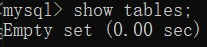

------

.jpg)

------

.jpg)

------

mysql库是系统库，包含MySQL的相关信息，不要修改。


## 3. 导入初始数据

### 3.1 导入数据

​		以 `.sql` 结尾的文件是数据库脚本文件。

​		先连接登录MySQL，然后执行如下命令：

```mysql
source 文件路径\文件.sql  -- 这是导入test数据库中了，因为正在操作test数据库。
```

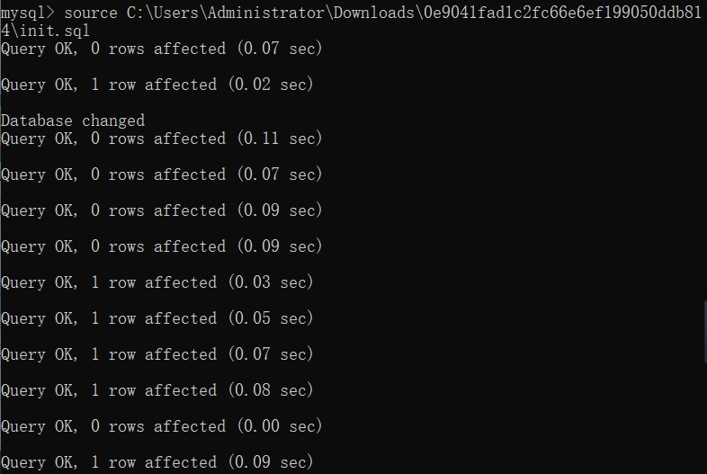


### 3.2 表结构

```mysql
desc 表名;  -- 查看表的结构
select * form 表名;  -- 从表里面查询所有信息
-- 表名不区分大小写
```

------

​		**` emp雇员表 `** 

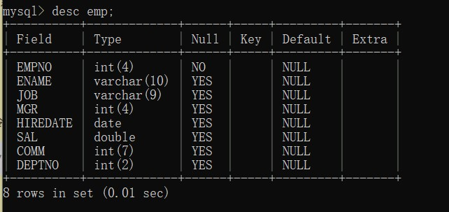

```mysql
varchar(n)  n个字符
int(n)  	n个整数
date	    日期
double(n)   n个双精度浮点型
```

------

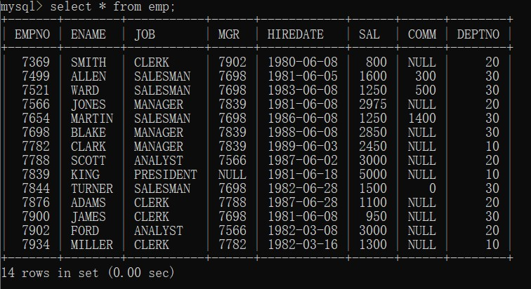

------

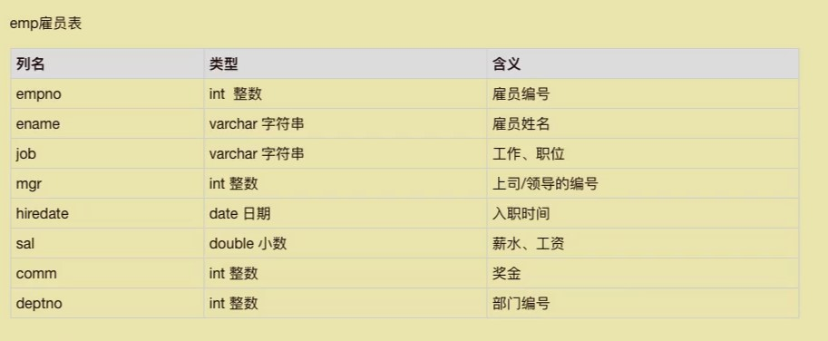

------

 		**`dept部门表`** 

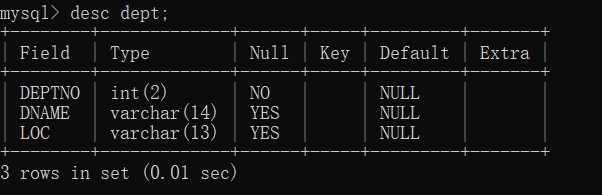

------

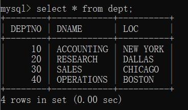

------

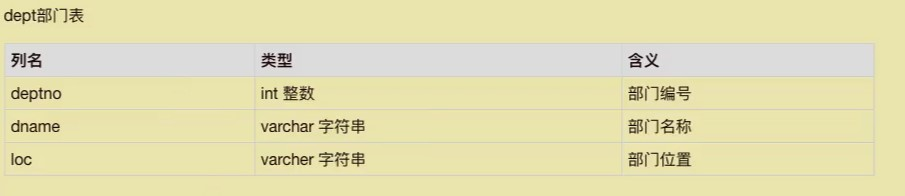

------

 		**`salgrade工资等级表`**

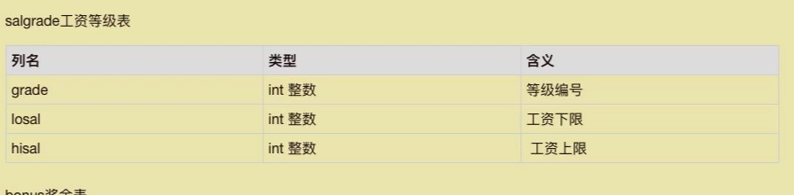


# 三、SQL

​		SQL: Structured Query Language   结构化查询语言，用来对数据库进行查询、更新、管理的一种特殊的语言。

​		包含三个部分：

   - DML : Data  Manipulation Language  数据操作语言。用于检索或更新数据库：
     			- insert 插入数据
          			- delete 删除数据
                			- update 修改数据
                           - select 查询数据
   - DDL : Data Definition Language  数据定义语言。用于定义数据的结构：
     			- create  新建表
          			- alter     修改表
                			- drop     删除表
   - DCL : Data Control Language  数据控制语言。用于定义数据库用户的权限：
     			- grant     授予权限
          			- revoke  撤销权限

# 四、查询操作

## 1. 简介

### 1.1 语法

```mysql
select 列名1[ 别名1],列名2[ 别名2],... from 表名;
-- 中括号内非必写，原名和别名要有空格隔开。
```

示例：

```mysql
select ename from emp; -- 查询一列
select ename,job from emp;  -- 查询两列
select * from emp; -- 查询所有列
select ename 姓名,job 职位, sal "your salary" from emp;   -- 别名中如果有空格的话，要用双引号引起来
-- 有中文的话也最好用双引号引起来
```

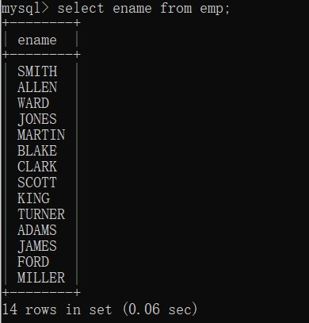

------

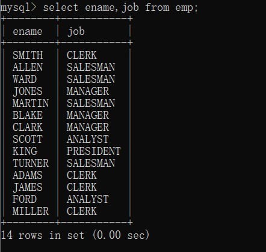

------

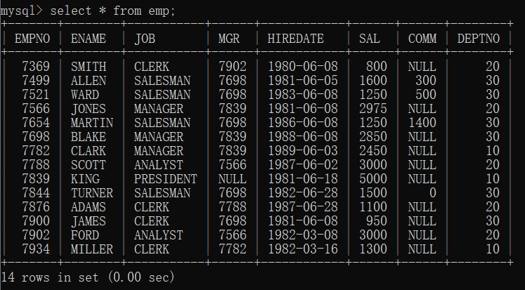

------

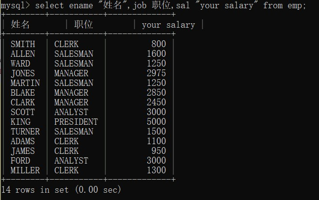


### 1.2 用法

- 字符串连接：concat()

  ```mysql
  select concat('编号为',empno,'的雇员，姓名为',ename,'，职位为',job) from emp;  -- 自己加的文字要用单引号引起来，查询的列名要用逗号分别隔开
  -- 注意分割的逗号不要漏写
  ```


- 四则运算  + - * %

  例：查询雇员的姓名及年薪

```mysql
select ename "姓名", sal*12 "年薪" from emp;
select ename "姓名", (sal+comm)*12 "年薪" from emp;  -- 有问题的，奖金comm可能为NULL
select ename "姓名",(sal+ifnull(comm,0))*12 from emp;   -- 处理NULL
```

在MySQL中，NULL与任何值进行运算，结果都是NULL。

ifnull(值1，值2)：对值1进行判断，如果是NULL，则把值1当做值2进行处理。


- 去重：使用关键字 `distinct` ，去除重复的列。

  例：查询所有职位。

```mysql
select distinct job from emp;
select distinct ename,job from emp;  -- 在去重时，只有当所有列都相同时才会去掉。
```

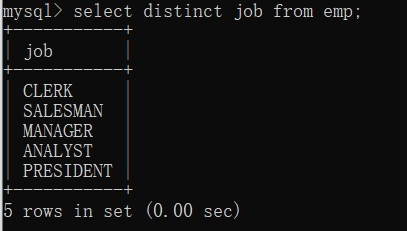


## 2. 限定查询

​		带有条件到的查询，称为限定查询。

语法：

```mysql
select 列名 
from 表名 
where 条件; -- 可换行写。
```

### 2.1 比较运算符

  `>,<,>=,<=,=,!=,<>` 

​		例：查询工资大于1500的雇员信息。

```mysql
select * from emp where sal>1500;
```

​		例：查询雇员的编号不是7369的雇员信息

```mysql
select * from emp where empno!=7369;
```

​		例：查询姓名是smith的雇员编号、工资、入职时间。

```mysql
select empno,sal,hiredate from emp where ename="smith"; -- 查询字符串，要用引号引起来。
```


### 2.2 null 或 not null

​		例：查询每个月可以获得奖金的雇员信息。

```mysql
select * from emp where comm is not null;
select * from emp where comm is null;
-- 在对null进行判断的时候，不能使用比较运算符，要用 is。
-- is 只用于对于 null 的判断。
```


### 2.3 and

​		例：查询基本工资大于1000，并且可以获得奖金的雇员信息。

```mysql
select * from emp where sal>1000 and comm is not null; -- and 等价于 &&
```


### 2.4 or

​		例：查询从事销售工作，或工资大于等于2000的雇员信息

```mysql
select * from emp where job='salesman' or sal>2000;
```


### 2.5 not

​		例：查询从事非销售工作并且工资不小于1500的雇员的编号、姓名、职位、工资、入职时间

```mysql
select empno,ename,job,sal,hiredate from emp where job  != 'salesman' and sal >= 1500;
-- 上下等价
select empno,ename,job,sal,hiredate from emp where not (job='salesman' or sal<1500);
-- -------------------------------------------------
select * from emp where not job='salesman' and sal>=1500;
```


### 2.6 between and

​		例：查询基本工资大于1500，但小于3000的雇员信息。

```mysql
select * from emp where sal>1500 and sal<3000;
select * from emp where sal between 1500 and 3000;  -- 1. [1500,3000] 这是个闭区间
 -- 2. 必须前面是小的，后面是大的，不能反着写。
```

​		例：查询1981年入职的雇员的编号、姓名、入职时间、所在部门的编号

```mysql
select empno,ename,hiredate,deptno from emp where hiredate between '1981-1-1' and '1981-12-31';
-- 字符串里面如果有数字，也会按照数字要求进行比较。
```


### 2.7 in 或 not in

​		例：查询编号为7369、7499、7788的雇员信息

```mysql
select * from emp where empno=7369 or empno=7499 or empno=7788;
select * from emp where empno in (7369,7499,7788);
```

​		例：查询姓名为smith、allen、king的雇员编号、姓名、入职时间。

```mysql
select empno,ename,hiredate from emp where ename in ('smith','allen','king');
```


### 2.8 like

用来进行模糊查询，需要结合通配符一起使用。

常用的通配符：

 - %  可以匹配任意长度字符

 - _   只能匹配单个字符

   ​	例：查询雇员姓名以S开头的雇员信息。

   ```mysql
   select * from emp where ename like 'S%';  -- like 后面的东西必须要用引号引起来。
   ```

   ​	例：查询雇员姓名中包含M的雇员信息。

   ```mysql
   select * from emp where ename like '%M%';
   ```

   ​	例：查询从事销售工作，并且姓名长度为4个字符的雇员信息。

   ```mysql
   select * from emp where job='salesman' and ename like '____';
   ```

   ​	例：查询1981年入职的雇员编号、姓名、入职时间、所在部门编号。

   ```mysql
   select empno,ename,hiredate,deptno 
   from emp 
   where hiredate like '1981%';
   ```


## 3. 排序

### 3.1 语法

​		语法：

```mysql
select 列名 
from 表名 
where 条件
order by 排序列1 ASC|DESC,排序列2 ASC|DESC,...;   -- 默认升序排列(ASC)，降序DESC
-- 先按照排序列1排序如果一样，则按照排序列2，以此类推。
```


### 3.2 示例

		1. 查询所有雇员信息，按工资由低到高排序。

```mysql
select * 
from emp
order by sal;
```

	2. 查询部门10的雇员信息，按工资由高到低排序，如果工资相同，则按入职时间由早到晚进行排序。

```mysql
select *
from emp
where deptno=10
order by sal desc,hiredate;
```

	3. 查询雇员编号、姓名、年薪，按年薪由高到低排序。

```mysql
select empno,ename,(sal+ifnull(comm,0))*12 income
from emp
order by income desc;
```


# 五、练习题

## 第一题

1.查看EMP表汇总部门号为10的员工的姓名、职位、参加工作时间、工资。

```mysql
select ename,job,hiredate,sal
from emp
where deptno=10;
```


## 第二题

2. 计算每个员工的年薪，要求输出员工姓名、年薪。

```mysql
select ename,(sal,ifnull(comm,0))*12 income
from emp
```


## 第三题

3. 显示第三个字符为大写R的所有员工的姓名及工资。

```mysql
select ename,sal
from emp
where ename like '__R%';
```


## 第四题

4. 显示有补助的员工的姓名、工资、补助。

```mysql
select ename,sal,comm
from emp
where comm is not null;
```


## 第五题

5. 查询姓名不包含M，且工资大于1500，或年薪不低于30000的雇员编号、姓名、工资、年薪，按雇员姓名降序排序。

```mysql
select empno,ename,sal,(sal+ifnull(comm,0))*12 years
from emp
where (ename not like '%M%') and (sal>1500 or (sal+ifnull(comm,0))*12 >=30000)
order by ename desc;  
-- 在 order by 可以用别名，在 where 不能用别名。
```


# 五、多表查询

## 1. 简介

​		同时从多张表中查询数据，一般来说，多张表之间都存在着某种关系。


## 2. 基本用法

### 2.1 语法

```mysql
select 列名1 别名1,列名2 别名2,...
from 表名1 别名1,表名2 别名2,...
where 条件
order by 排序列1 asc|desc,排序列2 asc|desc,...;
```

例：将emp和dept表进行夺标查询。（笛卡尔积）

```mysql
select * from emp,dept;
-- 将两个表的内容直接想成，表一m行，表二n行，则笛卡尔积m✖n行，即依次匹配。
```

​		通过将两张表的关联字段(deptno)进行比较，从而去掉笛卡尔积，夺标查询时，一般都会存在某种关联。

```mysql
select * from emp,dept where emp.deptno=dept.deptno;
```


### 2.2 示例

例：查询雇员编号、雇员姓名、工资、所在部门及位置。

```mysql
select empno,ename,sal,dname,loc
from emp,dept
where emp.deptno=dept.deptno;
```

例：查询雇员姓名、工资、入职时间、所在部门编号、部门名称。

```mysql
select ename,sal,hiredate,e.deptno,dname  -- 这个deptno在两个表都有，在查询的时候，需要加表的前缀，可以是简称。
from emp e,dept d   
where e.deptno=d.deptno;   -- 这种叫等值链接
```

例：查询雇员姓名、雇员工资、领导姓名、领导工资(自身连接)

```mysql
select e.ename '员工',e.sal '工资',m.ename '指数领导',m.sal '工资'
from emp e,emp m   -- e是用来筛选员工的，m是用来筛选领导的，这种叫自身链接
where e.mgr=m.empno;
```

例：查询雇员姓名、雇员工资、部门名称、领导姓名、领导工资。

```mysql
select e.ename '员工', e.sal '员工工资', d.dname '部门', m.ename '领导', m.sal '领导工资'
from emp e, emp m, dept d
where e.mgr=m.empno and e.deptno=d.deptno;
```

例：查询雇员名字、雇员工资、部门名称、工资所在等级(非等值连接)

```mysql
select e.ename, e.sal, d.dname, s.grade
from emp e, dept d, salgrade s
where e.deptno=d.deptno and e.sal between s.losal and s.hisal;
```

例：查询雇员姓名、雇员工资、部门名称、雇员工资等级、领导姓名、领导工资、领导工资等级

```mysql
select e.ename '员工', e.sal '员工工资', d.dname '部门', s1.grade '员工等级', m.ename '领导', m.sal '领导工资', s2.grade '领导等级'
from emp e, emp m, dept d, salgrade s1, salgrade s2
where e.deptno=d.deptno and (e.sal between s1.losal and s1.hisal) and (m.sal between s2.losal and s2.hisal) and e.mgr=m.empno;
```


## 3. SQL99标准

### 3.1 简介

 		SQL99标准，也称为SQL1999标准，是1999年制定的。

​		分类：内连接、外连接。


### 3.2 内连接

​		inner join ... on。

​		语法：

```mysql
select 列名1 别名1,列名2 别名2,...
from 表名1 别名1 inner join 表名2 别名2 on 多表的连接条件
where 条件
order by 排序列1 asc|desc,排序列2 asc|desc,...;
```

​		例：查询雇员编号、雇员姓名、工资、部门名称。

```mysql
select e.empno,e.ename,e.sal,d.dname
from emp e inner join dept d on e.deptno=d.deptno;
```

​		例：查询工资大于1500的雇员名称、工资、部门名称、领导姓名。

```mysql
select e.ename '员工姓名',e.sal '员工工资', d.dname '部门', m.ename '领导'
from emp e inner join dept d on e.deptno=d.deptno inner join emp m on e.mgr=m.empno
where e.sal>1500;
```


### 3.3 外连接

​		分类：

   - 左外连接  left outer join ... on，也称为左连接 left join ... on

     				- 以左边的表作为主表，无论如何都会显示主表中的所有数据。

   - 右外连接 right outer join ... on，也称为右连接 right join ... on

        - 以右边的表作为主表，无论如何都会显示主表中的所有数据。

     ​	语法：

     ```mysql
     select 列名1 别名1,列名2 别名2,...
     from 表名1 别名1 left join 表名2 别名2 on 多表的连接条件
     where 条件
     order by 排序列1 asc|desc,排序列2 asc|desc,...;
     ```

     例：查询雇员姓名、工资、领导姓名、领导工资

     ```mysql
     select e.ename,e.sal,m.ename,m.sal
     from emp e, emp m
     where e.mgr=m.empno; -- 有问题：King没有
     ```

     ```mysql
     select e.ename,e.sal,m.ename,m.sal
     from emp e inner join emp m on e.mgr=m.empno;
     -- 有问题：King没有
     ```

     ```mysql
     select e.ename, e.sal, m.ename, m.sal
     from emp e left join emp m on e.mgr=m.empno;
     -- 左连接，解决NULL问题，以左边的表为主。
     ```

     ```mysql
     select e.ename,e.sal,m.ename,m.sal
     from emp m right join emp e on e.mgr=m.empno;
     -- 以右边的表为主，和左连接功能一样，只是表的顺序换了一下。
     ```

     例：查询部门编号、部门名称、部门位置、部门中雇员名称、工资

     ```mysql
     select e.deptno,d.dname,d.loc,e.ename,e.sal
     from dept d left join emp e on d.deptno=e.deptno;
     ```


# 六、聚合函数和分组统计

## 1. 聚合函数

​		聚合函数，也称为统计函数。

​		常用聚合函数：

				- count()：求总数量
				- max()：最大值
				- min()：最小值
				- avg()：平均值
				- sum()：和

例：查询部门30的总人数

```mysql
select count(empno)
from emp
where deptno=30;  -- 如果有同名，count也不会当做一个人算
```

注：聚合函数在统计时，会忽略null值，但不会忽略同名值，所以在使用聚合函数时，一般用不会有null值的列作为统计列。

例：查询所有员工的工资

```mysql
select max(sal) from emp; -- 求工资最大值
select sum(sal) from emp; -- 求工资总和
select avg(sal) from emp where deptno=10; -- 求部门10的平均工资。
-- --------------------------------------------------
select ename,avg(sal) from emp where deptno=10; -- 查询需求不合理，既计算平均工资，又要输出对应人名。
-- --------------------------------------------------
select max(sal),min(sal),round(avg(sal),2) from emp;
-- round(a,b) 对数字a保留b位小数
```


## 2. 分组统计

### 2.1 语法

```mysql
select 列名1 别名1,列名2 别名2,...
from 表名1 别名1 left join 表名2 别名2 on 多表的连接条件
where 条件  -- 分组前的条件
group by 分组列
having 条件 -- 用来指定分组后的条件
order by 排序列1 asc|desc,排序列2 asc|desc,...; 
```


### 2.2 示例

例：查询每个部门的平均工资

```mysql
select deptno, round(avg(sal),2)
from emp
group by deptno;
```

```mysql
select dname, round(avg(sal),2)
from emp e,dept d
where e.deptno=d.deptno
-- group by e.deptno;
group by d.dname;
```

**注：**

- 在MySQL中，分组统计时，可以查询出分组列以外的其他列的，而在Oracle中不行，因为在其他数据库中，根据什么分组，就只能找出相应的列。
- 建议将要查询出的列作为分组列。

例：查询部门的名称及每个部门的员工数量

```mysql
select d.dname, count(e.empno)
from dept d left join emp e on d.deptno=e.deptno
group by d.dname; -- 使用左连接，避免统计的时候，忽略了部门人数为0的
```

例：查询平均工资大于2000的部门的编号和平均工资

```mysql
select deptno,round(avg(sal),2)
from emp
group by deptno
having avg(sal)>2000;
```

例：查询出非销售人员的职位名称，以及从事同一工作的雇员的月工资总和，并且要满足工资总和大于5000，查询的结果按月工资总和的升序排列。

```mysql
select job, sum(sal) sum
from emp
where job!='salesman'
group by job
having sum(sal)>5000
order by sum;
```

例：查询部门平均工资的最大值

```mysql
select max(avg(sal)) -- MySQL中不支持
from emp
group by deptno
```

注：在MySQL中聚合函数不能嵌套使用，而在Oracle中可以。

```mysql
select max(avg)
from (select avg(sal) avg 
    from emp 
    group by deptno) temp
```


# 七、子查询

## 1. 简介

​		一个查询中嵌套着另一个查询，称为子查询。

- 子查询必须放在小括号(表示一个整体)中。
- 子查询可以出现在任意位置，如：select、from、where、having等。


## 2. 基本用法

### 2.1 语法

```mysql
select (子查询) 别名
from where (子查询) 别名
where (子查询)
group by
having (子查询)
```


### 2.3 示例

例：查询工资比7566高的雇员信息

```mysql
-- 使用多表连接
select m.*
from emp e,emp m
where e.empno=7566 and e.sal<m.sal;
```

```mysql
-- select sal from emp where empno=7566;
-- 使用子查询
select *
from emp
where sal>(select sal from emp where empno=7566);
```

例：查询工资比部门30员工的工资高的雇员信息。

```mysql
select sal from emp where deptno=30;
select * from emp where sal>(select sal from emp where deptno=30); -- 错误用法
```

**<u>注：子查询与比较运算符一起使用时，必须保证子查询返回的结果不能多于一个。</u>**

例：查询雇员的编号、姓名、部门名称

```mysql
-- 使用多表连接
select e.empno,e.ename,d.dname
from emp e,dept d
where e.deptno=d.deptno;
```

```mysql
-- 子查询
select empno,ename, 
(select dname from dept where deptno=emp.deptno) '部门'
from emp;
```

**<u>总结：</u>**

- 一般来说，多表连接查询都可以使用子查询替换，但有的子查询不能使用多表连接来替换。
- 子查询特点：灵活、方便，一般作为增、删、改、查的条件，适合于操作一个表的数据。
- 多表连接查询更适合于从多表中查看数据。


## 3. 子查询分类

​		可以分为三类：

- 单列子查询：返回单行单列，使用频率最高。
- 多行子查询：返回多行单列
- 多列子查询：返回单行多列或多行多列


### 3.1 单列子查询

​		例：查询工资比7654高，同时又与7900从事相同工作的雇员信息。

```mysql
select *
from emp
where sal>(
	select sal from emp where empno=7654
) and job=(
	select job from emp where empno=7900
); -- 单行单列
```

​		例：查询工资最低的雇员的姓名、工作、工资

```mysql
select ename,job,sal
from emp
where sal=(
	select min(sal) from emp
);
```

​		例：查询工资高于公司平均工资的雇员信息

```mysql
select * 
from emp
where sal>(
	select avg(sal)
    from emp
);
```

​		例：查询每个部门的编号和最低工资，要求最低工资大于等于部门30的最低工资。

```mysql
select deptno,min(sal)
from emp
group by deptno
having min(sal)>=(
	select min(sal)
    from emp
    where deptno=30
) and deptno!=30;
```

​		例：查询部门的名称、员工数、平均工资、最低收入雇员的姓名。

```mysql
-- 拆分
select dname,count(empno),avg(sal),min(sal)
from emp e
group by deptno;
```

```mysql
-- 方法1：使用子查询
select (
		select dname from dept where deptno=e.deptno
	) dname,
	count(empno),
	round(avg(sal),2),
	(
        select ename from emp where sal=min(e.sal)
    ) minName
from emp e
group by deptno;
```

```mysql
-- 方式2：使用多表连接查询
select d.dname,t.count,round(t.avg,2) avg,e.ename
from (
		select deptno,count(empno) count,avg(sal) avg,min(sal) min
    	from emp
    	group by deptno
	) t, dept d, emp e
where d.deptno = t.deptno and e.sal = t.min;
```

​		例：查询平均工资最低的工作及平均工资。

```mysql
-- 拆分
-- 第一步
select avg(sal)
from emp
group by job;

-- 第二步
select min(t.avg)
from (select avg(sal) avg
from emp
group by job) t;

-- 第三步
select job, avg(sal)
from emp
group by job
having avg(sal) = 
	(
    select min(t.avg)
	from 
     	(select avg(sal) avg
		from emp
		group by job) t
    );
```


### 3.2 多行子查询

​		对于多行子查询，可以使用如下三种操作符：

- in：在内部。

  例：查询所在部门编号大于等于20的雇员信息。

  ```mysql
  -- 方法1：直接找
  select * from emp where deptno >= 20;
  
  -- 方法2：先找到大于等于20的部门，然后用in找在这个范围内的。
  select * from emp where deptno in (select deptno from emp where deptno>=20);
  ```

  例：查询工资与部门20中的任意员工相同的雇员信息

  ```mysql
  select *
  from emp
  where sal in (select sal from emp where deptno=20) and deptno!=20;
  ```

- any：任意。

  三种用法：

  ```mysql
  -- =any:与任意一个相同即可，此时与in操作符的功能一样。
  -- >any:只要比这里面最小的值大即可。
  -- <any:只要比这里面最大的值小即可。
  ```

  ```mysql
  -- =any
  select *
  from emp
  where sal =any (select sal from emp where deptno=20);
  ```

  ```mysql
  -- >any
  select *
  from emp
  where sal >any (select sal from emp where deptno=20);
  ```

  ```mysql
  -- <any
  select *
  from emp
  where sal <any (select sal from emp where deptno=20);
  ```

- all：全部，所有。

  两种用法：

  ```mysql
  -- >all:比里面最大的值大。
  -- <all:比里面最小的值小。
  ```

  ```mysql
  -- >all
  select *
  from emp
  where sal >all (select sal from emp where deptno=20);
  ```

  ```mysql
  -- <all
  select *
  from emp
  where sal <all (select sal from emp where deptno=20);
  ```


### 3.3 多列子查询

​		一般出现在from子句中，作为查询结果集。

例：在所在从事销售工作的雇员中找出工资大于1500的员工信息

```mysql
select *
from (
	select * from emp where job='salesman'
) t
where t.sal>1500;
```


## 4. 练习题

例：列出与“SMITH”从事相同工作的所有员工及部门名称。

```mysql
-- 找到smith的工作
select job from emp where ename='smith';

-- 找到与smith相同工作的员工
select e.*,d.dname
from emp e,dept d
where e.deptno=d.deptno and e.job=(select job from emp where ename='smith');
```

例：列出薪金等于部门30中庺的薪金的所有员工的姓名和薪金。

```mysql
select ename,sal from emp where sal in (select sal from emp where deptno=30);
```

例：列出薪金高于部门30所有员工薪金的员工姓名、薪金和部门名称。

```mysql
select e.ename,e.sal,d.dname
from emp e,dept d
where e.deptno=d.deptno and e.sal >all (select sal from emp where deptno=30);
```

例：列出在每个部门工作的员工数量和平均工资。

```mysql
-- round() 默认保留整数
select count(empno),round(avg(sal))
from emp
group by deptno;
```

例：列出所有员工的姓名、部门名称、工资

```mysql
select e.ename,d.dname,e.sal
from emp e left join dept d
on e.deptno=d.deptno;
```

例：列出所有部门的详细信息和部门人数

```mysql
-- 找出每个部门的人数
select deptno,count(empno) from emp group by deptno;

select d.*,count
from dept d left join (select deptno,count(empno) count from emp group by deptno) temp
on d.deptno=temp.deptno;
```

例：列出每种工作的最低工资以及从事此工作的雇员姓名。

```mysql
select job,min(sal) from emp group by job;

select e.ename,e.job,e.sal
from emp e,(select job,min(sal) min from emp group by job) t
where e.sal = t.min
```

例：列出所有员工的年工资，按年薪从低到高排序。

```mysql
select ename,(sal+ifnull(comm,0))*12 yearSal from emp order by yearSal asc;
```

例：查询雇员的领导信息，要求领导的薪水要超过3000

```mysql
-- distinct 去重
select distinct m.*
from emp e,emp m
where e.mgr=m.empno and m.sal>3000;
```

例：求出部门名称中，带'S'字符的部门员工的工资总和、部门人数。

```mysql
select d.dname,sum(e.sal) sum,count(e.empno) count
from emp e,dept d
where e.deptno=d.deptno and d.dname like '%S%'
group by d.dname;
```


# 八、分页查询

## 1. limit关键字

​		用来限制查询返回的记录数。

​		**语法：**

```mysql
select 列名1 别名1,列名2 别名2,...
from 表名1 别名1 left join 表名2 别名2 on 多表的连接条件
where 条件  -- 分组前的条件
group by 分组列
having 条件 -- 用来指定分组后的条件
order by 排序列1 asc|desc,排序列2 asc|desc,...
limit [参数1,]参数2 -- 参数1可省略(默认值0)。
```

可以接受一个或两个参数。

- 参数1用来指定起始行的索引，索引从0开始数，即第一行的索引为0。
- 参数2用来指定返回的记录数量。

例：查询工资的前三名。

```mysql
select * from emp order by sal desc limit 0,3;
select * from emp order by sal desc limit 3;
```

例：查询工资大于1000的第4-8个用户。

```mysql
select * from emp where sal>1000 limit 3,5;
```

例：查询工资最低的用户。

```mysql
select * from emp order by sal limit 1;
select * from emp where sal= (select distinct min(sal) from emp);
```


## 2. 分页

例：每页显示4条（pageSize 每页大小），显示第3页内容（pageIndex 页码）。

```mysql
-- 第某页的第一个的下标，就是上一页最后一个的编号
select * from emp limit (pageIndex-1)*pageSize,pageSize;
-- 不能直接执行
```

注：在 **`MySQL`** 中limit后面的参数不能包含任何运算，可以在别的语言中执行这种运算，然后把最终结果发给 **`MySQL`** 即可。


# 九、常用函数

## 1. 字符串函数

- concat(s1,s2,s3,...)：拼接所传入的字符串

  ```mysql
  select concat('aa','bb','cc') concat;   
  -- 后方可以不跟其他关键字。
  ```

  ```mysql
  select concat('aa') concat from dual; 
  -- dual表，是mysql提供的虚拟的表。
  ```

  注：dual表是mysql中提供的虚拟表，一般用来做测试用，为了满足 select ... from ... 语法习惯。每种数据库都有提供虚拟表。

  ```mysql
  select concat('编号为',empno,'的员工，姓名为：',ename) '员工基本信息'
  from emp;
  ```

- lower(s)：将字符串变为小写。

  ```mysql
  select lower('Hello');
  select lower(ename) from emp;
  ```

- upper()：把字符串变为大写。

  ```mysql
  select upper('Hello');
  ```

- length(s)：获取字符串长度。

  ```mysql
  select length('hello');
  ```

  

- reverse(s)：翻转字符串。

  ```mysql
  select reverse('hello');
  ```

- trim(s)：去掉两头的空格。

  ```mysql
  select trim('   Hello  ');
  -- ltrim()：去除左边的空格
  -- rtrim()：去除右边的空格
  ```

- replace(s,s1,s2)：将字符串s中的s1替换成s2。

  ```mysql
  select replace('helloWorld','o','xx');
  ```

- repeat(s,n)：将字符串s重复n次。

  ```mysql
  select repeat('hello ',3) from dual;
  ```

- lpad(s,len,s1)：在字符串s的左边使用s1进行填充，直至填充长度为len。

  ```mysql
  select lpad('hello',8,'Hh');
  -- rpad():在右边进行填充。
  ```

- substr(s,i,len)：从第i个位置开始对字符串s进行截取，截取len个。

  ```mysql
  select substr('hello',2,3) from dual;
  ```


## 2. 数值函数

- ceil(n)：对数字n向上取整。

  ```mysql
  select ceil(10.11);
  ```

- floor(n)：对数字n向下取整。

  ```mysql
  select floor(10.11);
  ```

- round(n,m)：将n保留m位小数，四舍五入。 

  ```mysql
  select round(3.121435,5);
  ```

- truncate(n,m)：将n保留m位小数，但是直接切掉多余部分。

  ```mysql
  select truncate(3.121435,5);
  ```

- rand()：返回0到1之间的随机数。

  ```mysql
  select rand();
  ```

  

## 3. 日期和时间函数

- now()：返回当前日期时间。

  ```mysql
  select now();
  ```

- curdate()：返回当前日期。

  ```mysql
  select curdate();
  ```

- curtime()：返回当前时间。

  ```mysql
  select curtime();
  ```

- year(date)：返回date日期中的年。

- month(date)、day(date)、hour(date)、minute(date)、second(date)   和Year用法一样。

  ```mysql
  select year('2018-8-12');
  select month('2018-8-22');
  select day('2018-8-22');
  ```

- timestampdiff(interval,datetime1,datetime2)：返回两个日期时间之间相隔的整数，单位由interval定义。

  - interval可取值：year、month、hour、minute、second

    ```mysql
    select timestampdiff(day,'1999-04-25',now());
    select timestampdiff(year,'1999-04-25',now());
    ```

- date_format(date,pattern)：格式化日期。

  - 格式化参数pattern：
    - %Y 表示四位数字的年份。
    - %m 表示两位数字的月份。
    - %d 表示两位数字的日。
    - %H表示两位数字的小时，24小时制（%h 12小时制）。
    - %i 表示两位数字的分钟。
    - %s 表示两位数字的秒数。

  ```mysql
  select date_format(now(),'%m月%d日%Y %H:%i:%s') from dual;
  ```

  

## 4. 流畅控制函数

- if(f,v1,v2)：如果f为真，则返回v1，否则返回v2。

  ```mysql
  select if(5>2,'Y','N');
  ```

- ifnull(v1,v2)：如果v1不为null，则返回v1，否则返回v2。

  ```mysql
  select ifnull(null,0) from dual;
  ```

- case when  f1 then v1 when f2 then v2 ... else v end：如果f1为真，则返回f1，结束；否则判断f2，依次类推，直到其中一个为真，或走到else，结束。

  ```mysql
  select case when 5<2 then 'yes' end from dual; -- NULL
  select case when 5<2 then 'yes' else 'no' end; -- no
  ```


## 5. 系统信息函数

- database()：返回当前正在操作二点数据库。

  ```mysql
  select database();
  ```

- user()：返回当前登录的用户。

  ```mysql
  select user();
  ```

- version()：返回MySQL数据库的版本。

  ```mysql
  select version();
  ```


## 6. 练习题

1. 以首字母大写，其他字母小写的方式，显示所有员工的姓名。

   ```mysql
   select concat(upper(substr(ename,1,1)),lower(substr(ename,2,length(ename)-1))) ename
   from emp;
   ```

2. 将员工的职位用小写字母显示。

   ```mysql
   select ename,lower(job) from emp;
   ```

3. 显示员工姓名超过5个字符的员工名。

   ```mysql
   select ename from emp where length(ename)>5;
   ```

4. 用#来填充员工职位job的结尾处，按10个字符长度输出。

   ```mysql
   select ename,rpad(job,10,'#') from emp;
   ```

5. 去除字符串 '   hello world  '  两边的空格，并将单词间的看空格改为','逗号。

   ```mysql
   select replace(trim('   hello world  '),' ',',');
   ```

6. 以指定格式显示员工的奖金（格式：allen's comm is 300）注：如果奖金为null显示null，如：smith's comm is null。

   ```mysql
   select concat(ename,'''s comm is ',ifnull(comm,'null')) from emp;
   -- ' 单引号表示转义字符。
   ```

7. 显示在一个月为30天的情况下所有员工的日薪，忽略余数。

   ```mysql
   select ename,round(sal/30) daySal from emp;
   ```

8. 显示员工在此公司工作了几个月。

   ```mysql
   select ename,timestampdiff(month,hiredate,now()) months from emp;
   -- 计算从入职到现在一共相差多少月份，timestampdiff(interval,time1,time2)
   ```

9. 显示所有12月份入职的员工。

   ```mysql
   select * from emp where month(hiredate) = 12;
   -- month(date):取出他的月份。
   ```

10. 显示员工的年薪。

    ```mysql
    select ename,(sal+ifnull(comm,0))*12 yearSal from emp;
    ```

11. 显示所有员工的姓名、加入公司的年份和月份，并且按照年份升序排列。

    ```mysql
    select ename,year(hiredate) year,month(hiredate) month from emp order by year;
    ```

12. 求部门名称中带 ”s“ 字符的部门员工的工资合计、部门人数。

    ```mysql
    select * from dept where dname like "%s%";
    
    select e.deptno,sum(e.sal) sumSal,count(e.empno) sumPeople
    from emp e,(select * from dept where dname like "%s%") t
    where e.deptno = t.deptno
    group by e.deptno;
    ```

13. 查询任职日期超过30年的员工，显示时将月薪加10%后显示。

    ```mysql
    select ename,round(sal*(1+0.1)) sal 
    from emp 
    where timestampdiff(year,hiredate,now())>30;
    ```

    

# 十、更新操作

## 1. 添加数据 insert

​		**语法：**

```mysql
-- 语法1：一次插入一个值。
insert into 表名 (列名1,列名2,...) values (值1,值2,...) -- 值和列名一一对应。
-- 语法2：一次性插入多个值。
insert into 表名 (列名1,列名2,...) values (值1,值2,...),(值1,值2,...),(值1,值2,...)
```

​		**示例：**

```mysql
insert into dept (deptno,dname,loc) values (50,'CBA','Beijing');
-- ---------------------------------------------------------------
insert into dept (deptno,dname) values (60,'ABABAB'); -- 没插入的值默认为NULL。
-- ---------------------------------------------------------------
insert into dept values (70,'Clean','Shanghai'); -- 如果是依次插入表中的所有列，则可以省略列名。
-- ----------------------------------------------------------------
insert into dept 
	values (11,'aaa','aaa'),
		   (22,'bbb','bbb'),
		   (33,'ccc','ccc'); -- values只需要有一个。
-- ----------------------------------------------------------------
insert into emp (empno,ename,job,hiredate,sal,deptno) values (9527,'Yoxi','painter','2020-08-30',2222,50);
```


## 2. 删除数据 delete

​		**语法：**

```mysql
delete from 表名 where 条件
```

​		**示例：**

```mysql
delete from dept where deptno=60;
delete from dept where dname='clean';
delete from emp where deptno=50 and sal>2000;
-- 需求：删除'CBA'部门所有工资大于5000的员工。
select deptno from dept where dname='CBA';
delete from emp where deptno=(select deptno from dept where dname='CBA') and sal>5000; 
```

注：`delete from emp` 这个语句会将表中所有数据全部删除。


## 3. 修改数据 update

​		**语法：**

```mysql
update 表面 set 列名1=值1,列名2=值2,... where 条件 -- 如果不加条件，则会把里面所有的数据都改成指定值。
```

​		**示例：**

```mysql
update dept set dname='Science' where dname='CBA';
update emp set job='manager',sal=8888 where ename='smith';
```


# 十一、表和库的管理

## 1. 数据类型

​		整数：smallint、int、bigint
​		小数：float、double  精度不一样。
​		日期时间：date(日期)、time(时间)、datetime(时间日期)、timestamp(时间戳：就是一个时间到另一个时间的时间段)
​		字符串：varchar(10)、char(10) 、text 【varchar空间是可变的（最多10个），char是不可变的（直接10个），前者时间换取空间，后者空间换取时间。】
​		其他：clob  存储文本大数据。
​					blob 存储二进制大数据 。


## 2. 创建表

​		**语法：**

```mysql
create table 表名
(
	列名1 数据类型 [特征],
    列名2 数据类型 [特征],
    ...
    列名n 数据类型 [特征]
)charset=utf8;

-- 特征：[primary key]、[auto_increment]、[not null]、[default 'XX']、[charset=XXX]

-- 查看表的结构。
desc 表名;
```

​		**示例：**

```mysql
create table t_user
(
	id int,
    username varchar(10),
    password varchar(50)
);
```

```mysql
create table t_student
(
	id int primary key auto_increment, 
    -- 主键列，不可为空，不可重复，唯一标识。
    -- auto_increment 自动+1，默认从1开始。
    name varchar(10) not null, -- 不允许为空。
    age int,
    sex varchar(8) not null default '女', -- 不可为空，默认值为女。
    address varchar(100),
    height double,
    birthday date
)charset=utf8; -- 设置字符集为utf-8
```

```mysql
insert into t_student (name,age,sex,height,birthday) values ('Tom',18,'女',180.5,'1998-05-05');

insert into t_student (name,age,height,birthday) values ('Jack',18,180.5,'1999-05-05');

insert into t_student (name,age,birthday) values ('',18,'1998-05-15');

insert into t_student values (null,"DuDu",18,'M','SiChuan',188.8,'1988-5-6'); -- id因为是自动增长的，所以这里写一个null进行补位，在添加进去后他就会自动增长。
```


## 3. 修改表

- **添加列  add ** 

  ​	**语法：**

  ```mysql
  alter table 表名 add 列名 数据类型
  ```

  ​	**示例：**

  ```mysql
  alter table t_student add weight double;
  ```

- **修改列类型  modify** 

  ​	**语法：**

  ```mysql
  alter table 表名 modify 列名 数据类型
  ```

  ​	**示例：**

  ```mysql
  alter table t_student modify name varchar(20);  -- 改一个类型大小的时候，最好往大了改，防止有的内容溢出报错。
  ```

- **修改列名  change**

  ​	**语法：**

  ```mysql
  alter table 表名 change 原列名 新列名 数据类型;
  ```

  ​	**示例：**

  ```mysql
  alter table t_student change sex gender varchar(6);
  ```

- **删除列  drop**

  ​	**语法：**

  ```mysql
  alter table 表名 drop 列名;
  ```

  ​	**示例：**

  ```mysql
  alter table t_student drop weight;
  ```

- **修改表名  rename**

  ​	**语法：**

  ```mysql
  alter table 原表名 rename 新表名;
  或
  rename table 原表名 to 新表名;
  ```

  ​	**示例：**

  ```mysql
  alter table t_student rename student;
  rename table student to t_student;
  ```


## 4. 销毁删除表  drop

​		**语法：**

```mysql
drop table 表名;  -- 如果没有这个表，则会报错。

drop table if exists 表名; -- 如果表存在，则删除，不存在则不删除，这样就不会报错了。
```

​		**示例：**

```mysql
drop table t_user;
drop table if exists t_user;
```


## 5. 截断清空表  truncate

​		清空表中的数据，作用类似于没有条件的delete语句 **`delet from emp`**  。

​		**语法：**

```mysql
truncate table 表名;
```

​		**示例：**

```mysql
truncate table t_student;
```

`delete`与`truncate`的区别：

- `delete`删除会记录日志，速度较慢；而`truncate`不记录日志，是直接清空。

- `delete`删除的东西，可以根据日志找回来；`truncate`删除二点东西是找不回来的。

- `delete`可以指定条件，只删除表中部分数据；`truncate`只能用来清空所有数据。

- `delete`不会将自动增长列归零，而`truncate`会。

  ​																				**delete from**

  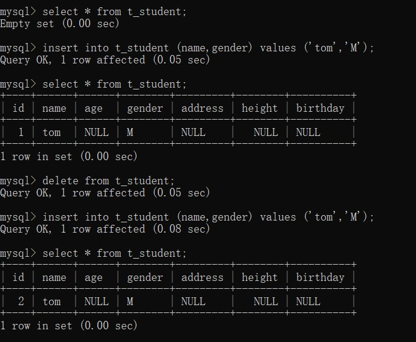

  ------

  ​																				**truncate table**

  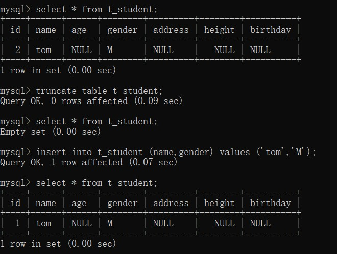


## 6. 创建数据库

​		**语法：**

```mysql
create database 数据库名 [charset utf8]; -- 字符据可加可不加。数据库如果已经存在，则会报错。

create database if not exists 数据库名 charset utf8; -- 防止因为存在而报错。
```

​		**示例：**

```mysql
create database shop charset utf8;
create database if not exists shop charset utf8;
```


## 7. 删除数据库

​		**语法：**

```mysql
drop database 数据库名;
```

​		**示例：**

```mysql
drop database shop;
drop database if exists shop;
```


# 十二、约束

## 1. 简介

​		**`constraint  约束关键字`** ：是对表中数据的一种限制，目的是保证数据的完整性和有效性。


## 2. 约束分类

​		有五种约束：

- 主键约束：primary key     用来唯一的表示一条记录（数据），本身不能为空。
- 唯一约束：unique     确保每一个值都是唯一的，无重复值。 **`注：MySQL会对check约束进行分析，但会忽略check约束，即不会强制执行此约束，可以通过其他语言的编程来截住非法数据，则到不了数据库（其他数据库如Oracle不会忽略）`** 
- 检查约束：check    判断数据是否符合指定的条件或要求。
- 非空约束：not null     不允许为null。(null≠空字符串)
- 外键约束：foreign key     约束两表之间的关联关系。这个关键字要跳行写，不能写在列名后面。 **`注：foreign key (列) references 表.列   指列引用的表.列，是这个表的外键`**


## 3. 添加约束

- **方式1：在创建表时，添加约束。**

  ```mysql
  -- 约束没有名字，使用的系统自己默认的名字
  create table student  -- 学生表
  (
  	id int primary key,  -- 主键约束
      name varchar(10) not null,  -- 非空约束
      age int check(age between 1 and 120),   -- 检查约束
      sex varchar(8) not null check(sex in ('Male','Female')),   -- 多个约束
      IDCard varchar(18) unique, -- 唯一约束
      class_id int,  -- 外键列
      foreign key (class_id) references class(c_id)   -- 外键约束，引用主表中的主键 
  )charset utf8;
  ```

  ```mysql
  create table class   -- 班级表
  (
  	c_id int primary key,
      c_name varchar(10) not null,
      c_info varchar(200)
  )charset utf8;
  ```

  查看表的所有信息（约束）：

  ```mysql
      show create table 表名;
  ```

  ``` mysql
  -- 为约束指定名称
  -- 除了非空约束保留，其他的单独末尾加。
  -- 给约束重新起名字后，在报错后，看到自己起的名字，就很容易锁定错误在哪儿。
  create table student  -- 学生表
  (
  	id int,  
      name varchar(10) not null,
      age int,
      sex varchar(8) not null,
      IDCard varchar(18),
      class_id int,
      constraint pk_id primary key (id), -- 将id设置为主键，pk_id是主键的一个新名字
      constraint ck_age check (age between 1 and 120),
      constraint ck_sex check (sex in ('Male','Female')),
      constraint up_IDCard unique (IDCard),
      constraint fk_class_id foreign key (class_id) references class(c_id)
  )charset utf8;
  ```

- **方式2：在创建表之后再添加约束。（？？？建表有BUG）**

  ```mysql
  -- 非空约束只能在创建表时，列名后面指定。
  create table student  -- 学生表
  (
  	id int,  
      name varchar(10) not null,
      age int,
      sex varchar(8) not null,
      IDCard varchar(18),
      class_id int
  )charset utf8;
  ```

  **为表添加约束，语法：**

  ```mysql
  alter table 表名 add constraint 约束名 约束类型 约束内容;
  ```

  **示例：**

  ```mysql
  alter table student add constraint pk_id primary key (id); -- 将id设置为主键，pk_id是主键的一个新名字
  alter table student add constraint ck_age check (age between 1 and 120);
  alter table student add constraint ck_sex check (sex in ('Male','Female'));
  alter table student add constraint up_IDCard unique (IDCard);
  alter table student add constraint fk_class_id foreign key (class_id) references class(c_id);
  ```


## 4. 删除约束

​		**语法：（这里的名称指的都是自定义的名称）**

- 删除主键约束  **`alter table 表名 drop primary key`**
- 删除外键约束  **`alter table 表名 drop foreign key 约束名名称`**
- 删除唯一约束   **`alter table 表名 drop index 约束名称`**
- 删除非空约束   **`alter table 表名 modify 列名 数据类型 null`**


## 5. 注意事项

- 创建表时，必须先创建主表，再创建从表（如学生表是依赖于班级表的）。

- 删除(drop)表时，必须先删除从表，再删除主表（因为如果有从表依赖主表，则主表无法被删除）。

- 删除主表数据的时候，如果有从表依赖于此数据，则次数据是无法删除的(无法delete)。

- 可以在创建表时，在指定级联删除，也就是当主表中的数据被删除的时候，从表对应依赖的数据也会被删除。

  ```mysql
  -- 建表的时候，指定级联操作
  create table student  -- 学生表
  (
  	id int primary key,  -- 主键约束
      name varchar(10) not null,  -- 非空约束
      age int check(age between 1 and 120),   -- 检查约束
      sex varchar(8) not null check(sex in ('Male','Female')),   -- 多个约束
      IDCard varchar(18) unique, -- 唯一约束
      class_id int,  -- 外键列
      foreign key (class_id) references class(c_id) on delete cascade   -- 外键约束，引用主表中的主键，指定级联操作 on delete cascade
  )charset utf8;
  ```


# 十三、用户和权限管理

## 1. 创建用户并授予权限

​		**语法：**

```mysql
grant 权限列表 on 库名.表名 to 用户名@来源地址 identified by '密码';
```

​		**示例：**

```mysql
grant select on test.emp to tom@localhost identified by '123';
grant select on shop.user to jack@localhost identified by '123';
grant select,update on shop.user to mike@'%' identified by '111';
-- @192.168.1.10  只能在这个域名的电脑登录
-- @'%'  在任意电脑登录

grant delete on shop.user to mike@'%'; -- 授予权限
grant all on *.* to alice@'%' identified by '123'; -- 创建一个用户alice，拥有所有数据所有表的所有权限，可以在任意地方登录。
```

**`注：test库是安装时默认创建的，默认情况下所有用户对该库都拥有最大的权限，but 我这个版本的mysql权限设置成功。`** 


## 2. 查看权限

​		**语法：**

```mysql
show grants;  -- 查看自己的权限
show grants for 用户名@来源地址;  -- 查看其他人的权限
```


## 3. 撤销权限

​		**语法：**

```mysql
revoke 权限列表 on 库名.表名 from 用户名@来源地址;
```

​		**示例：**

```mysql
revoke delete on shop.user from mike@'%'; -- 撤销mike所有地址的delete权限。
```


## 4. 删除用户

​		**语法：**

```mysql
-- 所有用户的信息存放在mysql的user表中。
-- 用管理员账户去mysql数据库中的user表中，将对应用户删除，然后刷新权限，即可马上生效。
delete from user where user='用户名';
flush privileges; -- 刷新权限
```


# 十四、事务处理

## 1. 简介

​		transaction

​		事务处理是用来保证数据操作的完整性。

​		一个业务/事务由若干个一次性操作组成，这些操作要么都成

功，要么都失败，如：银行转账。

​		事务的四个特性ACID：

			 - 原子性（Atomicity）：操作不可再分。
			 - 一致性（Consistency）：要保证数据前后的一致性。
			 - 隔离性（Isolation）：事物之间的操作互不干扰。
			 - 持久性（Durability）：一旦事务提交，则不可回滚。


## 2. 事务操作

​		**`MySQL`**默认是自动提交事务的，将每一条语句都当作一个独立的事务来执行，可以通过 **`autocommit`** 来关闭自动提交事务。

​		查看 **`autocommit`** 模式：**`show variables like 'autocommit'	`** 

​		关闭自动提交： **`set autocommmit=off 或 set autocommit=0`**

​		手动提交事务： **`commit`**

​		手动回滚事务： **`rollback`**

注：如果程序执行没有问题，则commit，否则rollback。