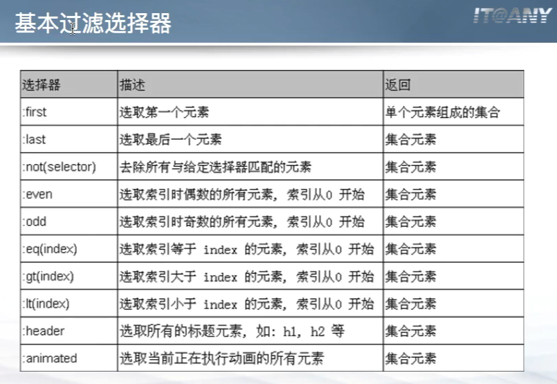
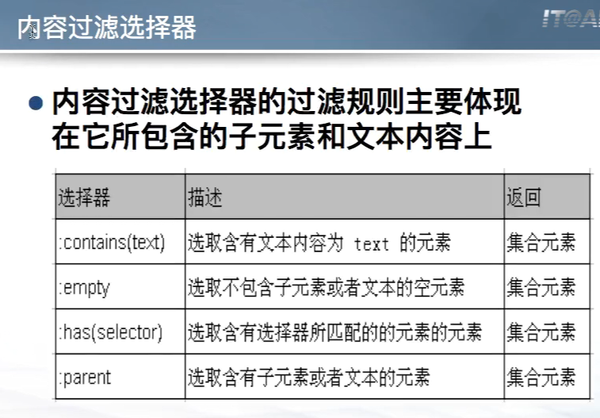
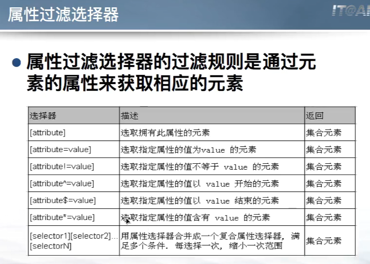
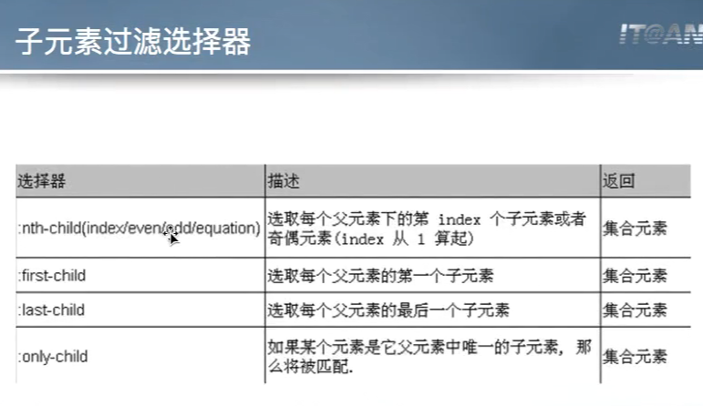
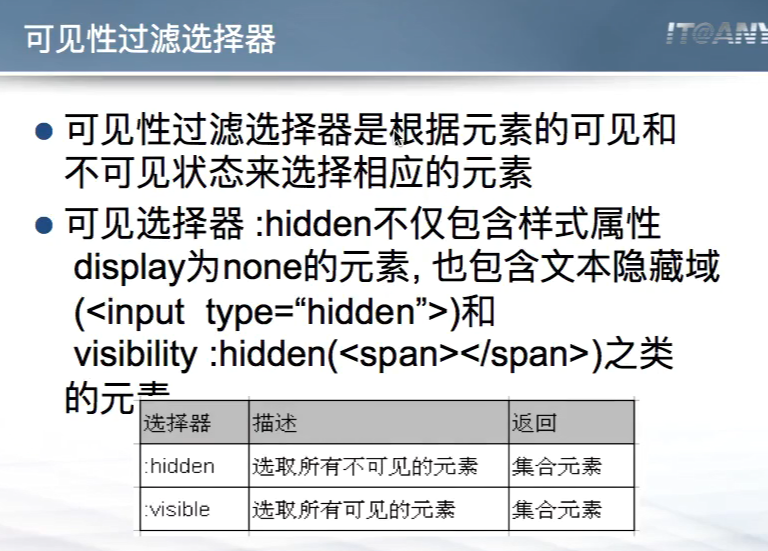
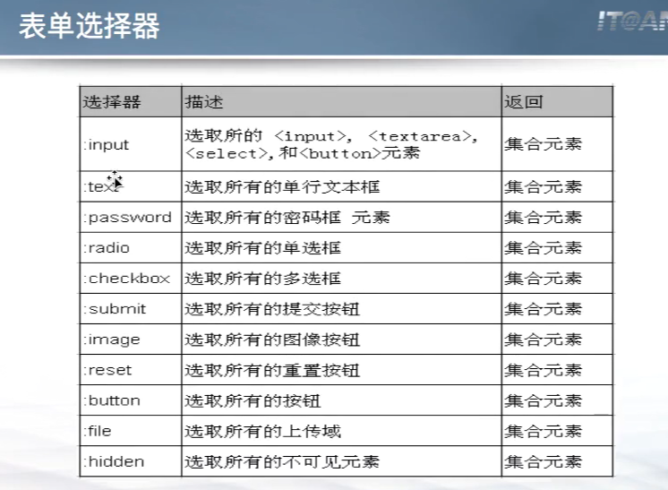
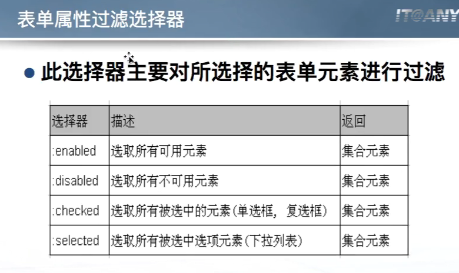
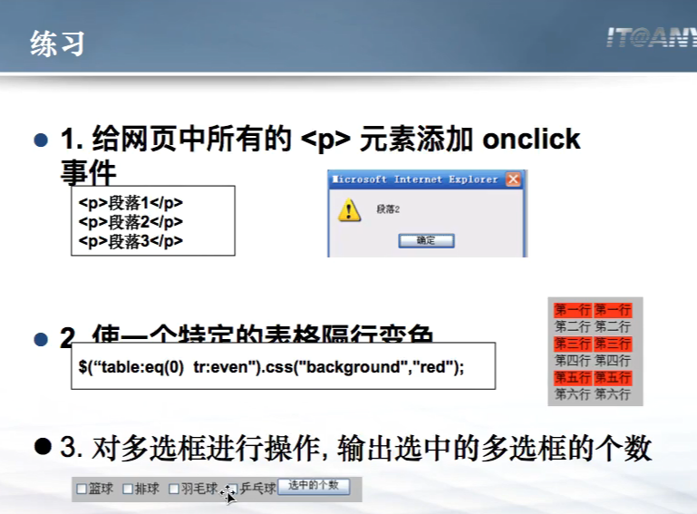

# jQuery

## 一、简介

- jQuery是继Prototype之后又一个优秀的JavaScript库，目前最流行的JavaScript框架库
- jQuery理念：write less, do more
- JQuery优势：
  - 较**轻量级**
  - 强大的**选择器**
  - 出色的**DOM操作的封装**
  - 可靠的**事件处理机制**
  - 出色的**浏览器兼容性**
  - 使用**隐式迭代**简化编程
  - 丰富的**插件支持**

- 在页面中引入jQuery

```html
<script type="text/javascript" scr="js/jquery-1.10.2.js"></script>
```

- jQuery开发版和发布版
  - jquery-1.版本号.js**(开发版)**    268kb    完整无压缩，主要用于测试、学习、开发。
  - jquery-1.版本号.min.js**(发布版)**    91kb     经过工具压缩或经过服务器Gzip压缩，主要应用于发布的产品和项目。

## 二、基本语法——$(selector).action()

- **工厂函数$()**：将DOM对象转换为jQuery对象
- **选择器selector**：获取需要操作的DOM元素
- **方法action()**：jQuery中提供的方法，其中包含绑定事件处理的方法
- 示例：**$("h2").css("background-color", "#CCFFFF")**


## 三、页面载入

- $(document).ready(callback)  缩写为---> $(callback)：绑定一个在DOM文档加载完毕后执行的函数

- $(document).ready()与window.onload的区别：

  - 个数区别

    - window.onload只能有一个，如果有多个，则执行最后一个；$()可以有多个。

    - ```javascript
      window.onload = function(){ console.log("aaa"); };
      window.onload = function(){ console.log("bbb"); };
      $(function(){ console.log("ccc"); });
      $(function(){ console.log("ddd"); });
      
      // 输出：ccc ddd bbb
      ```

  - 执行时机的区别

    - ```javascript
      window.onload=function(){ alert("页面所有元素加载完成"); };
      $(function(){ alert("页面DOM结构加载完成"); });
      ```

    - window.onload会等页面所有的内容加载完毕才会执行；$()则是在DOM全部绘制完毕，就会执行，这时候和DOM相关的其他东西可能还没加载完。

  - 是否可以简化缩写 


## 四、jQuery对象

- jQuery对象就是通过jQuery包装DOM对象后产生的对象
- jQuery对象是jQuery独有的。如果一个对象是jQuery对象，那么它可以使用jQuery里的方法：$("#persontab").html()
- jQuery对象无法使用DOM对象的任何方法，同样DOM对象也无法使用jQuery里的任何方法
- 约定：如果获取的是jQuery对象，那么要在变量前面加上$
  - var $variable = jQuery对象
  - var   variable = DOM对象


## 五、jQuery对象和DOM对象的转换

### 一）DOM --->  jQuery

- 对于已经是DOM对象，只需要用$()把DOM对象包装起来，就可以获得一个jQuery对象：$(DOM对象)


### 二）jQuery  --->  DOM

​		两种方式：将jQuery对象转换为DOM对象： `[index]` 和 `.get(index)`

- jQuery对象是一个数字对象，可以通过 `[index]` 的方法，来得到相应的DOM对象：jQuery对象[0]
- jQuery本身提供，通过 `.get(index)` 方法，得到相应的DOM对象：jQuery对象.get(0)


## 六、jQuery的语法特点

```javascript
// 1. 读取和设置使用同一个方法：只是是否带参的区别
$(function () {
    $('#btn1').click(function () {
        // console.log($("#itany").html());
        // console.log($('#itany').css('color'));
        console.log($('#btn1').val());
        console.log($('#btn2').val());
    });

    $('#btn2').click(function () {
        // $("#itany").html("Hello itany");
        // $('#itany').css("color","red");
        $('#btn1').val('读取个锤子');
        $('#btn2').val('设置个锤子');
    });
});

// 2. 链式操作
$(function () {
    $('#btn3').click(function () {
        // 链式写法
        // $('#itany').html('四川万源')
        //    .css('color','red')
        //    .css('font-size','30px')
        //    .css('border','1px solid #ccc')
        //    .width(200)
        //    .height(100);
        // 相当于每一层都返回了当前对象，然后再次调用他的方法

        // 链式写法+json对象作为参数
        $('#itany').html('四川万源')
            .css({  // 如果css要设置多个属性值的话，可以用Json对象
            "color":"red",
            "font-size":"30px",
            "border":"1px solid #ccc"
        })
            .width(200)
            .height(100);
    });
```


## 七、选择器

### 一）基本选择器

```html
<!DOCTYPE html>
<html lang="en">
    <head>
        <meta charset="UTF-8">
        <title>Title</title>
        <script type="text/javascript" src="jquery/jquery-1.9.0.js"></script>
        <script type="text/javascript">
            $(function () {
                // ID选择器
                $('#btn1').click(function () {
                    console.log("个数：",$('#first').length);
                    $('#first').css({
                        "background":"red",
                        "font-size":"30px"
                    });
                });

                // 标签选择器
                $('#btn2').click(function () {
                    $('div').css({
                        "background":"yellow",
                        "font-size":"25px"
                    });
                    console.log("个数：",$('div').length);
                });

                // 类选择器
                $('#btn3').click(function () {
                    $('.hehe').css({
                        "background":"blue",
                        "font-size":"40px"
                    });
                    console.log("个数：",$('.hehe').length);
                });

                // 并集选择器：逗号隔开
                $('#btn4').click(function () {
                    $('#first,.hehe,#last').css({
                        "background":"pink",
                        "font-size":"10px"
                    });
                    console.log("个数：",$('#first,.hehe,#last').length);
                });

                // 交集选择器
                // [p .hehe : p标签下的class为hehe的标签]
                // [p.hehe : class为hehe的p标签]
                $('#btn5').click(function () {
                    $('p.hehe').css({
                        "background":"pink",
                        "font-size":"10px"
                    });
                    console.log("个数：",$('p.hehe').length);
                });

                // 全局选择器：取到DOM的所有元素
                $('#btn6').click(function () {
                    $('*').css({
                        "background":"pink",
                        "font-size":"10px"
                    });
                    console.log("个数：",$('#first,.hehe,#last').length);
                });
            })
        </script>
    </head>
    <body>
    <input type="button" value="ID选择器" id="btn1">
    <input type="button" value="标签选择器" id="btn2">
    <input type="button" value="类选择器" id="btn3">
    <input type="button" value="并集选择器" id="btn4">
    <input type="button" value="交集选择器" id="btn5">
    <input type="button" value="全局选择器" id="btn6">
        <div id="first">itany1</div>
        <div class="hehe">itany2</div>
        <div>itany3</div>
        <div class="hehe">itany4</div>
        <div>itany5</div>
        <div id="last">itany6</div>
        <p class="hehe">p1</p>
        <p>p2</p>
        <p>p3</p>
        <p>p4</p>
        <p>p5</p>
    </body>
</html>
```


### 二）层次选择器

```html
<!DOCTYPE html>
<html lang="en">
    <head>
        <meta charset="UTF-8">
        <title>Title</title>
        <script type="text/javascript" src="jquery/jquery-1.9.0.js"></script>
        <script type="text/javascript">
            $(function () {
                // 后代选择器
                $('#btn1').click(function () {
                    // 取到里面的所有div
                    $('div#first span').css("background","red");
                    console.log($('div#first span').length);
                });

                // 子选择器
                $('#btn2').click(function () {
                    // 取到里面的所有div
                    $('div#first>span').css("background","red");
                    console.log($('div#first>span').length);
                });

                // 相邻选择器：取当前div#lastlast后面的第一个div
                $('#btn3').click(function () {
                    // 取到里面的所有div
                    $('div#lastlast+div').css("background","red");
                    console.log($('div#lastlast+div').length);
                });

                // 兄弟选择器：取他后面的所有兄弟，不取他自己和他前面的兄弟
                $('#btn4').click(function () {
                    // 取到里面的所有div
                    $('div.hehe ~ div').css("background","red");
                    console.log($('div.hehe ~ div').length);
                });
            })
        </script>
    </head>
    <body>
        <input type="button" value="后代选择器" id="btn1">
        <input type="button" value="子选择器" id="btn2">
        <input type="button" value="相邻选择器" id="btn3">
        <input type="button" value="兄弟选择器" id="btn4">
        <hr>

        <div id="first">
            itany1
            <p>
                <span>span1</span>
                <span>span2</span>
                <!--
                    <div>ID为first的div中的p中的div</div>
                    div是不能放进一个p标签里面的。
                    块级元素不能放进行级元素里面。
                    在放进去后，div上下的两个p标签会解析成两个，然后把div放出去
                -->
                <span>ID为first的div中的p中的span</span>
            </p>

            <span>ID为first的div中的span</span>
        </div>
        <div class="hehe">
            itany2
            <p>
                <span>span1</span>
                <span>span2</span>
            <div>class为hehe的div中的p中的div</div>
            </p>
        </div>
        <div>
            itany3
        </div>
        <div class="hehe">
            itany4
        </div>
        <div id="lastlast">
            itany5
        </div>
        <div id="last">
            itany6
        </div>

        <p class="hehe">
            p1
        </p>
        <p>p2</p>
        <p>p3</p>
        <p>p4</p>
        <p>p5</p>
    </body>
</html>
```


### 三）基本过滤选择器



```html
<!DOCTYPE html>
<html lang="en">
    <head>
        <meta charset="UTF-8">
        <title>Title</title>
        <script type="text/javascript" src="jquery/jquery-1.9.0.js"></script>
        <script>
            $(function () {
                // 选取div的class为hehe的第一个span
                $('#btn1').click(function () {
                    $('div.hehe span:first').css('background','red')
                });

                // 选取最后一个p标签
                $('#btn2').click(function () {
                    $('p:last').css('background','red')
                });

                // 选取所有class为hehe的元素
                $('#btn3').click(function () {
                    $('.hehe').css('background','red')
                });

                // 选取div中所有class不为hehe的div
                $('#btn4').click(function () {
                    $('div:not(.hehe)').css('background','blue')
                });

                // 选择索引为偶数的span元素:0 2 4 ...
                $('#btn5').click(function () {
                    $('span:even').css('background','blue')
                });

                // 选择索引为奇数的span元素:1 3 5 ...
                $('#btn6').click(function () {
                    $('span:odd').css('background','blue')
                });

                // 选择索引等于1的span元素
                $('#btn7').click(function () {
                    $('span:eq(1)').css('background','blue')
                });

                // 选择索引大于2的span元素
                // gt --> greater than
                $('#btn8').click(function () {
                    $('span:gt(2)').css('background','red')
                });

                // 选择索引小于1的span元素
                $('#btn9').click(function () {
                    $('span:lt(1)').css('background','green')
                });

                // 选择所有标题元素的第一个元素
                // 可以组合使用
                $('#btn10').click(function () {
                    $(':header:first').css('background','pink')
                });

                $('table tr:even').css('background', 'blue');
                $('table tr:odd').css('background', 'yellow');
            })
        </script>
    </head>
    <body>
    <input type="button" value="选择第一个span" id="btn1">
    <input type="button" value="选择最后一个p" id="btn2">
    <input type="button" value="选择class为hehe的元素" id="btn3">
    <input type="button" value="选择class不为hehe的div元素" id="btn4">
    <input type="button" value="选择索引为偶数的span元素" id="btn5">
    <input type="button" value="选择索引为奇数的span元素" id="btn6">
    <input type="button" value="选择索引等于1的span元素" id="btn7">
    <input type="button" value="选择索引大于2的span元素" id="btn8">
    <input type="button" value="选择索引小于1的span元素" id="btn9">
    <input type="button" value="选择所有标题元素" id="btn10">
    <hr>

    <div id="first">
        itany1
        <p>
            <span>span1</span>
            <span>span2</span>
            <br>
            <!--
                <div>ID为first的div中的p中的div</div>
                div是不能放进一个p标签里面的。
                块级元素不能放进行级元素里面。
                在放进去后，div上下的两个p标签会解析成两个，然后把div放出去
            -->
            <span>ID为first的div中的p中的span</span>
        </p>

        <span>ID为first的div中的span</span>
    </div>
    <div class="hehe">
        itany2
        <p>
            <span>span1</span>
            <span>span2</span>
        </p>
        <div>class为hehe的div中的div</div>
    </div>
    <h2>二级标题</h2>
    <div>
        itany3
    </div>
    <div class="hehe">
        itany4
    </div>
    <div id="lastlast">
        itany5
    </div>
    <div id="last">
        itany6
    </div>

    <p class="hehe">
        p1
    </p>
    <p>p2</p>
    <p>p3</p>
    <p>p4</p>
    <p>p5</p>

    <h3>三级标题</h3>
    <h5>五级标题</h5>

    <table border="1px" width="500px">
        <tr>
            <td>itany1</td>
            <td>itany2</td>
            <td>itany3</td>
            <td>itany4</td>
            <td>itany5</td>
            <td>itany6</td>
            <td>itany7</td>
            <td>itany8</td>
            <td>itany9</td>
        </tr>
        <tr>
            <td>itany1</td>
            <td>itany2</td>
            <td>itany3</td>
            <td>itany4</td>
            <td>itany5</td>
            <td>itany6</td>
            <td>itany7</td>
            <td>itany8</td>
            <td>itany9</td>
        </tr>
        <tr>
            <td>itany1</td>
            <td>itany2</td>
            <td>itany3</td>
            <td>itany4</td>
            <td>itany5</td>
            <td>itany6</td>
            <td>itany7</td>
            <td>itany8</td>
            <td>itany9</td>
        </tr>
        <tr>
            <td>itany1</td>
            <td>itany2</td>
            <td>itany3</td>
            <td>itany4</td>
            <td>itany5</td>
            <td>itany6</td>
            <td>itany7</td>
            <td>itany8</td>
            <td>itany9</td>
        </tr>
        <tr>
            <td>itany1</td>
            <td>itany2</td>
            <td>itany3</td>
            <td>itany4</td>
            <td>itany5</td>
            <td>itany6</td>
            <td>itany7</td>
            <td>itany8</td>
            <td>itany9</td>
        </tr>
        <tr>
            <td>itany1</td>
            <td>itany2</td>
            <td>itany3</td>
            <td>itany4</td>
            <td>itany5</td>
            <td>itany6</td>
            <td>itany7</td>
            <td>itany8</td>
            <td>itany9</td>
        </tr>
        <tr>
            <td>itany1</td>
            <td>itany2</td>
            <td>itany3</td>
            <td>itany4</td>
            <td>itany5</td>
            <td>itany6</td>
            <td>itany7</td>
            <td>itany8</td>
            <td>itany9</td>
        </tr>
        <tr>
            <td>itany1</td>
            <td>itany2</td>
            <td>itany3</td>
            <td>itany4</td>
            <td>itany5</td>
            <td>itany6</td>
            <td>itany7</td>
            <td>itany8</td>
            <td>itany9</td>
        </tr>
        <tr>
            <td>itany1</td>
            <td>itany2</td>
            <td>itany3</td>
            <td>itany4</td>
            <td>itany5</td>
            <td>itany6</td>
            <td>itany7</td>
            <td>itany8</td>
            <td>itany9</td>
        </tr>
        <tr>
            <td>itany1</td>
            <td>itany2</td>
            <td>itany3</td>
            <td>itany4</td>
            <td>itany5</td>
            <td>itany6</td>
            <td>itany7</td>
            <td>itany8</td>
            <td>itany9</td>
        </tr>
    </table>

    </body>
</html>
```


### 四）内容过滤选择器

···

```html
<!DOCTYPE html>
<html lang="en">
    <head>
        <meta charset="UTF-8">
        <title>Title</title>
        <script type="text/javascript" src="jquery/jquery-1.9.0.js"></script>
        <script>
            $(function () {
                // contains(text)
                $('#btn1').click(function () {
                    // 后代选择器
                    $('p:contains(wbs16073):last').css('background','red');
                    $('body :contains(wbs16073)').css('background','red')
                });

                // empty：空格也算元素
                $('#btn2').click(function () {
                    $('p:empty').css('background', 'blue').html('我原来什么都没有，现在有了');
                });

                // has(selector)
                $('#btn3').click(function () {
                    $('div:has(span#hello)').css('background', 'blue');
                });

                // parent
                $('#btn4').click(function () {
                    $('div:parent').css('background', 'green');
                });
                $('#btn5').click(function () {
                    $('div:not(div:empty)').css('background', 'blue');
                });

            })
        </script>
    </head>
    <body>
        <input type="button" value="选取body中包含wbs16073的元素" id="btn1">
        <input type="button" value="选择空p元素" id="btn2">
        <input type="button" value="选择div中包含id为hello的span元素" id="btn3">
        <input type="button" value="选择非空的div元素" id="btn4">
        <input type="button" value="选择非空的div元素(方式二)" id="btn5">
        <hr>
        <p>welcome to 四川</p>
        <!-- 两个id重复报错，但是在jQuery选择的时候都会被选择 -->
        <div>
            <p id="hello">Hello 四川</p>
        </div>
        <div>
            <span id="hello">Hello Hello</span>
            <p>今天天气真好</p>
        </div>
        <p>welcome to wbs16073</p>
        <p></p>
        <p>welcome to wbs16073</p>
        <p>who to where</p>

        <div>Happy wbs16073</div>

    </body>
</html>
```


### 五）属性过滤选择器



```html
<!DOCTYPE html>
<html lang="en">
    <head>
        <meta charset="UTF-8">
        <title>Title</title>
        <script type="text/javascript" src="jquery/jquery-1.9.0.js"></script>
        <script type="text/javascript">
            $(function () {
                $('#btn1').click(function () {
                    // 1. 选择包含hello属性的div元素
                    $('div[hello]').css('background', 'red');
                });

                $('#btn2').click(function () {
                    // 2. 选择hello属性值为itany的p元素
                    $('p[hello=itany]').css('background', 'red');
                });

                $('#btn3').click(function () {
                    // 3. 选择hello属性值不等于itany的p元素，并且p元素得有hello属性
                    $('p[hello!=itany][hello]').css('background', 'red');
                });

                $('#btn4').click(function () {
                    // 4. 选择id属性值以h开头的p元素
                    $('p[id^=h][id]').css('background', 'red');
                });

                $('#btn5').click(function () {
                    // 5. 选择id属性值以h开头的p元素
                    $('p[id$=lo][id]').css('background', 'red');
                });

                $('#btn6').click(function () {
                    // 6. 选择id属性值以h开头的p元素
                    $('p[id*=eh][id]').css('background', 'red');
                });

                $('#btn7').click(function () {
                    // 7. 选择包含属性id，并且属性hello的值为以wbs开头，并且class属性的值包含any的p元素
                    $('p[hello^=wbs][class*=any][id]').css('background', 'red');
                });
            });
        </script>
    </head>
    <body>
        <input type="button" id="btn1" value="选择包含hello属性的div元素">
        <input type="button" id="btn2" value="选择hello属性值为itany的p元素">
        <input type="button" id="btn3" value="选择hello属性值不等于itany的p元素">
        <input type="button" id="btn4" value="选择id属性值以h开头的p元素">
        <input type="button" id="btn5" value="选择id属性值以lo结尾的p元素">
        <input type="button" id="btn6" value="选择id属性值包含eh的p元素">
        <input type="button" id="btn7" value="选择包含属性id，并且属性hello的值为以wbs开头，并且class属性的值包含any的p元素">
        <hr>

        <p>welcome to 四川</p>
        <!-- 两个id重复报错，但是在jQuery选择的时候都会被选择 -->
        <div>
            <p id="hello">Hello 四川</p>
        </div>
        <div hello="itany">
            <span id="hehe">Hello Hello</span>
            <p id="hehei" hello="wbs16073" class="itany">今天天气真好</p>
        </div>
        <p id="world">welcome to wbs16073</p>
        <p></p>
        <p hello="world">Hello World</p>
        <p hello="itany">welcome to wbs16073</p>
        <p hello="itany">who to where</p>

        <div hello="welcome">Happy wbs16073</div>
    </body>
</html>
```


### 六）子元素过滤选择器



```html
<!DOCTYPE html>
<html lang="en">
    <head>
        <meta charset="UTF-8">
        <title>Title</title>
        <script type="text/javascript" src="jquery/jquery-1.9.0.js"></script>
        <script>
            $(function () {
                $('input[type=button]:first').click(function () {
                    // 1. 选择每个div下的第一个子元素
                    $('div a:first-child').css('background', 'red');
                });

                $('input[type=button]:eq(1)').click(function () {
                    // 2. 选择每个div下的最后一个a元素
                    $('div a:last-child').css('background', 'yellow');
                });

                $('input[type=button]:eq(2)').click(function () {
                    // 3. 选择每个div下的第二个a元素
                    $('div a:nth-child(2)').css('background', 'blue');
                });

                $('input[type=button]:eq(3)').click(function () {
                    // 4. 选择每个div下的偶数a元素
                    $('div a:nth-child(even)').css('background', 'green');
                });

                $('input[type=button]:eq(4)').click(function () {
                    // 4. 选择只有一个子元素的每个div元素
                    $('div a:only-child').css('background', 'gray');
                });

                // eq()索引从0开始，nth-child()索引从1开始
            });
        </script>
    </head>
    <body>
        <input type="button" value="选择每个div下的第一个a元素">
        <input type="button" value="选择每个div下的最后一个a元素">
        <input type="button" value="选择每个div下的第二个a元素">
        <input type="button" value="选择每个div下的偶数a元素">
        <input type="button" value="选择只有一个子元素的每个div元素">
        <hr>

        <div>
            <a href="">tom</a>
            <a href="">jack</a>
            <a href="">alice</a>
        </div>
        <hr>
        <div>
            <a href="">张三</a>
            <a href="">李四</a>
            <a href="">王五</a>
        </div>
        <hr>
        <p>
            <a href="">小桌子</a>
            <a href="">小凳子</a>
            <a href="">小锤子</a>
        </p>
        <hr>
        <div>
            <a href="">周末快乐</a>
        </div>
    </body>
</html>
```


### 七）可见性过滤选择器



- **注意：visibility:hidden(<span></span>)之类的元素不会被取到，PPT内容修正一下。**

```html
<!DOCTYPE html>
<html lang="en">
    <head>
        <meta charset="UTF-8">
        <title>Title</title>
        <script src="jquery/jquery-1.9.0.js" type="text/javascript"></script>
        <script type="text/javascript">
            $(function () {
                // 取到所有可见的div
                $('input[type=button]:first').click(function () {
                    $('div:visible').css('background', 'red');
                });

                // 取到所有不可见的div
                $('input[type=button]:eq(1)').click(function () {
                    $('div:hidden').css({
                        'background': 'yellow',
                        'display':'block',  // 把隐藏的显示出来
                        'font-size':'30px', // 结尾的逗号有没有都可以
                    });
                });

                // 取到所有可见的元素：这里加一个body，可直接找body里面的隐藏元素，Document就不会出来
                $('input[type=button]:eq(2)').click(function () {
                    $('body :hidden').css({
                        'background': 'blue',
                        'display':'block',  // 把隐藏的显示出来
                        'font-size':'30px', // 结尾的逗号有没有都可以
                        'visibility':'visible',
                    });
                });
            })
        </script>
    </head>
    <body>
        <input type="button" value="选择所有可见的div元素">
        <input type="button" value="选择所有不可见的div元素">
        <input type="button" value="选择所有不可见的元素">
        <hr>
        <div>可见div1</div>
        <div>可见div2</div>
        <div style="display: none;">不可见div</div>
        <input type="hidden" value="嘿嘿嘿">
        <!-- 这个span没有被jQuery的[:hidden]取到 -->
        <span style="visibility: hidden">不可见的span</span>
    </body>
</html>
```


### 八）表单选择器





```html
<!DOCTYPE html>
<html lang="en">
    <head>
        <meta charset="UTF-8">
        <title>Title</title>
        <script type="text/javascript" src="jquery/jquery-1.9.0.js"></script>
        <script type="text/javascript">
            $(function () {
                $('input:first').click(function () {
                    $('form :input').css('background', 'red');
                    console.log($('form :input').length);
                    // textarea也算作input类型里，可以输入类型
                });

                $('input:eq(1)').click(function () {
                    $('form :text').css('background', 'red');
                });

                $('input:eq(2)').click(function () {
                    console.log($('form :radio').length);
                    // 数字调用val()方法，会自动调用第一个
//                    console.log($('form :radio').val());
                    var radios = $('form :radio');
//                    for(var i=0; i<radios.length; i++){
//                        // 把这个元素从jQuery对象取出来后，就变成了DOM对象。
//                        console.log(radios[i].value);
//                        // 放到工厂函数里面，就又转换为jQeury对象
//                        console.log($(radios[i]).val());
//                    }

                    // each(参数1,参数2)：jQuery提供的工具函数，进行遍历循环操作
                    // $.each() == jQuery.each()
                    // 参数1：要遍历的集合
                    // 参数2：匿名函数（有两个参数）
                    //      参数1：索引，参数2：值
                    $.each(radios,function (index, value) {
                        // console.log(index,':',value.value);  DOM对象
                        console.log(index,':',$(value).val()); // jQuery对象
                    });
                });

                $('input:eq(3)').click(function(){
                    console.log($('body :button').length);
                    $('body :button').css('background', 'red');
                });

                $('input:eq(4)').click(function(){
                    console.log($('form :input:enabled').length);
                    $('form :input:enabled').css('background', 'red');
                });

                $('input:eq(5)').click(function(){
                    console.log($('form :checked').length);
                    $('form :checked').css('background', 'red');
                });

                $('input:eq(6)').click(function(){
                    console.log($('form :selected').length);

                });
            })
        </script>
    </head>
    <body>
        <input type="button" value="选择表单中所有的:input">
        <input type="button" value="选择所有的单行文本框">
        <input type="button" value="选择所有单选按钮">
        <input type="button" value="选择body中所有普通的button按钮">
        <input type="button" value="选取表单所有可用的:input">
        <input type="button" value="选择表单中所有被选中的复选框/单选框">
        <input type="button" value="选择表单中的下拉列表">
        <hr>
        <form action="">
            头&nbsp;&nbsp;&nbsp;&nbsp;像：<input type="file">
            <br><br>
            用户名：<input type="text" disabled>
            <br><br>
            密&nbsp;&nbsp;&nbsp;&nbsp;码：<input type="password">
            <br><br>
            性&nbsp;&nbsp;&nbsp;&nbsp;别：<input type="radio" name="sex" value="male" checked>男 &nbsp;&nbsp;
                                          <input type="radio" name="sex" value="female">女
            <br><br>
            爱&nbsp;&nbsp;&nbsp;&nbsp;好：<input type="checkbox" name="hobby" checked>吃饭 &nbsp;&nbsp;
            <input type="checkbox" name="hobby" checked>睡觉 &nbsp;&nbsp;
            <input type="checkbox" name="hobby">打豆豆
            <br><br>
            学&nbsp;&nbsp;&nbsp;&nbsp;历：
            <select>
                <option value="waitElected" selected>---请选择学历---</option>
                <option value="senior">高&nbsp;&nbsp;&nbsp;&nbsp;中</option>
                <option value="undergraduate">本&nbsp;&nbsp;&nbsp;&nbsp;科</option>
                <option value="postgraduate">研究生</option>
                <option value="doctor">博&nbsp;&nbsp;&nbsp;&nbsp;士</option>
            </select>
            <br><br>
            简&nbsp;&nbsp;&nbsp;&nbsp;介：<br>
            <textarea id="" cols="20" rows="3"></textarea>
            <br><br>
            &nbsp;&nbsp;&nbsp;&nbsp;&nbsp;&nbsp;&nbsp;&nbsp;<input type="submit" value="提交">

            &nbsp;&nbsp;&nbsp;&nbsp;&nbsp;&nbsp;&nbsp;&nbsp;<input type="reset" value="重置">
            <br><br>
            <input type="button" value="我是一个没用的button">
        </form>
    </body>
</html>
```





## 八、jQuery中的事件和DOM操作

### 一）事件处理


```javascript
$(function () {
    let li = $('li');
    // 1. 鼠标事件
    // 绑定点击事件
    li.click(function () {
        console.log($(this).html()); //$把DOM对象封装成jQ对象
    });

    // 经过时，触发事件
    li.mouseover(function () {
        // $(this).css('color', 'red')
        $(this).addClass('over')  // 也可以添加class样式，利用css设置
        // 离开时，触发事件
    }).mouseout(function () {  // 链式写法
        // $(this).css('color', 'black')
        $(this).removeClass('over')  // 再去掉css对一个的class样式，这样具有统一性，比较方便，直接在css的over里面改
    });

    // 2. 键盘事件，执行顺序：keydown-->keypress-->keyup
    // event:表示键盘事件对象（这个名字可以随意取——重构方法）
    // 事件对象中包事件相关信息
    $("#username").keydown(function(event){  // 按下按键
        console.log(event.keyCode);  // 获取的输入字符的ASCII码值
        if(event.keyCode!=null){
            console.log(true);
        }else{
            console.log(false);
        }
        console.log("keydown");
    }).keyup(function(){   // 松开按键
        console.log("keyup");
    }).keypress(function(){   // 打印字符
        console.log("keypress");
    });
    $(document).keydown(function(event){
        if(event.keyCode==13){
            alert("您是否确定提交？");
        }
    });

    // 表单事件
    $("#username").focus(function(){
        $(this).addClass("bg");
    }).blur(function(){
        $(this).removeClass("bg");
    });
})
```


### 二）绑定事件

