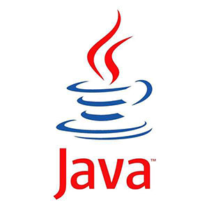
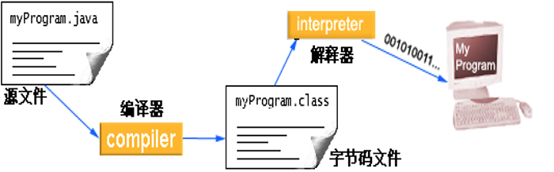
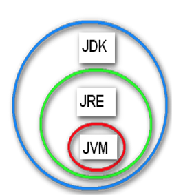
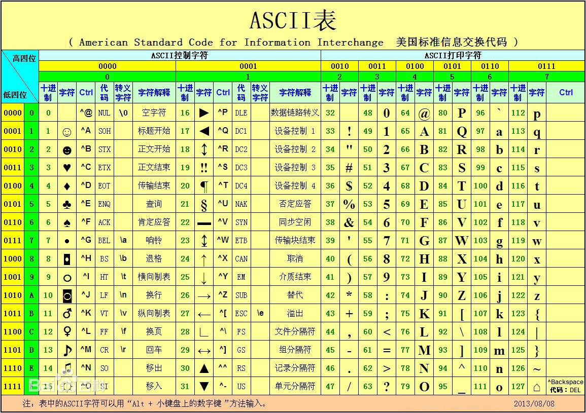

# Java基础，主讲：汤小洋

## 一、Java简介

### 1. 什么是程序

​	为了让计算机执行某些操作或解决某个问题而编写的一系列有序指令的集合，就是计算机程序

​	编写程序的工具 就是计算机语言，Java是目前应用最广泛的编程语言。

### 2. Java介绍

#### 2.1 发展

​	创始人：詹姆斯·高斯林 James Gosling 

​	Java图标：一杯冒着热气的咖啡




​	发展历程：

- 1995诞生，Sun公司
- 1996 JDK 1.0
- 2004 JDK 1.5，也称为JDK5
- 2006 JDK6
- 2009.4.20，被Oracle公司收购
- 2011 JDK7
- 2014 JDK8 **（推荐）**
- 2017.9 JDK9 Oracle宣布每六个月发布一个新版本（每年3月和9月）
- 2018.3 JDK10
- 2018.9 JDK11 长期支持版本

#### 2.2 平台

​	Java平台有三个版本：

- JavaSE

  Java Platform Standard Edition 标准版，包含Java语言的基础核心

  用于开发桌面应用程序，如QQ、记事本、计算器等

- JavaEE

  Java Platform Enterprise Edition 企业版，以前也称为J2EE，包含JavaSE

  用于开发企业应用程序，如Web网站、分布式应用等

- JavaME

  Java Platform Micro Edition 微缩版/移动版

  用于开发移动设备/嵌入式设备的应用，如手机游戏

#### 2.3 特点

- 跨平台：write once,run anywhere
- 安全的：安全机制，防止恶意代码的攻击
- 简单的：语法简洁，去除不常用的功能
- 健壮的：可靠性高，更具健壮性
- 面向对象：面向对象的程序设计语言

### 3. 名词解释

#### 3.1 JDK

​	Java Development Kit （Java开发工具包）

#### 3.2 JRE

​	Java Runtime Environment（Java运行时环境）

#### 3.3 JVM

​	Java Virtual Machine（Java虚拟机）

​	Java的跨平台就是通过在不同的平台安装相应的JVM来实现的。



​	JDK、JRE、JVM的关系：



## 二、安装Java

### 1. 下载并安装

​	分平台、分版本：

- Windows、Linux、Mac
- 32位、64位

​       使用jdk-8u151-windows-x64.zip，直接解压缩

### 2. 配置环境变量

​	右击计算机——>属性——>高级系统设置——>高级——>环境变量：

- JAVA_HOME

  新建一个JAVA_HOME，配置JDK安装的位置`D:\software\jdk-8u151-windows-x64`

- CLASSPATH

  新建一个CLASSPATH，配置类库文件的位置，即lib目录的位置`.;%JAVA_HOME%\lib`

- PATH

  修改PATH，在最前面添加JDK命令文件的位置，即bin目录的位置，以分号隔开``%JAVA_HOME%\bin`` `

​        验证：

```shell
java -version
javac -version	
```

## 三、第一个Java程序

### 1. 使用记事本开发

​	步骤：

1. 编写源代码

   源代码以`.java`结尾

   ```java
   public class wbs18121
   {
       public static void main(String[] args)
       {
   	System.out.println("welcome to wbs18121");
       }
   }
   ```

2. 将源代码编译为字节码

   字节码文件以`.class`结尾

   使用javac命令，执行：`javac wbs18121.java`

3. 运行字节码

   使用java命令，执行：`java wbs18121`

​          显示文件后缀名：双击计算机——>组织——>文件夹和搜索选项——>查看——>去掉“隐藏已知文件类型的扩展名”

### 2. 基本用法

#### 2.1 输出信息

​	System.out.println();  输出后换行

​	System.out.print();  输出后不换行

#### 2.2 转义符

​	反斜杠 \  表示转义符

​	该字符可以与后面相邻的一个字符组成一个新的含义，如：

- `\"` 表示双引号
- `\n` 表示换行
- `\t`表示制表符Tab
- `\\`表示反斜杠

#### 2.3 注释

​	用来标注解释的内容，不会被执行

​	三种类型：

- 单行注释，以`//`开头

- 多行注释，以`/*`开头，以`*/`结尾

- 文档注释，以`/**`开头，以`*/`结尾

  可以结合javadoc命令提取文档注释的内容，生成文档

  执行：`javadoc HelloWorld.java`

#### 2.4 编码规范

​	要求：

- 类名必须与文件名相同，通常采用所有单词首字母大写的形式（帕斯卡式命名法）
- 语句必须以分号结尾
- 标点符号必须为英文符号
- 大小写敏感，即区分大小写

​        建议：

- 所有命名不建议使用中文、空格、特殊字符等，不要以数字开头
- 一行只写一条语句
- {}的使用及位置
- 合理的代码缩进

### 3. 使用Eclipse开发

​	Eclipse是Java开发的一个集成开发工具（IDE：Integrated Development Environment ）

#### 3.1 基本使用

​	步骤：

1. 创建Java项目

   File——>New——>Project——>Java Project

2. 创建包

   右击src——>New——>Package

3. 创建源代码文件并编写

   右击包——>New——>Class

4. 运行程序

   右击——>Run As——>Java Application

​         **注：Eclipse会自动将源代码编译成字节码**

#### 3.2 常用设置

- 修改字体

  Window——>Preferences——>搜索font——>Colors and Fonts——>Basic——>Text Font

- 修改字符集

  Window——>Preferences——>搜索encoding——>Workspace——>Text file encoding：UTF-8

### 4. 基础知识

#### 4.1 容量单位

​	bit 位（比特），简写b，计算机存储信息的最小单位

​	byte 字节，简写B，1B=8b

​	1KB=1024B（千字节）

​	1MB=1024KB（兆字节）

​	1GB=1024MB（吉字节）

​	1TB=1024GB

​	1PB=1024TB

​	1EB=1024PB

#### 4.2 字符集

​	计算机底层使用的是二进制，所有数据在计算机底层都是以二进制形式来保存的

- 将字符转换为二进制的过程，称为编码
- 将二进制转换为字符的过程，称为解码
- 编码和解码时所采用的规则，称为字符集

​       常见的字符集：

- ASCII

  美国的编码，使用7位来对美国常用的字符进行编码，包含128个字符

  

- ISO-8859-1

  欧洲的编码，使用8位，包含256个字符

- GB2312、GBK

  国标码，中国的编码

- Unicode

  万国码，是一种国际标准编码，包含世界上所有的语言和字符，为每个字符都设定了一个唯一的编码

  有多种实现：UTF-8**（最常用）**、UTF-16、UTF-32

- 中文乱码

  编写程序时，由于字符集设置不对 或编码解码时使用了不一致的字符集，会导致出现中文筹码的问题

## 四、变量和数据类型

### 1. 变量

​	值可以变化的量，称为变量，用来存储程序运行时的数据

​	变量的三要素：变量名、变量类型、变量值

​	变量的命名规范：

- 只能数字、字母、下划线_、美元符号$组成，但不能以数字开头 
- 建议使用英文单词
- 通常采用第一个单词首字母小写，其他单词首字母大写的形式（骆驼式命名法/驼峰式命名法）
- 不能使用Java关键字，如public、class、static、void、int、double等

```java
/*
 * 变量的基本用法
 */
// 1.定义一个变量
int age;
// 2.为变量赋值
age = 18;
// 3.调用变量
// System.out.println(age);
System.out.println("您的年龄:" + age); // 拼接

// 定义变量的同时为其赋值
int num = 6;
System.out.println(num);

// 同时定义多个变量
int a = 5, b = 8, c; // 以逗号隔开
System.out.println(a);
// System.out.println(c); //变量必须先赋值才能调用

/*
 * 变量的命名规范
 */
int aa324_$;
int score;
int fenshu;
int kscj; // 考试成绩
int studentAverageScore;
int sCore;
// int void; //不能使用关键字
```

### 2. 数据类型

#### 2.1 常用类型

| 类型    | 含义   | 长度            | 说明                                       |
| ------- | ------ | --------------- | ------------------------------------------ |
| byte    | 整数   | 占1字节         | 字节型，取值范围为[-128,127]               |
| short   | 整数   | 占2字节         | 短整型，取值范围为[-32728,32767]           |
| int     | 整数   | 占4字节         | 整数型，约21亿**（常用）**                 |
| long    | 整数   | 占8字节         | 长整型，需要以l或L结尾                     |
| float   | 小数   | 占4字节，单精度 | 需要以f或F结尾                             |
| double  | 小数   | 占8字节，双精度 | 默认会将小数作为double类型处理**（常用）** |
| char    | 字符   | 占2字节         | 表示单个字符，需要使用单引号引起来         |
| boolean | 布尔   | 占1字节         | 表示真或假，值只能为true或false            |
| String  | 字符串 |                 | 表示一串字符，需要使用双引号引起来         |

Java中的基本数据类型有八种：byte、short、int、long、float、double、char、boolean

```java
byte num1 = 5;
short num2 = 26;
int num3 = 12;
long num4 = 666l; //需要以l或L结尾
System.out.println(num4);

float weight=180.5f; //需要以f或F结尾
double height=176.8;
System.out.println("体重："+weight);
System.out.println("身高："+height);

char sex='男'; //需要使用单引号引起来
System.out.println("性别："+sex);

boolean isOK=false; //取值只能为true或false
System.out.println("可以吗："+isOK);

String name="唐伯虎";
System.out.println("姓名："+name);
```

#### 2.2 类型转换

​	两种类型：

- 自动类型转换

  条件：

  ​	1.数据类型要兼容

  ​	2.目标类型要大于源类型，如int——>long

- 强制类型转换

  语法：`(目标数据类型)数据`

  可能会导致数据丢失，损失精度

```java
/*
 * 自动类型转换，也称为隐式转换
 */
int a=3;
long b=a;
double c=a;
double d=a+2.5;
System.out.println(c);
System.out.println(d);

/*
 * 强制类型转换，也称为显式转换
 */
double e=12.6;
int f=(int)e;
System.out.println(f);
```

```java
/*
 * char和int之间的转换
 */
//将char转换为int
int x='a'; //隐式转换
System.out.println(x);

//将int转换为char
char y=(char)x; //必须进行强制类型转换
System.out.println(y);
char z=97; //不会报错，97被当作常数来处理，而非整型int（整数和整型是有所不同的）
System.out.println(z);
```

### 3. 获取用户输入

​	使用Scanner获取用户输入的数据

​	步骤：

1. 导入Scanner
2. 创建一个Scanner
3. 使用Scanner获取输入数据

```java
//1.导入Scanner，否则无法使用Scanner
import java.util.Scanner;

public class Test04_获取用户输入 {
	public static void main(String[] args) {
		// 2.创建一个Scanner对象，名称为input
		Scanner input = new Scanner(System.in);
		// 3.使用Scanner获取输入数据
		System.out.print("请输入您的姓名："); // 提示用户输入数据
		String name = input.next(); // 使用next()获取字符串，将数据存储到变量中
		System.out.print("请输入您的年龄：");
		int age = input.nextInt(); // 使用nextInt()获取整数
		System.out.print("请输入您的身高："); // 使用nextDouble()获取小数
		double height = input.nextDouble();

		System.out.println("姓名：" + name);
		System.out.println("年龄：" + age);
		System.out.println("身高：" + height);
	}
}
```

## 五、运算符

### 1. 运算符分类

​	算术运算符、关系运算符、赋值运算符、逻辑运算符、条件运算符、位运算符

#### 1.1 算术运算符

| 运算符 | 含义            |
| ------ | --------------- |
| +      | 加              |
| -      | 减              |
| *      | 乘              |
| /      | 除              |
| %      | 取余，求模      |
| ++     | 自增，对原值加1 |
| --     | 自减，对原值减1 |

前缀自增自减和后缀自增自减的区别：

- 前缀自增自减

  先进行自增或自减，然后再执行表达式

- 后缀自增自减

  先执行表达式，然后再进行自增或自减

```java
/*
 * 基本用法
 */
int a = 5;
int b = 2;
// int sum = a + b;
// System.out.println("a+b=" + sum);

System.out.println(a + b);
System.out.println(a - b);
System.out.println(a * b);
System.out.println(a / b);
System.out.println(a % b);
System.out.println("-------------------------------");

/*
 * 自增自减
 */
int c = 6;
// c++;
// ++c;
// c--;
--c;
System.out.println(c);

/*
 * 前缀自增自减和后缀自增自减的区别
 */
int x = 3;
// System.out.println(++x); //先加1，再输出
System.out.println(x++); // 先输出，再加1

int m = 5;
// int n = m--;
int n = --m;
System.out.println(n);

// 思考？
int i = 3;
int j = (i++) + (++i);
System.out.println(j);

/*
 * 将字符串与数值相加时会进行拼接
 */
System.out.println("hello" + 33 + 55);
System.out.println("hello" + (33 + 55));
int d = 3, e = 8;
System.out.println("" + d + e); // 借助空字符串，实现将数字拼接
```

#### 1.2 关系运算符

​	也称为比较运算符，用来做比较运算，比较结果是boolean类型

| 运算符 | 含义     |
| ------ | -------- |
| >      | 大于     |
| <      | 小于     |
| >=     | 大于等于 |
| <=     | 小于等于 |
| ==     | 等于     |
| !=     | 不等于   |

```java
int a = 5, b = 8;
System.out.println(a > b); // 结果为boolean值
System.out.println(a < b);
System.out.println(a >= b);
System.out.println(a <= b);
System.out.println(a == b);
System.out.println(a != b);

// System.out.println(1<5<8); //不支持此写法

System.out.println('x' > 'm'); // 可以用于字符的比较，比较的是字符的ascii码
```

#### 1.3 赋值运算符

| 运算符 | 含义     |
| ------ | -------- |
| =      | 简单赋值 |
| +=     | 加法赋值 |
| -=     | 减法赋值 |
| *=     | 乘法赋值 |
| /=     | 除法赋值 |
| %=     | 求模赋值 |

```java
int a = 5;
// a += 2; // 等价于a = a+2
// a -= 2; // 等价于a = a-2
// a *= 2; // 等价于a = a*2
// a /= 2; // 等价于a = a/2
a %= 2; // 等价于a = a%2
System.out.println(a);

// int b=c=6; //不支持此写法
```

#### 1.4 逻辑运算符

| 运算符 | 含义         |
| ------ | ------------ |
| &&     | 逻辑与，并且 |
| \|\|   | 逻辑或，或者 |
| !      | 逻辑非，取反 |

```java
boolean a = true, b = false;
System.out.println(a && b); // 两个都为true，则为true，否则为false
System.out.println(a || b); // 只要有一个为true，则为true，否则为false
System.out.println(!b); // 如果为true，则为false；如果为false，则为true

System.out.println(5 > 2 && 8 <= 6);
System.out.println(16 > (4 + 2) * 3);
System.out.println(!(5 > 8));

/*
 * 逻辑运算是一种短路运算 
 * 对于&&，如果左边为false，则不再执行右边代码
 * 对于||，如果左边为true，则不再执行右边代码
 */
// System.out.println(false && (5 + 2) * 3 > 15);

// System.out.println(5 / 0); //除数不能为零

System.out.println(false && 5 / 0 > 3);
System.out.println(true || 5 / 0 > 3);
```

#### 1.5 条件运算符

​	也称为三目运算符

​	语法：`条件?表达式1:表达式2`

​	当条件为true时执行表达式1，当条件为false时执行表达式2

```java
int a = 5;
int b = 9;
System.out.println(a * 2 < b ? "yes" : "no");

int c = a > b ? a + b : a - b;
System.out.println(c);
```

#### 1.6 运算符优先级

​	从高到低的顺序：

1. 小括号( )
2. 一元运算：自增++、自减--、非!
3. 乘*、除/、取余%
4. 加+、减-
5. 关系运算：> < >= <=
6. 相等运算：==、!=
7. 逻辑与 &&
8. 逻辑或 || 
9. 赋值运算：=、+=等

​         注：当运算符较多时，建议使用小括号控制运算的顺序

### 2. 进制

#### 2.1 简介

​	进制就是进位计数制，是一种带进位的计数方法，即逢几进一

​	生活中的进制：十进制、七进制、十二进制、二十四进制、六十进制、二进制、十六进制

#### 2.2 常用进制

| 进制种类 | 单词     | 范围                                    | 引导符号                   | 示例 |
| -------- | -------- | --------------------------------------- | -------------------------- | ---- |
| 十进制   | decimal  | 由0-9组成，共10个，逢十进一             | 无，Java中整数默认为十进制 | 10   |
| 二进制   | binary   | 由0-1组成，共2个，逢二进一              | 0b或0B                     | 0b10 |
| 八进制   | octonary | 由0-7组成，共8个，逢八进一              | 0                          | 010  |
| 十六进制 | hex      | 由0-9、a-f或A-F组成，共16个，逢十六进一 | 0x或0X                     | 0x10 |

#### 2.3 进制转换

​	十进制转换为其他进制：除基取余，如23  -----> 0b10111    ——>0x17

​								     15 ------>0b1111   

​	其他进制转换为十进制：按权相加，如 0b10111 ------>23 

​								      0b1101 ------> 13

 								      0x12 -----> 18					

#### 2.4 二进制

​	计算机底层使用的是二进制，所有数据在计算机底层都是以二进制形式保存的

​	二进制数分为两种：

- 无符号二进制，只能存储正整数

- 有符号二进制，可以存储正数和负数，最高位为符号位，0表示正数，1表示负数

  正数5表示为`00000000 00000000 00000000 00000101`

  负数-5表示为`10000000 00000000 00000000 00000101`

​        二进制中的原码、补码、反码

- 原码

  原始二进制值

- 反码

  正数：反码和原码相同，如5的反码`00000000 00000000 00000000 00000101`

  负数：符号位不变，其余各位取反，如-5的反码``11111111 11111111 11111111 11111010``

- 补码

  正数：补码和原码相同，如5的补码`00000000 00000000 00000000 00000101`

  负数：反码+1，如-5的补码``11111111 11111111 11111111 11111011``

​         总结：

- 对于正数，原码、反码、补码都相同
- 对于负数有所不同

​        **计算机内部是使用补码来存储和表示值的**

#### 2.5 位运算符

​	主要针对二进制的位进行运算，需要将值转换为二进制后进行按位运算

| 运算符 | 含义               |
| ------ | ------------------ |
| &      | 按位与             |
| \|     | 按位或             |
| ~      | 按位非             |
| ^      | 异或               |
| >>     | 右移               |
| <<     | 左移               |
| >>>    | 无符号右移（了解） |

​	位运算符和逻辑运算符的区别：

- 逻辑运算符是针对布尔值进行运算
- 位运算符是针对二进制数的位进行运算

```java
int a = 5; // 二进制为00000000 00000000 00000000 00000101
int b = 8; // 二进制为00000000 00000000 00000000 00001000

// 与：两位都为1，则为1，否则为0
System.out.println(a & b); // 00000000
// 或：只要有一个1，则为1，否则为0
System.out.println(a | b); // 00001101
// 非：如果为1，则为0，如果为0，则为1
System.out.println(~a); // 11111111 11111111 11111111 11111010 
//异或：如果两位相同，则为0，否则为1
System.out.println(a^b); //00001101
//左移：将二进制的所有位都向左移指定的位数，末尾补0
System.out.println(a<<2); //00010100
//右移：将二进制的所有位都向右移指定的位数，高位补符号位
System.out.println(a>>2); //00000001
//无符号右移：将二进制的所有位都向右移指定的位数，高位补0
System.out.println(a>>>2);
```

## 六、选择结构

### 1. 简介

​	程序结构有三种：顺序结构、选择结构、循环结构

​	根据条件进行判断，从而执行不同的操作，称为选择结构（分支结构），其实就是条件判断

### 2. 两种选择结构

#### 2.1 if结构

​	分为：单分支结构、二分支结构、多分支结构、嵌套if结构

​	语法：

```java
if(条件1){
    if(条件){
       代码块
    }else{
       代码块 
    }
}else if(条件2){
    代码块2
}else if(条件3){
    代码块3
}
......
else{
    代码块
}
```

#### 2.2 switch结构

​	用来进行等值判断

​	语法：

```java
switch(表达式){ //表达式为要判断的内容
    case 常量1:
        语句;
        break;
    case 常量2:
        语句;
        break;
    ......
    default: 
        语句;
}
```

​	switch结构表达式的值可以是整型、字符型、字符串类型（**JDK6及以前不支持字符串类型**）

#### 2.3 两者的区别

- switch结构

  只能进行等值的判断，且只能为整型、字符型、字符串

- if结构

  没有限制，适合某个连续区间的判断

## 七、循环结构

### 1. 简介

​	重复性的执行某个操作，就是循环，也称为循环结构

​	循环结构的类型：while、do...while、for

### 2. 三种循环结构

#### 2.1 while循环

​	只要条件成立就不停的执行

​	语法：

```java
while(条件){
    代码块
}
```

​	特点：先判断，再执行

#### 2.2 do...while循环

​	语法：

```java
do{
    代码块
}while(条件);
```

​	特点：先执行，再判断，循环操作至少会被执行一次

#### 2.3 for循环

​	语法：

```java
for(初始化;条件;迭代){
    代码块
}
```

#### 2.4 总结

​	循环次数确定时一般使用for循环

​	循环次数不确定时一般使用while和do...while循环

### 3. 循环控制

​	break：跳出整个循环，执行循环之后的代码，一般与if一起使用

​	continue：跳出本次循环，执行下一次循环，本次循环尚未执行完的代码不再执行

### 4. 二重循环

​	一个循环中嵌套着另一个循环，称为二重循环，各种循环可以互相嵌套

​	外层循环变量变化一次，内层循环变量要变化一遍


