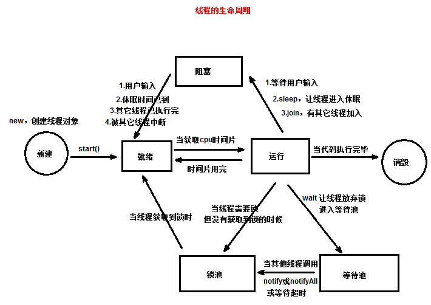
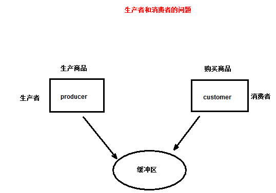

# 线程，主讲：汤小洋

## 一、简介

### 1. 进程

​	进程：在操作系统中独立运行的程序，每运行一个应用程序就对应着一个进程 process

​	多进程：在操作系统中可以同时运行多个程序

### 2. 线程

​	线程：是进程内部的一个执行单元，用来执行应用程序中一个功能 thread

​	多线程：在一个应用程序中可以同时执行多个功能，例如迅雷中同时执行多个下载任务就是多线程

​	特性：

- 一个进程中可以包含多个线程，且至少要有一个线程
- 一个线程必须属于某个进程，进程是线程的容器
- 一个进程中的多个线程共享该进程的所有资源

### 3. CPU时间片

​	对于单核CPU，在某个时间点只能处理一个程序

​	CPU分配给各个程序的时间，称为时间片，即该进程允许运行时间（时间很短）

- 从表面上看各个程序是同时运行的，实际上CPU在同一时间只能执行一个程序
- 只是CPU在很短的时间内，在不同程序间切换，轮流执行每个程序，执行速度很快，所以感觉上像是同时在运行

## 二、创建线程

​	两种方式：

- 继承Thread类
- 实现Runnable接口

### 1. 继承Thread类

​	步骤：

1. 定义一个类，继承自Thread类，重写run()方法
2. 创建该类的实例，即创建一个线程
3. 调用start()方法，启动线程（不能直接调用run()方法）

### 2. 实现Runnable接口

​	步骤：

1. 定义一个类，实现Runnable接口，实现run()方法
2. 创建实现类的实例
3. 创建Thread类的一个实例，将上一步中实现类的实例传入
4. 调用start()方法，启动线程

### 3. 两种方式的对比

​	继承Thread类

- 线程执行的代码放在Thread类的子类的run方法中
- 无法再继承其他类

​        实现Runnable接口

- 线程执行的代码放在Runnable接口的实现类的run方法中
- 可以继承其他类，避免单继承的局限性
- 适合多个相同程序代码的线程去处理同一个资源
- 增强程序的健壮性

## 三、线程的生命周期

### 1. 生命周期



### 2. 相关方法

| 方法名    | 作用                                                         | 说明     |
| --------- | ------------------------------------------------------------ | -------- |
| start     | 启动线程，线程进入就绪状态（可运行状态）                     |          |
| sleep     | 休眠线程，线程从执行状态进入阻塞状态                         | 静态方法 |
| yield     | 暂停执行线程，线程从执行状态进入就绪状态                     | 静态方法 |
| join      | 暂停执行线程，等待另一个线程执行完毕后再执行，线程从执行状态进入阻塞状态 |          |
| interrupt | 中断线程的休眠或等待状态                                     |          |

## 四、线程安全问题

### 1. 简介

​	多个线程同时访问共享数据时可能会出现问题，称为线程安全问题

- 当多线程访问共享数据时，由于CPU的切换，导致一个线程只执行了关键代码的一部分，还没执行完
- 此时另一个线程参与进来，导致共享数据发生异常

​        解决：线程同步机制synchronized + 锁

- 被synchronized包围的代码块，称为同步代码块
- 被synchronized修饰的方法，称为同步方法
- 锁，也称为对象锁，每个对象都自带一个锁(标识)，且不同对象的锁是不一样的

​        执行过程：

- 当线程执行*同步代码块或同步方法*时，必须获取特定对象的锁才行
- 且一旦对象的锁被获取，则该对象就不再拥有锁，直接线程执行完 同步代码块或同步方法时 才会释放对象的锁
- 如果线程无法获取特定对象上的锁，则线程会进入**该对象的锁池**中等待，直到锁被归还对象，此时需要该锁的线程会进行竞争

​        线程同步的优缺点：

- 优点：解决了线程安全的问题，使代码块在某一时间只能被一个线程访问
- 缺点：由于需要进行锁的判断，消耗资源，效率变低

### 2. 解决

​	两种方式：同步代码块、同步方法

```java
synchronized (this) { //多个线程必须使用同一把锁
	if (num > 0) {
		try {
			Thread.sleep(10);
		} catch (InterruptedException e) {
			e.printStackTrace();
		}
		System.out.println(Thread.currentThread().getName()
				+ "----售出车票：" + num--);
	}
}
```

```java
public synchronized void sellTicket(){
	if (num > 0) {
		try {
			Thread.sleep(10);
		} catch (InterruptedException e) {
			e.printStackTrace();
		}
		System.out.println(Thread.currentThread().getName()
				+ "----售出车票：" + num--);
	}
}
```

## 五、线程间的通信

### 1. 锁池和等待池

​	每个对象都自带锁池和等待池

​	锁池：

- 当线程执行synchronized块时如果无法获取特定对象上的锁，此时会进入*该对象*的**锁池**
- 当锁被归还给该对象时，锁池中的多个线程会竞争获取该对象的锁
- 获取对象锁的线程将执行synchronized块，执行完毕后会释放锁

​        等待池：

- 当线程获取对象的锁后，可以调用`wait()`方法放弃锁，此时会进入该对象的**等待池**
- 当*其他线程*调用*该对象*的`notify()`或`notifyAll()`方法时，等待池中的线程会被唤醒，会进入该对象的锁池
- 当线程获取对象的锁后，将从它上次调用wait()方法的位置开始*继续运行*

### 2. 相关方法

| 方法名    | 作用                                     | 说明                                       |
| --------- | ---------------------------------------- | ------------------------------------------ |
| wait      | 使线程放弃对象锁，线程进入等待池         | 可以调用等待超时时间，超时后线程会自动唤醒 |
| notify    | 随机唤醒等待池中的一个线程，线程进入锁池 | 唤醒的是特定对象的等待池中的线程           |
| notifyAll | 唤醒等待池中的所有线程                   |                                            |

​	注意：

- 这三个方法都只能在synchronized块中使用，即只有获取了锁的线程才能调用
- 等待和唤醒必须使用的是同一个对象

## 六、生产者-消费者问题

### 1. 简介

​	生产者-消费者问题是多线程同步的一个经典问题，即并发协作的问题

​	所谓生产者-消费者问题，实际上主要是包含了两种线程：生产者线程、消费者线程

​	生产者线程：

- 生产商品并放入缓冲区
- 当缓冲区满时，生产者不可再生产商品

​        消费者线程：

- 从缓冲区中取出商品
- 当缓冲区为空时，消费区不可再取出商品

​        注：生产者和消费者使用的是同一个缓冲区

### 2. 实现

```java
@Override
public void run() {
    while (true) {
        synchronized (pool) {
            if (pool.isFull()) {
                try {
                    pool.wait();
                } catch (InterruptedException e) {
                    e.printStackTrace();
                }
            } else {
                pool.put();
                System.out.println(this.name + "生产了一个商品，现在商品数量："
                                   + pool.getNum());
                pool.notifyAll();
            }
        }

        try {
            Thread.sleep(3000);
        } catch (InterruptedException e) {
            e.printStackTrace();
        }
    }
}
```

```java
@Override
public void run() {
    while (true) {
        synchronized (pool) {
            if (pool.isEmpty()) {
                try {
                    pool.wait();
                } catch (InterruptedException e) {
                    e.printStackTrace();
                }
            } else {
                pool.get();
                System.out.println(this.name + "消费了一个商品，现在商品数量是："
                                   + pool.getNum());
                pool.notifyAll();
            }
        }

        try {
            Thread.sleep(2000);
        } catch (InterruptedException e) {
            e.printStackTrace();
        }
    }
}
```

## 七、线程单例

### 1. 简介

​	为每个线程提供一个实例

- 同一个线程获取的是一个实例
- 不同线程获取的是不同的实例

​       Java中提供了一个ThreadLocal，直接提供了线程单例的解决方案

- 用于管理变量，提供了线程局部变量
- 它为变量在每个线程中都存储了一个本地的副本

### 2. 实现

```java
public class MyThreadLocal<T> {

	private Map<Thread, T> map = new HashMap<>();

	public void set(T t) {
		map.put(Thread.currentThread(), t); // 将当前线程作为Key
	}

	public T get() {
		return map.get(Thread.currentThread());
	}
}
```


