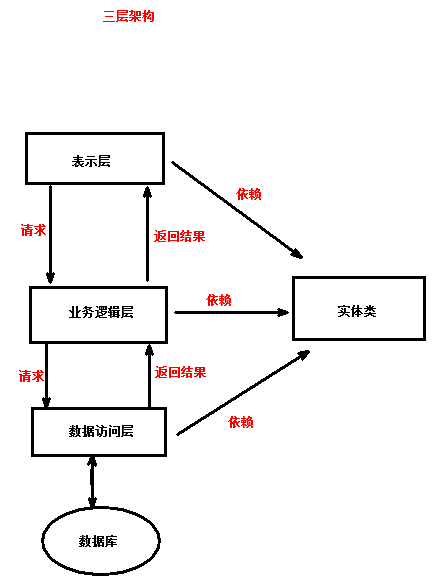

# JDBC，主讲：汤小洋

## 一、简介

### 1. JDBC是什么

​	Java Database Connectivity 是Java程序访问数据库的方式

- 提供了一套用于访问数据库的接口（API），其独立了特定的数据库
- 不同的数据库产品，实现方式和通信协议都是不一样的
- 由数据库厂商对接口进行实现，然后以`jar包`的形式提供实现类，这个jar包称为 数据库的驱动包

​        注：jar包就是一个以`.jar`结尾的文件，其中包含了一些已经写好的类和接口，只需要将jar包引入到项目中，就可以直接使用jar包中的类和接口

### 2. 相关API

​	JDBC相关的类和接口都在java.sql包中

| 类/接口           | 作用                                   |
| ----------------- | -------------------------------------- |
| DriverManager     | 用于管理数据库驱动，建立与数据库的连接 |
| Connection        | 表示与数据库的连接                     |
| Statement         | 用于执行SQL语句，并返回结果集ResultSet |
| PreparedStatement | 用于执行预编译的SQL语句                |
| ResultSet         | 表示结果集，封装了数据库返回的结果     |

## 二、基本用法

### 1. jar包的管理

​	需要将jar包导入到项目中才能使用

​	导入：

1. 在项目根目录下创建一个lib文件夹
2. 将jar包拷贝到该文件夹中
3. 右击jar包——>Build Path——>Add to Build Path

​        移除：References Libraries——>右击jar包——>Build Path——>Remove from Build Path

 	批量管理：右击项目——>Build Path——>Configure Build Path——>Libraries

### 2. 操作步骤

​	访问数据库的步骤

```java
String driverClassName="com.mysql.jdbc.Driver";
String url="jdbc:mysql://localhost:3306/test?useUnicode=true&characterEncoding=utf8";
String username="root";
String password="";

Connection conn = null;
Statement stmt = null;
try {
    // 1.注册驱动
    Class.forName(driverClassName);
    // 2.获取连接
    conn = DriverManager.getConnection(url, username, password);
    // 3.获取Statement
    stmt = conn.createStatement();
    // 4.执行sql语句
    String sql = "insert into t_user(username,password,age) values ('汤姆','123',18)";
    int num = stmt.executeUpdate(sql); // 调用executeUpdate()方法，返回受影响的行数
    // 5. 处理结果
    System.out.println(num);
} catch (ClassNotFoundException e) {
    e.printStackTrace();
} catch (SQLException e) {
    e.printStackTrace();
} finally {
    // 6.关闭资源（关闭的顺序与打开的顺序相反）
    if (stmt != null) {
        try {
            stmt.close();
        } catch (SQLException e) {
            e.printStackTrace();
        }
    }
    if(conn!=null){
        try {
            conn.close();
        } catch (SQLException e) {
            e.printStackTrace();
        }
    }
}
```

### 3. 数据库操作

#### 3.1 更新

​	使用`int executeUpdate(sql)`方法，用于执行更新操作（增、删、改），返回影响的行数

```java
/*
 * 更新操作，适用于：
 * 	insert/delete/update/create/drop
 * 		凡是在命令行中返回Query OK, 1 row affected (0.01 sec)的都适用
 */
public static void update(String sql) {
	Connection conn = null;
	Statement stmt = null;
	try {
		Class.forName("com.mysql.jdbc.Driver");
		conn = DriverManager
				.getConnection(
						"jdbc:mysql://localhost:3306/test?useUnicode=true&characterEncoding=utf8",
						"root", "");
		stmt = conn.createStatement();
		int num = stmt.executeUpdate(sql);
		System.out.println(num); // 对于更新操作，结果一般无需处理
	} catch (ClassNotFoundException e) {
		e.printStackTrace();
	} catch (SQLException e) {
		e.printStackTrace();
	} finally {
		if (stmt != null) {
			try {
				stmt.close();
			} catch (SQLException e) {
				e.printStackTrace();
			}
		}
		if (conn != null) {
			try {
				conn.close();
			} catch (SQLException e) {
				e.printStackTrace();
			}
		}
	}
}
```

#### 3.2 查询

​	使用`ResultSet executeQuery(String sql)`方法，用于执行查询操作，返回查询到的结果

```java
/*
 * 查询操作 
 */
public static List<User> query(String sql) {
	List<User> list=new ArrayList<User>();
		
	Connection conn = null;
	Statement stmt = null;
	ResultSet rs = null;
	try {
		Class.forName("com.mysql.jdbc.Driver");
		conn = DriverManager
				.getConnection(
						"jdbc:mysql://localhost:3306/test?useUnicode=true&characterEncoding=utf8",
						"root", "");
		stmt = conn.createStatement();
		rs = stmt.executeQuery(sql); // 返回查询到的结果，以ResultSet形式返回
		while(rs.next()){ // 作用：1.指向下一条数据 2.返回下一条数据是否存在(在一次循环中，不要多次调用next()方法，会跳过部分数据)
			int id = rs.getInt(1); // 根据列的编号来获取，从1开始
			String username = rs.getString(2);
			String password = rs.getString("password"); // 根据列名来获取
			int age = rs.getInt("age");
			// System.out.println(id+","+username+","+password+","+age);
			
			User user = new User(id, username, password, age);
			list.add(user);
		}
	} catch (ClassNotFoundException e) {
		e.printStackTrace();
	} catch (SQLException e) {
		e.printStackTrace();
	} finally {
		if(rs!=null){
			try {
				rs.close();
			} catch (SQLException e) {
				e.printStackTrace();
			}
		}
		if (stmt != null) {
			try {
				stmt.close();
			} catch (SQLException e) {
				e.printStackTrace();
			}
		}
		if (conn != null) {
			try {
				conn.close();
			} catch (SQLException e) {
				e.printStackTrace();
			}
		}
	}
	return list;
}
```

### 4. 封装JdbcUtil工具类

```java
/**
 * JDBC工具类
 */
public class JdbcUtil {
	/**
	 * 获取数据库连接
	 */
	public static Connection getConnection() {
		String driverClassName = "com.mysql.jdbc.Driver";
		String url = "jdbc:mysql://localhost:3306/test?useUnicode=true&characterEncoding=utf8";
		String username = "root";
		String password = "";

		Connection conn = null;
		try {
			Class.forName(driverClassName);
			conn = DriverManager.getConnection(url, username, password);
		} catch (ClassNotFoundException e) {
			e.printStackTrace();
		} catch (SQLException e) {
			e.printStackTrace();
		}
		return conn;
	}

	/**
	 * 关闭资源
	 */
	public static void close(Connection conn, Statement stmt, ResultSet rs) {
		if (rs != null) {
			try {
				rs.close();
			} catch (SQLException e) {
				e.printStackTrace();
			}
		}
		if (stmt != null) {
			try {
				stmt.close();
			} catch (SQLException e) {
				e.printStackTrace();
			}
		}
		if (conn != null) {
			try {
				conn.close();
			} catch (SQLException e) {
				e.printStackTrace();
			}
		}
	}

	public static void close(Connection conn, Statement stmt) {
		close(conn, stmt, null);
	}
}
```

### 5. PreparedStatement

​	PreparedStatement继承Statement，推荐使用PreparedStatement

​	优点：

- 可以使用`?`占位符，简单易读（称为动态SQL）
- 预编译SQL语句，效率高
- 安全，避免出现SQL注入

### 6. 练习：学生管理

​	主要功能：

```java
1.查询所有学生
2.根据学号查询学生
3.根据姓名和年龄范围查询学生
4.添加学生
5.修改学生
6.根据学号删除学生	 
```

## 三、其他用法

### 1. 返回主键

​	保存后返回生成的主键

```java
conn=JdbcUtil.getConnection();
// 传入常量值RETURN_GENERATED_KEYS，表示返回生成的主键
ps=conn.prepareStatement(sql, PreparedStatement.RETURN_GENERATED_KEYS);
ps.executeUpdate();

//获取存储主键的结果集
rs=ps.getGeneratedKeys();
while(rs.next()){ //可能是复合主键
	System.out.println(rs.getInt(1));
}
```

### 2. 事务

​	Transaction 事务是用来保证数据操作的完整性

- 一个业务由若干个一次性的操作组成，这些操作要么都成功，要么都失败，如银行转账

- 事务的四大特性ACID

  原子性（Atomicity）：不可再分

  一致性（Consistency）：事务执行的前后，数据库是一致的

  隔离性（Isolation）：两个事务的操作互不干扰

  持久性（Durability） ：事务提交后，结果被永久保存下来

​          JDBC默认是自动提交事务的，将每一条sql语句都当做一个独立的事务执行

- 关闭自动提交事务 `conn.setAutoCommit(false);`
- 提交事务 `conn.commit();`
- 回滚事务 `conn.rollback();`

### 3. 批处理操作

​	当需要执行的sql语句比较多时，每次发送一条SQL语句并执行的效率比较低，此时可以批量处理执行SQL

​	步骤：

1. 在url中添加`rewriteBatchedStatements=true`参数，启用批处理
2. 调用addBatch()方法，添加批处理
3. 调用executeBatch()方法，执行批处理

​        事务和批处理的区别：

- 事务

  底层是在数据库方存储SQL，没有提交事务的数据放在数据库的临时表空间

  最一次把临时表空间中的数据提交到数据库服务器执行

  消耗的是数据库服务器内存

- 批处理

  底层是在客户端存储SQL

  最后一次把客户端存储的数据发送到数据库服务器执行

  消耗的是客户端的内存

### 4. 元数据

​	Meta Data元数据是用来描述数据的数据，主要是描述数据属性的信息

​	分类：

- 数据库的元数据 DatabaseMetaData，获取数据库的名称、版本等信息
- 结果集的元数据 ResultSetMetaData，获取结果集中列的数量、名称、列类型等

## 四、数据库连接池

### 1. 简介

​	传统获取数据库连接的方式存在的问题：

- 每一次获取连接时都需要向数据库发送请求建立连接，耗时、效率低
- 访问结束后会断开与数据库的连接，下次访问时需要重新建立连接
- 并发访问量较大时，网站性能会受到很大的影响
- 安全性和稳定性相对较差

​        使用连接池技术：

- 原理：创建一个连接池pool，在该连接池创建时，会先向数据库申请建立多个连接（初始连接数），当用户需要连接时直接从连接池中获取即可
- 访问结束后会将连接归还给连接池，可以被其他用户重复使用

### 2. 常用连接池

​	开源的数据库连接池：

- dbcp

  Apache开源项目，全称 Database Connection Pool，也称为commons-dbcp

  Apache是一个运作开源项目的非盈利性的组织，提供了很多开源项目（jar包、软件） 

- druid

  阿里巴巴的开源项目，俗称为 德鲁伊

- c3p0（已经没落了）

### 3. 用法

#### 3.1 使用dbcp

​	添加jar包：commons-dbcp.jar、commons-pool.jar	

#### 3.2 使用druid

​	添加jar包：druid-1.1.14.jar

### 4. 练习：改写学生管理

​	主要功能：

```java
学生管理
1.查询所有学生
2.根据学号查询学生
3.根据姓名和年龄范围查询学生
4.添加学生
5.修改学生
6.根据学号删除学生
班级管理
1.查询所有班级
2.根据班级号查询班级
3.添加班级
```

​	技术要求：

1. 使用连接池技术

2. 实体类

   entity：实体类对应数据库中的表，类的属性对应表的字段

   pojo：Plain Ordinary Java Object 简单的Java对象，类中包含：属性/get/set/构造方法，不允许有业务逻辑

   vo：Value Object 值对，用于封装 值/数据 的对象，可自定义属性

3. 使用模板模式

   JdbcTemplate、RowMapper

## 五、三层架构

### 1、简介

​	三层架构是一种程序设计结构，使用分层式结构将整个应用拆分为三层：

- 表示层
- 业务逻辑层
- 数据访问层

​        分层的目的：实现高内聚、低耦合

- 每一层分工明确，相互独立，任意一层发生修改都不影响其他层
- 每一层中都不应该出现其它层的技术



### 2. 三层

#### 2.1 表示层

​	表示层，也称为显示层（View）

- 用于实现 **和系统用户进行数据交互**

  向用户展示数据，如控制台、网页、导出文件等

  接收用户输入的数据，如Scanner、网页、导入文件等

- 类的命名：一般使用XxxView，Xxx一般表示业务模块

#### 2.2 业务逻辑层

​	业务逻辑层 ，也称为业务层（Service）

- 用于实现  **具体的业务逻辑功能**

- 类和接口的命名：一般使用XxxService、XxxServiceImpl

- 方法的命名：add、remove、modify、find、findAll、findById...

  使用具体业务名，如regist、login、submit、apply、transfer....

#### 2.3 数据访问层

​	数据访问层，也称为持久层（DAO：Data Access Object 数据访问对象）

- 用于实现  **对数据的访问操作，即数据的持久化操作**
- 类和接口的命名：XxxDao、XxxDaoImpl
- 方法的命名：insert、delete、update、select、selectAll、selectById...

### 3. 技术要求

​	面向接口编程：使用接口解耦合，分离（接口中方法的）调用者和实现者

#### 3.1  工厂

​	使用 **工厂 + 接口** 进行对象的创建，降低层与层之间的耦合度，实现解耦合——>高低原则

#### 3.2 异常

​	每一层都需要对该层的异常进行 **捕获 和 转换**

- Dao层：捕获SQLException——>抛自定义异常DataAccessException extends RuntimeException

- Service：捕获DataAccessException ——>抛自定义异常ServiceException extends RuntimeException

  对于业务相关的异常——>抛自定义异常，继承自Exception，如StudentNotFoundException Extends Exception

#### 3.3 事务

​	事务操作

- 增、删、改操作必须加事务，查询操作可以不加，但建议所有数据库操作都加事务
- 事务加在**Service层**，即在Service层实现事务操作，可以通过代理添加事务功能
- 需要对事务代码进行封装，使用 事务管理器类
- 使用ThreadLocal管理Connection，实现线程单例

​       改写学生管理系统：

```java
调换两名学生所在班级
```

### 4. 项目结构

#### 4.1 结构层次

```java
项目
	|-JRE System library // JRE环境
	|-References Libraries // 项目中引用的jar
    |-lib // 用于存放jar包
    |-src // 源代码
    	|-域名反向.项目名
    		|-entity // 实体类
    		|-dao	// 数据访问层的接口
    			|-impl // 数据访问层的实现类
    		|-service // 业务逻辑层的接口
    			|-impl  // 业务逻辑层的实现类
    			|-proxy // 业务逻辑层的代理类
    		|-view	// 表示层的类
    		|-util // 工具
    		|-mapper // 行映射的实现类
    		|-factory // 工厂
    		|-exception // 异常
    		|-transaction // 事务
    			|-impl // 事务的实现类
            |-constant // 常量
            |-vo // 值对象
    	|-datasource.properties // 数据库的配置文件	
    	|-objs.properties // 工厂的配置文件
```

#### 4.2 封装jar包

​	将自己写的工具类打包jar包，供他人使用，如实现jdbc操作的代码

​	步骤：

1. 新建一个Java项目，将相关代码拷贝到该项目中
2. 右击项目——>Export——>JAR file——>指定保存的路径，如itany-jdbc-1.3.jar


