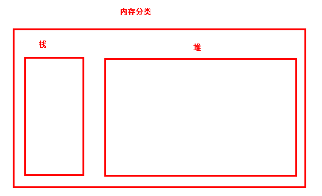
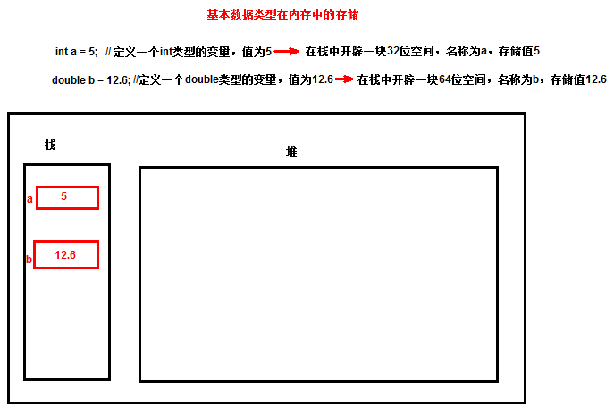
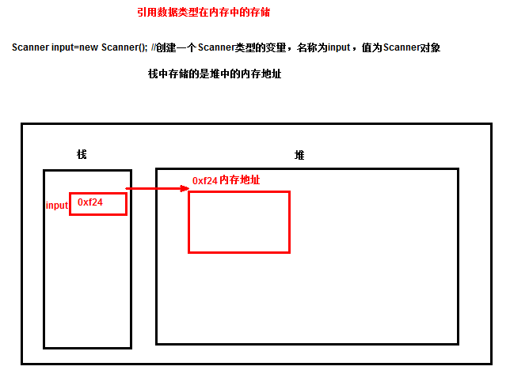
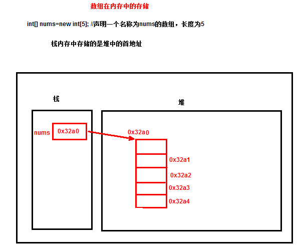
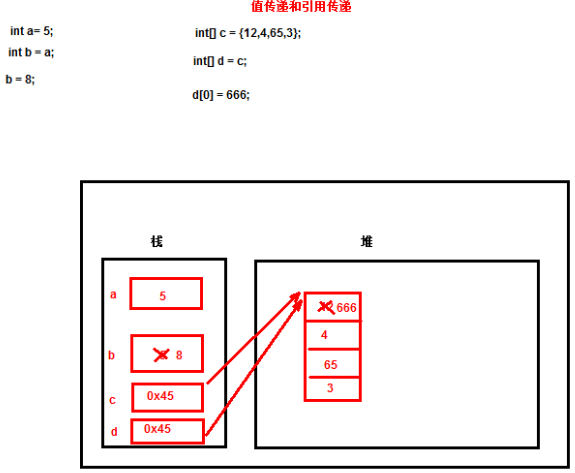
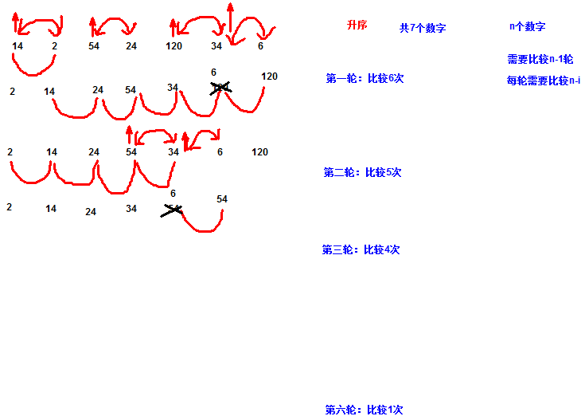

# Java进阶，主讲：汤小洋

## 一、Java方法

### 1. 简介

​	方法是实现特定功能的代码段的封装，在需要时可以多次调用方法来完成该功能，实现代码复用。

​	使用步骤：

1. 定义方法
2. 调用方法

### 2. 自定义方法

​	语法：

```java
修饰符  返回值类型 方法名(参数){
    //方法体
}
```

​	说明：

- 修饰符：对方法的修饰，public static暂且认为是固定写法
- 返回值类型：方法执行后的返回值类型，如果没有返回值则指定为void
- 方法名：采用驼峰命名法，一般使用动词
- 参数：执行方法时所需要的信息，参数由参数类型和参数名组成，多个参数之间以逗号隔开

### 3. 递归

​	方法自己调用自己，称为递归，该方法称为递归方法

```java
/*
 * 计算x的y次方，如2的5次方
 */
public static int calc(int x, int y) {
	// 常规实现方法
	// if (y == 0) {
	// return 1;
	// }
	// int result = x;
	// for (int i = 1; i < y; i++) {
	// result = result * x;
	// }
	// return result;

	if (y == 0) {
		return 1;
	}
	return x * calc(x, y - 1);
}
```

## 二、程序调试

### 1. 简介

​	如果程序出现问题/错误，运行结果与预期不一样，怎么办？

​	如何发现问题，找到出现问题的位置？

​	方式：

1. 阅读代码  或 输出语句
2. 使用专门的技术：程序调试debug

### 2. Debug的使用

​	步骤：

1. 设置断点

   程序暂停运行的位置（代码行）

2. 单步运行

   F6：单步运行，接着执行下一次代码

   F5：单步跳入执行，会进到方法中

3. 观察变化的变化

## 三、数组

### 1. 简介

​	数组是用来存储相同数据类型的一组数据

- 声明一个变量就是在内存中划出一块空间
- 声明一个数组就是在内存中划出一串连续的空间

​        数组的四要素：

- 数组名称：用来区分不同的数组
- 数组元素：向数组中存放的数据
- 元素类型：数组元素的数据类型
- 元素下标：数组元素的编号，也称为索引，从0开始，通过下标来访问数组元素

### 2. 基本用法

​	步骤：

1. 声明数组

   指定元素的类型

   `数据类型[] 数组名称;` 或 `数据类型 数组名称[];`

2. 分配空间

   指定数组长度/大小，即分配几个连续的空间

   `数组名称=new 数组类型[大小];`

3. 数组赋值

   向数组中添加元素

   `数组名称[下标]=值;`

4. 访问元素

   获取数组中的元素

   `数组名称[下标];`

```java
// 1.声明数组，即定义一个数组
int[] nums; // 推荐
String names[];

// 2.分配空间，指定数组大小
nums = new int[4];

// 3.数组赋值
nums[0] = 13;
nums[1] = 25;
nums[2] = 38;
nums[3] = 250;

// 4.访问元素
System.out.println("第三个元素：" + nums[2]);
System.out.println(nums[0]);
System.out.println(nums[3]); // 最后一个元素的下标为：数组长度-1

System.out.println(nums); // 直接访问数组名称时会显示数组在内存中的首地址

/*
 * 定义数组的同时为其分配空间
 */
// String[] hobbies=new String[3];
/*
 * 定义数组的同时为其赋值
 */
// String[] hobbies = new String[] { "吃饭", "睡觉", "打豆豆" }; // 此时不能指定数组长度
String[] hobbies = { "吃饭", "睡觉", "打豆豆" };
System.out.println(hobbies[1]);

/*
 * 调用length属性获取数组长度
 */
System.out.println(hobbies.length);
System.out.println(nums.length);
System.out.println("最后一个元素："+nums[nums.length-1]);


/*
 * 数组长度一旦指定后，则无法修改，不能增加长度
 */
nums=new int[6];
```

### 3. 动态赋值

​	循环接收用户输入的数据，动态为数组赋值

```java
Scanner input = new Scanner(System.in);

/*
 * 循环接收用户输入的数据，为数组赋值
 */
String[] names = new String[5];
for (int i = 0; i < names.length; i++) {
	System.out.print("请输入第" + (i + 1) + "个学生的姓名：");
	names[i] = input.next();
}

/*
 * 循环输出数组中的元素
 */
for (int i = 0; i < names.length; i++) {
	System.out.println(names[i]);
}
```

### 4. 增强for循环

​	增强for循环，用来对集合进行遍历操作，也称为foreach循环（foreach本身并不是java关键字）

​	语法：

```java
for(元素类型 循环变量:集合){
    
}
```

```java
int[] nums = { 3, 12, 67, 2, 65, 32, 9 };

// 普通的for循环
for (int i = 0; i < 5; i++) {
	System.out.println(nums[i]);
}
System.out.println();

// 增强for循环
for (int n : nums) {
	System.out.println(n);
}

//Arrays类的toString()方法，将数组转换为字符串
System.out.println(Arrays.toString(nums)); //数组元素以逗号隔开，放到中括号里
```

### 5. 默认值

​	数组中元素的默认值

```java
/*
 * 局部变量是没有默认值的
 */
// int age;
// System.out.println(age);

/*
 * 数组中元素是有默认值的
 */
int[] nums = new int[3];
double[] heights = new double[3];
boolean[] flags = new boolean[3];
String[] names = new String[3];

System.out.println(nums[1]); // 0
System.out.println(heights[1]); // 0.0
System.out.println(flags[1]); // false
System.out.println(names[1]); // null
```

### 6. 常见错误

```java
int[] nums = new int[5];

/*
 * ArrayIndexOutOfBoundsException 数组下标越界异常 
 * 原因：下标大于等于数组长度 或 小于0
 */
System.out.println(nums[2]);

/*
 * 不支持以下写法
 */
// int[] scores=new int[5];
// scores={12,5,234,2};
```

## 四、数据存储方式

### 1. 内存分类

​	Java中内存的分类：栈内存、堆内存

​	区别：

- 栈的存取速度比堆要快
- 栈内存要小于堆内存



### 2. 数据类型

​	根据存储方式的不同，主要分为两种：

- 基本数据类型（共8种）

  byte short int long float double boolean char

  定义方式：`数据类型 变量名=值;`

- 引用数据类型

  除了基本数据类型和null以外的其他数据类型，如String、数组、类、接口....

  定义方式：`数据类型 变量名=new 数据类型();`

  引用类型的默认值是null

  **注：String类型比较特殊，因为特别常用，所以JVM对其做了优化**

### 3. 数据在内存中的存储方式

​	基本数据类型在内存中的存储



​	引用数据类型在内存中的存储



总结：

- 基本数据类型的值和引用数据类型的名称，存储在栈内存中
- 引用数据类型的值，存储在堆内存中

数组在内存中的存储



### 4. 值传递和引用传递

​	对于基本数据类型，传递的是值

​	对于引用数据类型，传递的是内存地址



```java
/*
 * 基本数据类型
 */
int a = 5;
int b = a; // 将a的值传递给b
b = 8;
System.out.println(a);
System.out.println(b);

/*
 * 引用数据类型
 */
int[] c = { 12, 4, 23, 7 };
int[] d = c; // 将c的内存地址传递给d，本质上指向同一块内存空间
d[0] = 666;
System.out.println(Arrays.toString(c));
System.out.println(Arrays.toString(d));

/*
 * 方法传参，与变量赋值是相同的
 */
	change(a,c);
	System.out.println(a);
	System.out.println(Arrays.toString(c));

}

public static void change(int i, int[] array) {
	i = 111;
	array[array.length - 1] = 222;
}
```

## 五、二维数组

### 1. 简介

​	二维数组可以认为是特殊的一维数组，一维数组中的每个元素又是一个一维数组

​	分类：

- 规则的二维数组
- 不规则的二维数组

### 2. 规则的二维数组

​	数组形状是规则的

```java
/*
 * 规则的二维数组
 */
// 定义二维数组
int[][] nums;
String names[][];

// 分配空间
nums = new int[3][2]; // 3表示第一维的长度，2表示第二维的长度（可以认为是3行2列，规则的）

// 赋值
nums[0][0] = 13;
nums[0][1] = 4;
nums[1][0] = 6;
nums[1][1] = 65;
nums[2][0] = 8;
nums[2][1] = 14;

// 访问元素
// System.out.println(nums[1][0]);

/*
 * 定义数组的同时为其赋值
 */
// int[][] a = new int[][] { { 13, 4 }, { 6, 65 }, { 8, 14 } };
int[][] a = { { 13, 4 }, { 6, 65 }, { 8, 14 } };
// System.out.println(a.length); // 获取第一维的长度
// System.out.println(a[0].length); // 获取第二维的长度

// 使用二重循环遍历二维数组
for (int i = 0; i < a.length; i++) {
	for (int j = 0; j < a[i].length; j++) {
		System.out.print(nums[i][j] + "\t");
	}
	System.out.println();
}
```

### 3. 不规则的二维数组

​	数组形状是不规则的

```java
/*
 * 不规则的二维数组
 */
int[][] c = new int[4][]; // 只指定第一维的长度
c[0] = new int[3]; // 第二维的长度有所不同
c[1] = new int[1];
c[2] = new int[2];
c[3] = new int[3];
c[0][0] = 5;
c[0][1] = 23;
c[0][2] = 9;
c[1][0] = 76;
c[2][0] = 6;
c[2][1] = 3;
c[3][0] = 79;
c[3][1] = 7;
c[3][2] = 90;
int[][] d = { { 5, 23, 9 }, { 76 }, { 6, 3 }, { 79, 7, 90 } };

for (int i = 0; i < d.length; i++) {
	for (int j = 0; j < d[i].length; j++) {
		System.out.print(d[i][j] + "\t");
	}
	System.out.println();
}
```

## 六、冒泡排序

​	原理：依次比较相邻的两个元素，如果顺序错误就交换位置



​	结论：如果有n个元素，需要比较n-1轮，每一轮需要比较n-i次（i表示第几轮）

```java
int[] nums = { 14, 2, 54, 24, 120, 34, 6 };

// 外层循环控制比较的轮数
for (int i = 0; i < nums.length - 1; i++) {
    // 内层循环控制每一轮比较的次数
    for (int j = 0; j < nums.length - i - 1; j++) {
        if (nums[j] > nums[j + 1]) {
            int temp = nums[j + 1];
            nums[j + 1] = nums[j];
            nums[j] = temp;
        }
    }
    System.out.println("第" + (i + 1) + "轮：" + Arrays.toString(nums));
}

System.out.println("排序后的数组：" + Arrays.toString(nums));
```

## 七、Arrays工具类

​	java.util.Arrays类提供了操作数组的方法

```java
int[] nums = { 14, 2, 54, 24, 120, 34, 6 };

/*
 * toString() 将数组转换字符串
 */
System.out.println(Arrays.toString(nums));

/*
 * sort() 排序
 */
Arrays.sort(nums);
System.out.println(Arrays.toString(nums));

/*
 * fill() 填充
 */
Arrays.fill(nums, 0);
System.out.println(Arrays.toString(nums));
```

## 八、不定长参数

`数据类型...`表示不定长参数，特点：

- 只能是方法的最后一个参数
- 调用方法时参数的个数任意
- 一个方法最多只有一个不定长参数
- 本质上就是一种特殊的数组，只能作为方法的形参使用


