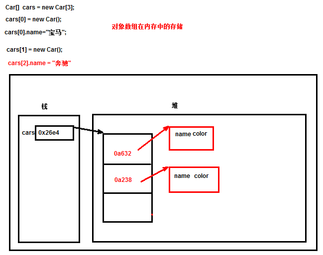
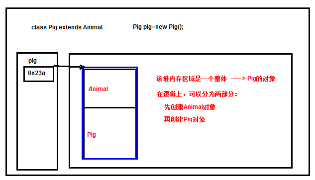

# 面向对象，主讲：汤小洋

## 一、面向对象简介

### 1. 面向对象是什么

​	OOP：Object Oriented Programming 

​	面向对象是一种程序的设计范型，是一种思想，使用`类` 和 `对象`的概念进行程序设计

**一切皆对象**，世间万物都是对象

### 2. 两个概念

#### 2.1 类

​	类是具有相同的特征和行为的一组对象的抽象	

​	类是一个抽象的概念，没有具体事物与之对应，如人类、动物等

#### 2.2 对象

​	对象是类的实例

​	对象是某一个具体的事物，如这个学生、这只狗

### 3. 产生

## 二、类的使用

### 1. 定义类

​	语法：

```java
class 类名
{
    成员属性;
    成员方法;
}
```

​	类：

- 一个类就是一个数据类型，定义一个类其实就是创建了一个数据类型
- 类名使用帕斯卡命名法，即所有单词首字母大写
- **一个文件中可以定义多个类，但只能有一个public修饰的类，且此类的名称必须与文件名相同**

​        属性：

- 类的特征
- 定义方式：`数据类型 属性名;`
- 属性名使用驼峰命名法，即第一个单词首字母小写，其他单词首字母大写

​        方法：

- 类的行为
- 定义方式：`public 返回值类型 方法名(参数列表)｛ 方法体｝`
- 方法名使用驼峰命名法，且一般多使用动词

### 2. 创建对象

​	语法：

```java
// 方式1
类名 对象名=new 类名();
// 方式2
类名 对象名;
对象名=new 类名();
```

### 3. 访问对象

​	访问对象的属性：`对象名.属性名`

​	访问对象的方法：`对象名.方法名()`

## 三、this关键字

### 1. 全局变量和局部变量

​	全局变量：

- 在类中定义的变量，称为全局变量，也就是属性
- 在整个类中都可以使用
- 有默认值，可以直接使用

​        局部变量：

- 除全局变量以外的其他变量，称为局部变量，如在方法 或 代码块中定义的变量
- 只能在局部访问
- 没有默认值，必须行赋值才能使用
- 局部变量和全局变量同名，局部变量优先级更高，即默认访问的是局部变量

​       可以使用this关键字来解决局部变量和全局变量同名的问题

### 2. this用法

​	this表示当前类的一个对象

- 只能在类的方法中使用，表示方法的调用者，即调用该方法的对象
- 当局部变量和全局变量同名时，可以使用`this.`来访问全局变量
- 当局部变量和全局变量不同名时，可以省略不写`this.`

## 四、static关键字

​	static表示静态的，可以用来修饰变量和方法，分别称为静态变量和静态方法

### 1. 静态变量

​	使用static修饰的变量，称为静态变量 或 类变量（非static修饰的变量称为实例变量）

​	静态变量为类的所有对象所共有，属于整个类

​	访问方式：`对象名.属性名` 或 `类名.属性名`（推荐）

### 2. 静态方法

​	使用static修饰的方法，称为静态方法 或 类方法（非static修饰的方法称为实例方法）

​	访问方式：`对象名.方法名()` 或 `类名.方法名()`（推荐）

​	静态方法中只能访问静态变量或静态方法，不能访问实例变量和实例方法


​	变量分类：

- 从作用域上划分：全局变量、局部变量
- 从变量所属上划分：实例变量、类变量

## 五、方法重载

​	一个类中包含两个或两个以上同名的方法，其参数不同，称为方法重载overload

- 在同一个类中
- 方法名相同
- 参数列表不同（参数个数、类型、顺序至少有一项不同），即方法签名不同
- 与方法修饰符、返回值类型、形参名无关

​        作用：提供同一种功能 的多种实现方式，根据调用者传递的参数来决定采用哪种方式

​	

> 练习：对象数组




## 六、构造方法

​	构造方法是一种特殊的方法，也称为构造函数 或 构造器 constructor 

​	作用：用于创建和初始化对象

​	特点：

- 方法名必须和类名相同
- 没有返回值，也不能写作void
- 当创建类的对象时，会自动调用构造方法
- 一个类中可以有多个构造方法（构造方法重载）
- 如果没有自定义构造方法，则类中默认会有一个无参的构造方法
- 如果自定义了构造方法，则默认的无参构造方法就没有了，可以自己写无参的构造方法（建议）
- 可以使用`this(参数)`调用当前类中的另一个构造方法，但只能出现在构造方法的第一行

## 七、包package

​	包的作用：

- 区分同名的类
- 类较多时便于管理
- 便于访问控制

​        声明包：

- 用来指定当前类所在包
- 使用package，写法：`package 包名;`
- 必须位于第一行（注释除外）

​        命名规范：

- 采用组织的反向域名
- 使用小写字母，不能以点号开头或结尾
- com.baidu.fanyi

​        导入包：

- 当需要使用其他包中的类时必须导入
- 使用import，写法：`import 包名.类名;` 或 `import 包名.*;`
- 必须位于包声明的下面

​       常用的包：

- java.lang 包含Java的核心类，如System、String、Math等，**该包默认会被自动导入，当使用其中的类，无需import导入**
- java.util 包含实用的工具类，如Scanner、Arrays等
- java.io 包含输入/输出操作的类
- java.sql 包含数据库操作的类
- java.net 包含网络操作的类
- java.awt 包含图形窗口操作的类

​       **注意：定义类务必指定包名，严禁将类直接放到src下（default package默认包），会导致类无法被引用**

## 八、访问修饰符

​	用来控制访问范围，可以修饰属性、方法、类等

| 修饰符            | 同一个类 | 同一个包内的类 | 不同包的子类 | 不同包并且不是子类 |
| ----------------- | -------- | -------------- | ------------ | ------------------ |
| public公开的      | 是       | 是             | 是           | 是                 |
| protected受保护的 | 是       | 是             | 是           | 否                 |
| 默认              | 是       | 是             | 否           | 否                 |
| private私有的     | 是       | 否             | 否           | 否                 |

​	总结：

- public：在哪都能访问
- protected：只有不同包并且非子类不能访问，其他都能访问
- 默认：只有本包中可以访问
- private：只有本类中可以访问

​        范围从大到小的顺序：public>protected>默认>private

## 九、对象的初始化顺序

### 1. 类加载

​	概念：将class文件读取加载到JVM内存中的过程，称为类加载

​	类加载的时机：

1. 创建类的对象
2. 调用类的静态属性或静态方法
3. 执行main方法时，main方法所在的类会被加载
4. 通过反射调用类`Class.forName("包名.类名")`

### 2. 类的成员

​	类中的成员：

- 属性（实例属性、静态属性）
- 方法（实例方法、静态方法）
- 构造方法
- 代码块
- 静态代码块：使用static修饰的代码块

​       注：static关键字可以修饰变量、方法、代码块、匿名类等

### 3. 初始化顺序

​	步骤：

1. 对象所在的类被加载

   执行静态属性和静态代码块（根据定义的顺序，从上往下执行）

   特性：

   - 静态变量在类加载时初始化，且在内存中只分配一块空间
   - 静态代码块在类加载时执行，且只执行一次（**类只会被加载一次**），主要用于初始化静态属性
   - 静态代码块中不能初始化实例变量，只能初始化静态变量

2. 对象被创建

   执行实例属性和代码块（根据定义的顺序，从上往下执行）

   执行构造方法

​        总结：执行先后顺序：`静态代码块>代码块>构造方法`

## 十、面向对象的三大特征

### 1. 封装

#### 1.1 Java代码规范

- 将类的属性封装在类中，不允许在类的外部直接访问，保护数据的安全，使内容可控
- 只能通过被授权的方法才能对数据进行访问
- 类的基本原则就是封装

#### 1.2 实现方式

​	步骤：

1. 将属性私有化

   使用private修饰属性

2. 提供对外访问的方法，用于赋值、取值

   使用public修饰方法

   方法的命名规范：

   - 赋值方法：以set开头，后面属性名，如setXxx，称为setter方法（属性名首字母大写）

   - 取值方法：以get开头，后面属性名，如getXxx

     ​		  如果是boolean类型属性，可以getXxx，也可以是isXxx

   如果属性只具有getter方法，则表示该属性是只读的，在外部只能读取

   如果属性只具有setter方法，则表示该属性是只写的，在外部只能修改

### 2. 继承

#### 2.1 概念

​	可以让一个类继承自另一个类，此时该类会继承另一个类中的属性和方法

​	继承而得到的类称为子类，被继承的类称为父类（超类/基类）

​	继承是一种`is a`的关系，比如：`cat is a animal` 或 `student is a person`

#### 2.2 实现方式

​	语法：

```java
class 子类 extends 父类{
    
}
```

​	作用：

- 代码复用：将多个子类中相同的属性和方法放到父类中
- 功能扩展：子类可以有自己独特的属性和方法

​       特性：

- Java只支持单继承，不支持多继承，但支持多层继承，即继承的传递	
- Java中所有的类都直接或间接的继承了java.lang.Object类（后面会详细讲）

#### 2.3 继承的范围

​	子类可以继承父类的哪些成员？

- 父类的public、protected、默认修饰的属性和方法可以被子类继承（**同包的情况下**）
- 父类的private修饰的属性和方法不能被子类继承
- 父类的构造方法不能被子类继承（构造方法名必须与类名相同，而子类名称不可能与父类相同）

#### 2.4 构造方法的调用

​	调用过程：

- 创建子类对象时默认会自动调用父类无参的构造方法（此时必须要保证父类中有无参构造，否则会报错）
- 从子类开始，逐层往上调用父类的构造方法，直到Object类，然后再层层返回到子类中，执行后续代码
- 创建子类对象时必须会调用父类的构造方法，而调用父类构造方法也就创建了父类的对象，所以当创建子类对象时，其实也创建了父类对象，只不过这个父类对象并不是独立存在的，而是和子类对象合为一个整体



​        super关键字：

- 表示父类对象的引用，只能在子类中使用
- 可以使用`super()`调用父类的构造方法，必须位于第一行
- 可以使用`super.`访问父类的属性和方法，解决父类和子类中成员同名的问题

​       this关键字：

- 表示当前对象的引用，只能在方法中使用
- 可以使用`this()`访问当前类中重载的构造方法，必须位于第一行
- 可以使用`this.`访问本类中的属性和方法，解决全局变量和局部变量同名的变量

​        **注：调用构造方法时this()和super()都只能放在第一行，所以不能同时使用**

#### 2.5 方法重写

​	子类中的方法，与父类中的方法的名称、参数列表、返回类型一样，我们就说子类重写了父类的方法，称为方法重写override

- 在父子类中
- 方法名相同
- 参数列表相同
- 返回类型相同或是子类
- 访问修饰符不能缩小，即访问权限不能缩小
- 子类不能抛出比父类更大的异常（后面会详细讲）

​        作用：用来重新定义子类的行为，解决父类和子类的差异性

​	面试：方法重载和方法重写的区别

### 3. 多态

#### 3.1 概念

​	多态是具有表现多种形态的能力的特殊，即一种事物，具有多种形态

​	回顾？基本数据类型之间的转换

- 自动类型转换
- 强制类型转换

​        引用类型之间的转换

#### 3.2 引用类型之间的转换

​	两种：

- 自动类型转换

  将子类对象转换父类，如student——>Person

  将父类的引用指向子类的对象，称为**向上转型**，会自动进行类型转换

  特性：

  > 通过父类引用变量调用的方法是子类重写后的方法，不是父类的方法	
  >
  > 通过父类引用变量无法访问子类特有的属性和方法

- 强制类型转换

  将一个指向子类对象的父类引用赋给一个子类的引用，称为**向下转型**，必须进行强制类型转换

  语法：`(子类类型)指向子类对象的父类引用`

  特性：

  > 向下转型后，可以访问子类特有的属性和方法
  >
  > 必须转换为父类指向的真实子类类型，否则会出现类型转换异常ClassCastException
  >
  > 向下转型是不安全的，可以在转换时使用`instanceof`操作符判断对象的类型，避免类型转换异常

#### 3.3 多态的实现

​	将父类作为方法形参，将子类的对象作为方法实参，从而实现多态

​	案例：主人与宠物、玩耍、喂养

- 主人类 Master
- 宠物 Pet ——> Dog、Cat....
- 食物 Food——>Bone、Fish...

#### 3.4 总结

​	实现多态的条件：

- 继承的存在（继承是多态的基础，没有继承就没有多态）
- 子类重写父类的方法（多态下调用的是子类重写后的方法）
- 父类引用变量指向子类对象（向上转型）

​        多态的优点：

- 减少代码量
- 提高可扩展性和可维护性


