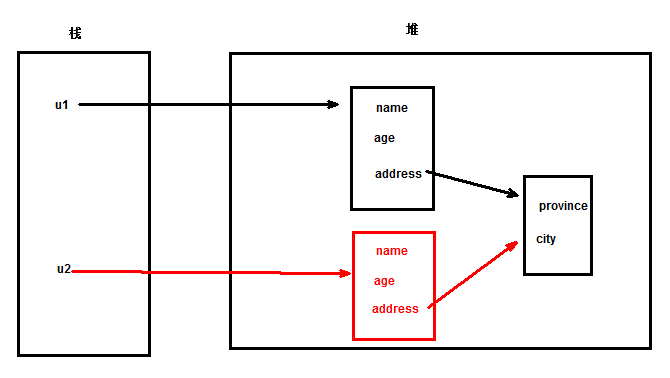
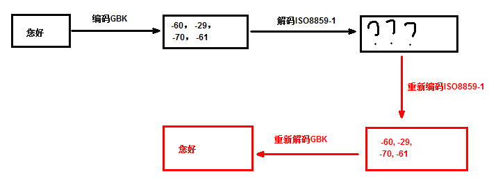
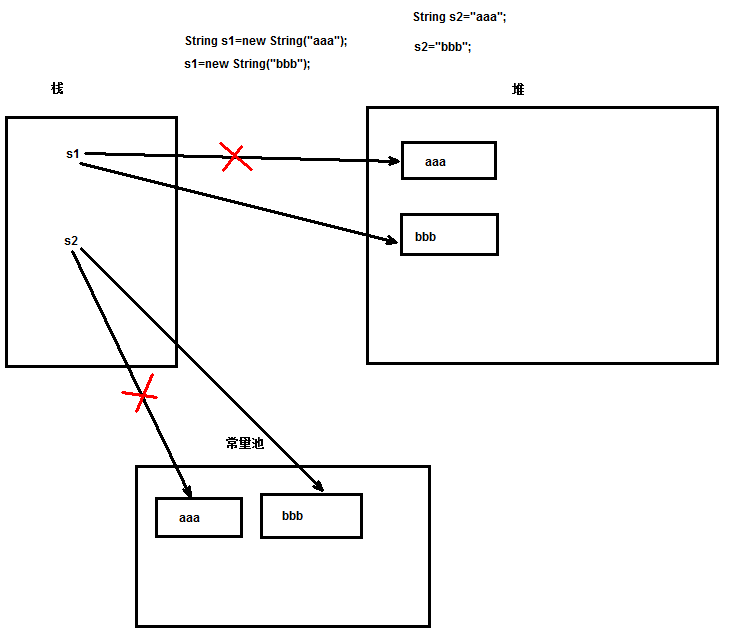

# 常用类，主讲：汤小洋

## 一、API的使用

### 1. 简介

#### 1.1 什么是API

​	Application Programming Interface 应用程序编程接口，实际上就是帮助文档

​	JDK API：提供了JDK中大部分类以及类中成员的介绍

#### 1.2 参考文档

​	官方文档  https://docs.oracle.com/javase/8/docs/api/index.html

​	离线文档 jdk8_api_en.zip jdk8_api_zh.zip

### 2. 文档结构

#### 2.1 Field Summary

​	类中属性的介绍

#### 2.2 Constructor Summary

​	类中构造方法的介绍

#### 2.3 Method Summary

​	类中方法的介绍

### 3. 查看JDK源码

​	快捷键：

- Ctrl+Shift+T ——>打开类型，查看源码
- Ctrl+O——>查看类中的成员
- Ctrl+T——>查看当前类的继承结构（层次树），默认是从上向下显示，再按一次从下向上显示

​        关联JDK的源码：

- Preferences——>Java——>Installed JREs——>选中安装jre——>Edit——>选中rt.jar——>Source Attachement——>External location——>选择JDK安装路径下的`src.zip`

### 4. 生成API文档

​	API文档就是根据文档注释生成的

​	文档注释以`/**`开头，以`*/`结尾，是一种带有特殊功能的注释

​	文档注释中可以包含特定的标记，都是以@开头，常用标记：

- @author 作者
- @date 日期
- @version 版本
- @see 参考内容
- @since 从哪个版本开始支持
- @param 方法参数，格式：@param 参数名称 参数描述
- @return 方法返回值，格式：@return 返回值描述
- @throws 方法抛出的异常
- @exception 方法抛出的异常，作用和@throws相同
- @override 重写方法
- @deprecated 已过时，仅为了保证兼容性，不建议使用

​        设置Eclipse自动生成注释：

- Preferences——>Java——>Code Style——>Code Templates

  Comments——>Types——>Edit 为类设置注释模板

  ```java
  /**
   * <功能描述>
   * @author 汤小洋
   * @date ${date} ${time}
   * @version v1.0
   */
  ```

  Comments——>Methods——>Edit 为方法设置注释模板

  ```java
  /**
   * <功能描述>
   * ${tags}
   * @date ${date} ${time}
   */
  ```

  勾选"Automatically add comments....."

​         生成文档：

- 使用javadoc工具生成

  执行`javadoc Bank.java`

- 使用eclipse向导生成

  如果出现中文乱码，可以加参数 `-encoding utf8`

## 二、Object

### 1. 简介

​	java.lang.Object类所有类的根，所有类都直接或间接的继承了Object类

​	Object类中共有**11**个方法，都需要掌握

### 2. 常用方法

| 方法名   | 作用                          |
| -------- | ----------------------------- |
| getClass | 获取对象的运行时类的Class对象 |
| equals   | 比较两个对象是否相等          |
| hashCode | 获取对象的hashCode值          |
| toString | 将对象转换为字符串            |
| clone    | 克隆对象                      |
| finalize | 对象被回收时自动调用          |

#### 2.1 getClass()

​	返回对象的运行时类的Class对象，表示运行时类，简单来说，可以认为是字节码文件

​	主要用于反射（后面会详细讲解）

​	Object类中多个方法都是被`native`关键字修饰的

- 被`native`修饰的方法，称为本地方法
- 该方法的方法体由非java语言实现，主要用来调用本地的底层语言，如c或c++
- 定义该方法时并不提供方法体，而是使用外部的非java语言实现

```java
User user = new User();

Class c = user.getClass(); // 返回的是Class对象，表示的是运行时类
System.out.println(c);

User u = new VIPUser();
System.out.println(u.getClass()); // 运行时类为VIPUser

// 判断对象的类型
// if(u instanceof VIPUser){
if (u.getClass() == VIPUser.class) { // 通过 类名.class属性 也可以获取类 的Class对象
    // VIPUser vu = (VIPUser)u;
    // vu.show();
    ((VIPUser) u).show();
}
```

#### 2.2 equals()

​	equals和==的区别：

- ==判断是否引用同一个对象，比较的是栈中的值
- equals如果没有被重写，则默认和==没区别，因为Object的equals()就是使用==来判断的
- 如果重写了equals，则按重写后的比较规则进行比较

​        说明：

- 自定义类可以重写equals()方法来实现对特定字段的等值判断
- 可以通过开发工具快速重写equals方法

```java
User u1 = new User("tom", 18);
User u2 = new User("jack", 18);

System.out.println(u1 == u2);
System.out.println(u1.equals(u2));
```

#### 2.3 hashCode()

​	返回对象的hashCode值，即哈希码值

- hashCode是为了支持数据结构的哈希表hash table
- 如果没有重写该方法，默认返回的是对象的内存地址
- 重写equals()方法时，务必要重写hashCode()方法

​        特性：

- 多次调用同一个对象的hashCode方法，必须返回相同的值
- 如果两个对象的equals比较为true，则两个对象的hashCode值也应该相同
- 如果两个对象的equals比较为false，不强制要求两个hashCode值不相同，但为不同对象产生不同的hashCode值可以提升哈希表的性能（讲集合时会详细讲解）

```java
User u1 = new User("tom",18);
User u2 = new User("jack",18);

System.out.println(u1.hashCode());
System.out.println(u1.hashCode());
System.out.println(u2.hashCode());

System.out.println(Integer.toHexString(u1.hashCode())); //转换为十六进制的hashCode值
```

#### 2.4 toString()

​	将对象转换为字符串表示形式

- 当直接输出对象时，会自动调用对象的toString()方法，即本质上输出的是toString()方法的返回值
- 如果没有重写该方法，默认返回值：`类全名@十六进制的hashCode值`
- 通过重写该方法，输出对象时可以返回更易读的信息，便于查看结果，一般用于测试

#### 2.5 clone()

​	用于克隆对象

​	对象被克隆的要求：

- 必须重写clone()方法，且要调用super.clone()方法
- 类必须实现`Cloneable`接口，表示该类可以被克隆

​        浅克隆和深克隆：

- 浅克隆（浅复制）

  从Object继承的clone()方法默认是浅克隆，只克隆对象本身，不克隆它所引用的对象，即只克隆第一层

  所有的对其他对象的引用仍然指向原来的对象

  

- 深克隆（深复制）

  把要克隆的对象所引用的其他对象都克隆一遍

  所有的对其他对象的引用都将指向被克隆的新对象

  需要自己实现，对所有引用的其他对象进行再次克隆

```java
User u1 = new User("tom", 18);
u1.setAddress(new Address("江苏", "南京"));

//只克隆u1对象，所用的address对象并没有克隆，仍然指向原来的u1的address
User u2 = (User)u1.clone(); 

u2.setName("jack");
u2.getAddress().setCity("扬州");

System.out.println(u1);
System.out.println(u2);

System.out.println(u1.getAddress() == u2.getAddress());
```

#### 2.6 finalize()

​	该方法不需要程序员手动调用，由垃圾回收器自动调用

​	垃圾回收机制：

- JVM中存在有一个守护线程，叫做gc：garbage collector 垃圾回收器

- gc的作用：

  每个对象上，都会存在一个int类型的变量，叫做引用计数器

  每当有一个引用指向该对象时，引用计数+1

  每当有一个引用不再指向该对象时，引用计数-1

  当引用计数值为0时，gc认为该对象为 垃圾

  gc会在**合适的时机（算法）**对该对象进行回收，释放资源

- 当对象被gc回收时，gc会自动调用finalize()方法

- 可以通过执行`System.gc()`，建议JVM进行垃圾回收

## 三、String

### 1. 简介

​	java.lang.String 字符串就是一个字符序列，由多个字符组成，是Java中最常用的类型

```java
public final class String
    implements java.io.Serializable, Comparable<String>, CharSequence
```

​	创建字符串的方式：

- 直接创建
- 使用构造方法创建

```java
/*
 * 1.直接创建 
 * 该方式本身来说是不符合引用类型的特点，不符合面向对象的规范
 * 原则上来说，所有引用类型都应该通过new关键来创建对象，只有基本数据类型才能直接赋值
 * String是一种特殊的引用类型，由于特别常用，所以JVM对其做了优化
 */
String s1 = "hello";
char c = 'h'; // 单个字符
String s2="h"; //只包含一个字符的字符串
String s3=""; //空字符串

/*
 * 2.使用构造方法创建
 */
String s4=new String(); //空字符串
String s5=new String("world");

//空字符串和null的区别
String s6=""; //在堆内存中分配了内存，但为空字符串
String s7=null; //在堆内存中没有分配 空间

//String可以和其他任意类型进行+的操作，实现字符串拼接
System.out.println(s1+12+8);
System.out.println(s1+true);
System.out.println(s1+'x');
```

### 2. 常用方法

| 方法名           | 作用                                                         |
| ---------------- | ------------------------------------------------------------ |
| length           | 获取字符串长度                                               |
| indexOf          | 获取指定子串第一次出现的位置，如果找不到则返回-1             |
| lastIndexOf      | 获取指定子串最后一次出现的位置                               |
| substring        | 获取指定索引范围内的子串，即截取字符串，范围[beginIndex,endIndex)，左闭右开 |
| charAt           | 获取指定索引位置的字符                                       |
| concat           | 字符串拼接，很少使用，一般都直接使用+进行拼接                |
| startsWith       | 判断是否以指定子串开头                                       |
| endsWith         | 判断是否以指定子串结尾                                       |
| contains         | 判断是否包含指定子串                                         |
| isEmpty          | 判断是否为空字符串                                           |
| equals           | 判断值是否相等                                               |
| equalsIgnoreCase | 判断是否相等，忽略大小写                                     |
| toUpperCase      | 转换为大写                                                   |
| toLowerCase      | 转换为小写                                                   |
| replace          | 替换                                                         |
| trim             | 去掉字符串首尾的空格                                         |
| split            | 将字符串分割为数组                                           |
| toCharArray      | 将字符串转换为字符数组                                       |
| getBytes         | 将字符串转换为字节数组                                       |
| join             | 将多个元素以指定分隔符拼接为字符串，jdk8中新增方法，静态方法String.join() |

```java
String str = "aEllo woRld";

// length()
System.out.println("字符串长度：" + str.length());

// indexOf()
System.out.println("字符o第一次出现的位置：" + str.indexOf('o')); // 索引从0开始，如果找不到则返回-1
System.out.println("字符串wo第一次出现的位置：" + str.indexOf("wo"));
System.out.println("从索引为6的位置开始后向查找字符o第一次出现的位置：" + str.indexOf('o', 6));

// lastIndexOf()
System.out.println("字符o最后一次出现的位置：" + str.lastIndexOf('o'));

// substring()
System.out.println("获取索引为[3,7)之间的子串：" + str.substring(3, 7)); // 左闭右开
System.out.println("获取索引为3到结尾的子串：" + str.substring(3));

// charAt()
System.out.println("获取索引为1的字符：" + str.charAt(1));

// concat()
System.out.println("在字符串后拼接abc" + str.concat("abc"));

// startsWith()
System.out.println("是否以he开头：" + str.startsWith("he"));

// endsWith()
System.out.println("是否以abc结尾：" + str.endsWith("abc"));

// contains()
System.out.println("是否包含el：" + str.contains("el"));

// isEmpty()
System.out.println("是否为空字符串：" + str.isEmpty()); // 本质上就是判断str.length==0
System.out.println("是否为null：" + str == null);

// equals()
String str2 = new String("hello World");
System.out.println("地址是否相同：" + str == str2);
System.out.println("内容是否相同：" + str.equals(str2));

// equalsIgnoreCase
System.out.println("忽略大小的话，内容是否相同：" + str.equalsIgnoreCase(str2));

// toUpperCase()
System.out.println("转换为大写：" + str.toUpperCase());

// toLowerCase()
System.out.println("转换为小写：" + str.toLowerCase());

// replace()
System.out.println("将字符o替换为x：" + str.replace('o', 'x')); // 返回一个新字符串
System.out.println(str); // 原字符串没有变化

// trim()
System.out.println("去除两边的空格："+str.trim());

// split()
String[] arr1 = str.split(" ");
System.out.println("以空格进行分割："+Arrays.toString(arr1));
System.out.println("以o进行分割："+Arrays.toString(str.split("o")));

//toCharArray()
System.out.println("-----将字符串转换为字符数组--------");
char[] chars = str.toCharArray();
System.out.println(Arrays.toString(chars));
System.out.println("-----将字符数组转换为字符串--------");
String str3 = new String(chars);
System.out.println(str3);

// getBytes()
System.out.println("-----将字符串转换为字节数组--------");
byte[] bytes = str.getBytes();
System.out.println(Arrays.toString(bytes));
System.out.println("-----将字节数组转换为字符串--------");
String str4 = new String(bytes);
System.out.println(str4);
```

### 3. 字符集

​	字符 Character：是各种文字和符号的总称，包括各国家文字、标点符号、图形符号、数字等

​	字符集 Charset：是多个字符的集合，字符集种类很多，每个字符集包含的符号个数不同

​	常见字符集：ASCII、ISO-8859-1、GB2312、GBK、UTF-8

​	注：Windows系统默认使用GBK，Linux和MacOS系统默认使用UTF-8

```java
System.out.println("当前系统使用的字符集：" + System.getProperty("file.encoding"));
System.out.println("当前JVM使用的字符集：" + Charset.defaultCharset()); // JVM默认使用当前操作系统的字符集
```

​	由于计算机底层使用二进制，只认识0和1，所以在处理各种字符时，需要对字符进行编码和解码，以便计算机能够识别和存储

​	编码和解码：

- 将字符串转换为字节数组，称为编码
- 将字节数组转换为字符串，称为解码

​       在编码和解码时需要使用所使用的字符集

```java
String s = "您好";

/*
 * 编码
 */
byte[] bytes = s.getBytes("gbk"); // 对于GBK，一个汉字占2个字节
// byte[] bytes = s.getBytes("utf-8"); //对于UTF-8，一个汉字占3个字节
System.out.println(Arrays.toString(bytes));

/*
 * 解码
 */
//		String str = new String(bytes, "gbk");
String str = new String(bytes);
System.out.println(str);
```

​	乱码：编写程序时，由于字符集设置不对  或 编码和解码时使用了不一致的字符集，导致出现了乱码

```java
String s = "您好";

// 1.编码——>正确
byte[] bytes = s.getBytes("gbk");
System.out.println(Arrays.toString(bytes));

// 2.解码——>错误
String str = new String(bytes, "iso8859-1");
System.out.println(str);

// 3.重新编码
// byte[] bytes2 = str.getBytes("iso8859-1");
// System.out.println(Arrays.toString(bytes2));

// 4.重新解码
// String str2 = new String(bytes2,"gbk");
// System.out.println(str2);

String str2 = new String(str.getBytes("iso8859-1"),"gbk");
System.out.println(str2);

/*
 * 如果编码不正确，则无论如何解码都没用
 */
bytes = s.getBytes("iso8859-1");
str = new String(bytes,"iso8859-1");
System.out.println(str);
```

### 4. 正则表达式

#### 4.1 简介

​	正则表达式是一门独立的语言，有自己的语法，用于检测指定字符串是否符合特定规则

​	正则表达式就是用来定义规则的

#### 4.2 规则

​	规则的定义

| 示例            | 作用                              |
| --------------- | --------------------------------- |
| a               | 只能是a                           |
| a\|b            | 只能是a或b                        |
| a{5}            | 只能是a，并且有5位                |
| a{5,}           | 只能是a，至少有5位                |
| a{5,7}          | 只能是a，5到7位                   |
| a*              | 只能是a，0到多位，即可有可无      |
| a+              | 只能是a，1到多位，即至少有1位     |
| a?              | 只能是a，0到1位                   |
| [a-g]{5}        | 只能是a到g，并且有5位             |
| [a-zA-Z]{5}     | 只能是字母，忽略大小写，并且有5位 |
| [0-9a-zA-Z]{2,} | 只能是数字、字母，至少有2位       |
| .               | 任意一个字符                      |
| \d              | 数字，\表示正则转义符             |
| \D              | 非数字                            |
| \w              | 数字、字母、下划线                |
| \W              | 非（数字、字母、下划线）          |
| \s              | 空格                              |
| \S              | 非空格                            |
| \n              | 回车                              |
| \t              | 制表符                            |

#### 4.3 用法

​	String中支持正则表达式的方法：

| 方法名       | 作用                                     |
| ------------ | ---------------------------------------- |
| matches      | 判断字符串是否匹配某个规则               |
| replaceAll   | 作用和replace一样，区别在于支持正则      |
| replaceFirst | 作用和replaceAll一样，区别是只替换第一个 |
| split        | 使用正则，将字符串分割为数组             |

### 5. 不变性

​	字符串的值一旦确定，则不可修改

`不可修改`指的是内存中的值不能再修改，不是变量不能修改	

```java
/*
 * 基本数据类型
 */
int i = 3;
i = 6; // 内存中只有一个变量值6，3的值会被6覆盖

/*
 * 字符串（特殊的引用类型）
 */
String str = "tom";
str = "jack"; // 当重新赋值时会在内存中再分配一块空间，创建一个新的String，所以内存中有两个String对象，分别是tom和jack
```

### 6. 常量池

​	String常量：使用双引号直接创建的字符串，称为String常量，即字符常量

- 字符常量被存放在内存的常量池中
- 常量池中的值不会被gc回收，即gc不会清理这个区域中的内容
- 多次出现的相同字符常量，只会在常量池中创建一个Sring对象（JVM做了优化）

​        常量池的位置：

- jdk1.6中，常量池在方法区的PermGen Space永久代中（就是一个永久保存区域）
- jdk1.7中，常量池在堆内存中
- jdk1.8中，常量池在元空间中，和堆相独立




```java
/*
 * 使用构造方法创建字符串
 */
// 存放在堆中，强制在堆内存中开辟一块新空间（只要是new出来的，必须会在堆中分配新的内存
String s1 = new String("aaa");
s1 = new String("bbb"); // 由于aaa不再被任何引用所指向，所以会gc回收

/*
 * 使用双引号直接创建字符串
 */
String s2 = "aaa"; // 字符常量，存放在常量池中
s2 = "bbb"; // 内存的常量池中会有两个String对象，分别是aaa和bbb，且不会被gc回收

/*
 * 多次出现的相同字符常量，只会在常量池中创建一个String对象
 */
String s3 = "bbb"; // 创建流程：先判断常量池是否有bbb，如果有则直接指向常量池中的bbb，如果没有则在常量池中创建bbb
System.out.println(s3 == s1); // false
System.out.println(s3 == s2); // true

String s4 = new String("bbb");
System.out.println(s4 == s1); // false
System.out.println(s4 == s2); // false

// 问题1
String s5 = "bb";
String s6 = "b";
String s7 = s5 + s6; // s7不是字符常量，不是使用双引号直接创建的字符串，而是在运行时计算得到的
System.out.println(s7 == s2); // false

// 问题2
String s8 = "bb" + "b"; // s8是字符常量，对于常量和常量的运算，在编译期已经得到了值（编译器做了优化）
System.out.println(s8 == s2); // true

// 问题3
String s9 = s5 + "b"; //s9不是字符常量，在编译期无法确定s9的值
System.out.println(s9==s2); //false

// 问题4：共创建了多少个对象？ 9个
```

## 四、StringBuffer和StringBuilder

### 1. 简介

​	String是不可变字符串，不可修改

- 频繁对String进行修改时会在内存中产生许多对象，垃圾数据
- String类中提供了许多方法，但没有`增删改`等操作的方法

​        如果需要频繁对字符串进行修改操作，建议使用StringBuffer和StringBuilder，它们是可变字符串

​	这两个类的用法基本一致

### 2. 用法

```java
/*
 * String是不可变的，会在内存中产生许多String对象
 */
// String s = "";
// while (true) {
// s += "hello";
// }

/*
 * 使用StringBuilder和StringBuffer
 */
// 创建一个StringBuffer对象，为空字符串
// StringBuffer buffer=new StringBuffer();
// 创建一个StringBuffer对象，存储字符串hello
StringBuffer buffer = new StringBuffer("hello");
System.out.println(buffer);

// append()
buffer.append("aaa"); // 向末尾添加，直接在buffer对象上进行修改，不会创建新对象
buffer.append("bbb").append("ccc").append(666).append(true); //链式写法
System.out.println(buffer);

// insert()
buffer.insert(1, "ddd");
System.out.println(buffer);

// delete()
buffer.delete(3,5); //删除索引为[3,5)的字符
System.out.println(buffer);

// deleteCharAt()
buffer.deleteCharAt(2);
System.out.println(buffer);

// setCharAt()
buffer.setCharAt(1, 'X');
System.out.println(buffer);

// setLength()
buffer.setLength(5); // 设置保留的字符串长度
System.out.println(buffer);

// reverse()
buffer.reverse();
System.out.println(buffer);

// toString()
String str = buffer.toString(); // 将StringBuffer转换为String
System.out.println(str);


/*
 * 以下方法的使用与String相同
 * length()、charAt()、indexOf()、lastIndexOf()、substring、replace()
 */
```

### 3. 区别

​	StringBuffer

- 线程安全（多个人同时访问一个字符串，不会出现问题）
- 效率低

		StringBuilder

- 线程不安全（多个人同时访问一个字符串，可能会出现问题）
- 效率高

## 五、包装类

### 1. 简介

​	基本数据类型功能比较简单，不具有面向对象的特性

​	Java中为每个基本数据类型都提供了一个对应的包装类，使其具有面向对象的特性

| 基本数据类型 | 对应的包装类 |
| ------------ | ------------ |
| byte         | Byte         |
| short        | Short        |
| int          | Integer      |
| long         | Long         |
| float        | Float        |
| double       | Double       |
| char         | Character    |
| boolean      | Boolean      |

### 2. 基本类型和包装类的转换

​	装箱和拆箱：

- 将基本数据类型转换为包装类，称为装箱
- 将包装类转换为基本数据类型，称为拆箱

​       在JDK1.5以前，需要手动装箱和拆箱，即手动进行转换

​	在JDK1.5及以后，支持自动装箱和拆箱，即自动进行转换

```java
/*
 * 装箱和拆箱
 */
int a = 10;
// 装箱
Integer integer = new Integer(a); // 手动
Integer integer2 = a; // 自动
// 拆箱
int b = integer.intValue(); // 手动
int c = integer; // 自动

/*
 * 基本数据类型和包装类进行运算，会自动进行拆箱
 */
int m = 6;
Integer n = new Integer(8);
int p = m + n; //自动拆箱

int x=3;
Integer y = new Integer(3);
Integer z = new Integer(3);
System.out.println(y==z);
System.out.println(x==z); // 因为z在进行运算时发生了自动拆箱

/*
 * 下面代码是否正确，为什么？  
 * 先自动装箱，然后多态
 */
Object obj=5;
```

### 3. 基本类型和String的转换

```java
/*
 * 将基本类型转换为String
 */
int a = 9;

// Integer.toString()
String str = Integer.toString(a);
System.out.println(str);
System.out.println(a + ""); // 拼接空字符串（推荐）

System.out.println(Integer.toBinaryString(a)); // 以2进制形式
System.out.println(Integer.toOctalString(a)); // 以8进制形式
System.out.println(Integer.toHexString(a)); // 以16进制形式

/*
 * 将String转换为基本类型
 */
String b = "11"; // 数值形式的字符串
int i = Integer.parseInt(b); // 转换的是10进制数值（推荐）
System.out.println(i);

System.out.println(Integer.parseInt(b, 2)); // 转换的是二进制数，第二个参数表示的是进制
System.out.println(Integer.parseInt(b, 8));

int j = Integer.valueOf(a);
System.out.println(j);
```

## 六、其他类

### 1. Date

#### 1.1 简介

`java.util.Date`表示日期

​	Java底层使用long类型表示日期

- long类型的值表示的是当前时间的毫秒值
	 这个毫秒值是基于`1970年1月1日 0时0分0秒`	的差值，这个时间被认为是计算机的起始时间（纪元时间）

​         Date类中有多个构造方法都是过时的，不建议使用

#### 1.2 常用方法 

```java
Date date = new Date();

// getYear()、getMonth()、getDate()、getHours()等，都已过时

// getTime() 获取毫秒值
System.out.println(date.getTime());

// setTime() 设置毫秒值
date.setTime(6666);
System.out.println(date);

// after() 判断某个日期是否在指定日期之后
Date d1 = new Date(222);
Date d2 = new Date(111);
System.out.println(d1.after(d2));

// before() 判断某个日期是否在指定日期之前
System.out.println(d1.before(d2));

/*
 * a.compareTo(b) 对两个日期进行比较
 * 如果a>b，则返回1，如果a<b，则返回-1，如果a==b，则返回0
 */
Date d3 = new Date(111);
System.out.println(d1.compareTo(d2));
System.out.println(d2.compareTo(d1));
System.out.println(d2.compareTo(d3));
```

#### 1.3 Date和String的转换

​	使用`java.text.SimpleDateFormat`日期格式化类，继承自DateFormat

​	格式化字符串，参考API文档中的SimpleDateFormat

```java
Date date = new Date();

/*
 * 将日期转换为字符串
 */
// 1.创建SimpleDateFormat对象，指定目标格式，如 2019-2-14 12:30:25
DateFormat df = new SimpleDateFormat("E yyyy年MM月dd日 HH:mm:ss"); 
// 2.调用format()进行格式化
String str = df.format(date);
System.out.println(str);

/*
 * 将字符串转换为日期
 */
String s="2008年12月8日";

// 1.创建SimpleDateFormat对象，指定字符串的日期格式
DateFormat df2=new SimpleDateFormat("yyyy年MM月dd日");
// 2.调用parse()解析为日期
Date d = df2.parse(s);
System.out.println(d);
```

### 2. Calendar

#### 2.1 简介

​	java.util.Calendar表示日历，用于日期的运算和取值

​	Calendar是一个抽象类，不能通过new来创建，使用静态方法getInstance()获取一个实例		

#### 2.2 常用方法 

```java
// 创建一个Calendar实例
Calendar c = Calendar.getInstance();
System.out.println(c.getClass());

/*
 * 常用方法
 */
// getTime() 将Calendar转换为Date
Date d = c.getTime();
System.out.println(d);
System.out.println(DateUtil.toString(d));

// setTime() 设置时间为指定的Date
// c.setTime(new Date(1112223334445L));
// System.out.println(c.getTime());

// get() 获取日期的指定字段
System.out.println(c.get(Calendar.YEAR)); // 年
System.out.println(c.get(Calendar.MONTH) + 1); // 月，返回值为0-11，0表示1月
System.out.println(c.get(Calendar.DATE)); // 日
System.out.println(c.get(Calendar.DAY_OF_MONTH)); // 一个月的第几天，等同于DATE
System.out.println(c.get(Calendar.DAY_OF_WEEK)); // 一周的第几天，返回值为1-7，1表示第1天（星期天）
System.out.println(c.get(Calendar.DAY_OF_YEAR)); // 一年的第几天
System.out.println(c.get(Calendar.HOUR)); // 时，12小时制
System.out.println(c.get(Calendar.HOUR_OF_DAY)); // 24小时制
System.out.println(c.get(Calendar.MINUTE)); // 分
System.out.println(c.get(Calendar.SECOND)); // 秒
System.out.println(c.get(Calendar.MILLISECOND)); // 毫秒

// set() 设置日期时间
c.set(2019, 1, 14); // 月份从0开始，1表示二月
c.set(2019, Calendar.FEBRUARY, 14, 12, 30, 25); // 使用常量
c.set(Calendar.YEAR, 2008); // 指定的field
c.set(Calendar.DATE, 8);
System.out.println(c.getTime());

// add() 添加日期时间
c.add(Calendar.YEAR, 2); // +2年
c.add(c.DATE, 3); // +3天
c.add(c.HOUR, 1); // +1小时
System.out.println(c.getTime());

// clear() 清空
// c.clear();
// System.out.println(c.getTime());

// getTimeInMillis() 毫秒值
System.out.println(c.getTimeInMillis());

System.out.println(System.currentTimeMillis()); // 当前时间的毫秒值
```

### 3. Math

​	java.lang.Math用于执行数学运算

​	Math类中所有方法都是静态方法 

```java
/*
 * 常量
 */
System.out.println(Math.PI); // 圆周率
System.out.println(Math.E); // 自然对数

/*
 * 方法
 */
double a = 3.758;

// round() 四舍五入
System.out.println((int) a);
System.out.println(Math.round(a)); // 返回long类型
System.out.println(Math.round(a * 100) / 100.0); // 保留两位小数

// floor() 返回小于等于参数的最大整数
System.out.println(Math.floor(a));

// ceil() 返回大于等于参数的最小整数
System.out.println(Math.ceil(a));

// abs() 绝对值
System.out.println(Math.abs(-5));

// pow() 求次方（幂）
System.out.println(Math.pow(2, 5));

// random() 产生一个[0,1)的随机浮点数
System.out.println(Math.random());
System.out.println((int) (Math.random() * 100)); // 产生一个[0,100)之间的随机整数
System.out.println((int) (Math.random() * 61) + 20);// 产生一个[20,80]之间的随机整数
```

### 4. Random

​	java.util.Random用于生成随机数

```java
// 创建一个Random实例，随机数生成器
Random r = new Random();

/*
 * 常用方法
 */
// nextInt() 生成一个随机整数
System.out.println(r.nextInt());
System.out.println(r.nextInt(100)); // 生成一个[0,100)之间的随机整数
System.out.println(r.nextInt(61) + 20);// 产生一个[20,80]之间的随机整数

// nextDouble 生成一个[0,1)之间的随机浮点数，相当于Math.random()
System.out.println(r.nextDouble());

// nextBoolean() 生成一个随机布尔值
System.out.println(r.nextBoolean());

System.out.println(Math.random()>0.5?true:false);
```


