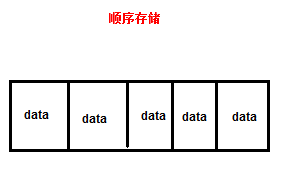

# 集合，主讲：汤小洋

## 一、简介

### 1. 概念

​	简介来说，集合就是一组数据，存储多个元素的数据结构

### 2. 存储结构

​	集合的存储结构，分为两种：

- 顺序存储

  将集合中的元素依次存放在某个区域中，称为顺序存储，在内存中分配的空间是连续的

  特性：访问效率高、插入或删除效率低

  

- 链式存储

  在内存中分配的空间可以是不连续

  分为：单向链式存储、双向链式存储

  特性：插入和删除效率高，访问效率低

  


### 3. 集合类和接口

​	集合相关的API都在java.util包中

```java
|-集合
	|-Collection接口，对象集合
		|-List接口
			|-ArrayList
			|-LinkedList
			|-Vector
				|-Stack
		|-Set接口
			|-HashSet
			|-TreeSet
        |-Queue接口
	|-Map接口，键值对集合
		|-HashMap
		|-Hashtable
			|-Properties
```

## 二、List

​	特点：有序、可重复

​	实现类：ArrayList、LinkedList、Vector、Stack

### 1. ArrayList

​	ArrayList实现了长度可变的数组

- 本质上就是使用数组实现的，数组的默认长度为10
- 存储结构：顺序存储
- 特点：访问元素时效率高，而插入或删除时效率低，因为会导致后面的所有元素都移动

```java
// 创建一个ArrayList集合，默认集合中元素为Object类型
ArrayList list = new ArrayList();
// 向集合中添加元素
list.add("tom");
list.add(18);
list.add(120.5);
list.add(true);
list.add(new Object());
list.add(null);

// 创建一个泛型集合，指定集合中元素的类型
List<String> list2 = new ArrayList<>();
list2.add("tom");

System.out.println(list);
```

​      常用方法：

```java
ArrayList<String> list = new ArrayList<String>();

// add() 添加元素
list.add("tom"); // 向末尾添加，有序（元素顺序与放入顺序一致）
list.add("jack");
list.add("mike");
list.add("tom"); // 允许重复
list.add(2, "alice"); // 向指定索引位置添加，索引从0开始
System.out.println(list);

// set() 修改
// String str = list.set(0, "lucy"); // 返回被修改的元素
// System.out.println(str);

// remove() 删除
// boolean flag = list.remove("tom"); // 根据元素值删除，返回boolean，表示成功或失败
// System.out.println(flag);
// String str = list.remove(1); // 根据索引删除，返回被删除的元素
// System.out.println(str);

// get() 获取
System.out.println(list.get(1));

// size() 集合大小/长度，即元素个数
System.out.println(list.size());

// isEmpty() 是否为空
System.out.println(list.isEmpty());
System.out.println(list.size() == 0);

// indexOf() 指定元素在集合中的索引
System.out.println(list.indexOf("tom"));
System.out.println(list.lastIndexOf("aaa")); // 如果不存在，则返回-1

// contains() 是否包含指定元素
System.out.println(list.contains("aaa"));

// clear() 清空
// list.clear();

// toArray() 将list转换为数组
// Object[] arr = list.toArray();
// System.out.println(Arrays.toString(arr));

// 将数组转换为list
String[] arr = { "aaa", "bbb", "ccc" };
List<String> list2 = Arrays.asList(arr);
List<String> list3 = Arrays.asList("aaa", "bbb", "ccc");
```

​        遍历集合：

```java
List<Integer> list = Arrays.asList(12, 4, 65, 8, 2);

// 方式1
for (int i = 0; i < list.size(); i++) {
    System.out.print(list.get(i)+"\t");
}
System.out.println();

// 方式2
for(Integer num:list){
    System.out.print(num+"\t");
}
System.out.println();

// 方式3，使用Iterator迭代器，用于遍历集合中所有元素的一种类型（只要实现了Iterable接口的类都可以使用迭代器进行遍历）
Iterator<Integer> it = list.iterator();
while(it.hasNext()){ // 判断是否有下一个元素
    Integer num = it.next(); //获取下一个元素
    System.out.print(num+"\t");
}
```

### 2. Vector

​	Vector和ArrayList非常相似，都是使用数组实现的，用法基本相同，区别：

​	Vector：

- 同步的，线程安全，方法基本都是被synchronized关键字修饰的
- 执行效率低，影响性能
- 可以使用Iterator或Enumeration遍历

​        ArrayList：

- 异步的，线程不安全
- 相比较Vector，执行效率高
- 不能使用Enumeration遍历

​        **Vector已过时，不建议使用**，作为替代可以使用Collections.synchronizedList

```java
/*
 * 使用Enumeration枚举，适用于Vector、Hashtable、Properties等集合，已过时
 */
Enumeration<Integer> e = nums.elements();
while (e.hasMoreElements()) { // 判断是否还有更多元素
	Integer num = e.nextElement(); // 获取元素
	System.out.print(num + "\t");
}
```

### 3. Stack

​	Stack继承自Vector

​	特点：先进后出	

​	常用方法：具有List的所有方法，同时具有栈的操作方法 


### 4. LinkedList

​	当需要频繁的插入和删除元素时可以使用LinkedList

- 存储结构：双向链式存储
- 特点：插入或删除元素时效率高

​       常用方法：具有List的所有方法，同时具有一些额外的方法

​	LinkedList是一种队列，实现Queue接口，所有实现Queue的类都是一个队列

​	队列的特点：先进先出


​	

## 三、Set

​	特点：

- 无序（元素顺序与放入顺序无关），不能按索引访问元素
- 不可重复（集合中不允许出现重复的元素）

​        实现类：HashSet、TreeSet

### 1. HashSet

​	HashSet是一种哈希算法的集合，以哈希表的形式存储

- 数据结构：哈希表，也称为哈希散列表

  

- 特点：操作速度更快，效率更高，根据哈希算法进行快速的查找（根据hashCode()方法的返回值，确定其存放位置）


​         HashSet判断元素是否重复的过程：     

1. 添加元素时首先调用要存入对象的hashCode()方法，获取hashCode值

2. 根据hashCode值，使用哈希算法确定在哈希表中的存放位置

3. 判断该位置是否已经有元素：

   如果该位置没有元素，则直接将元素放入该位置   ——>结束

   如果该位置已经有元素，则调用已有对象的equals方法和要放入的对象进行比较：

   ​	如果返回true，则认为是重复元素，舍弃要放入的元素 ——>结束

   ​	如果返回false，则在当前位置下，以链表的形式追加  ——>结束

​          总结：

- 判断重复的依据：当添加的两个元素的hashCode()返回值相同，并且equals()返回值为true，则认为是重复的相同元素
- 向Set集合中添加元素时，需要重写hashCode()和equals()方法，防止相同元素被添加到Set集合中

### 2. TreeSet

​	TreeSet是用于对元素进行排序的有序集合类，不允许有重复的元素，不保证元素顺序与插入顺序一致

- 数据结构：二叉树
- 特点：元素是有大小顺序的

​        TreeSet会对元素进行排序，排序的依据：

1. 元素本身具有的自然顺序

   让对象实现`Comparable`接口，实现compareTo()方法

   让对象自身具有可比较性

2. 提供一个比较器，根据比较器进行排序

   定义一个比较器，实现`Comparator`接口的类，实现compare()方法

   在创建TreeSet时传入比较器

​        TreeSet判断重复的依据：当添加的两个元素的compareTo()返回值为0时，则认为是相同元素

## 四、Map

​	Map是专门用来处理 键值映射数据 的一种集合，可以根据key键实现对value值的操作

- 是一种映射关系，称为键值对（key-value）
- key必须是唯一，不允许重复
- 一个key只能对应一个value，但一个value可以有多个key与之对应
- 不保证元素的顺序与插入的顺序一致，不能按索引访问元素

​        实现类：HashMap、Hashtable、Properties

### 1. HashMap

​	HashMap是一种基于哈希算法的Map集合，以哈希表形式存储

- 数据结构：哈希表
- 特点：查找元素时效率高

```java
// 创建一个HashMap集合，存储键值对
HashMap<Integer, String> map = new HashMap<>(); // 第一个泛型为key的类型，第二个泛型为value的类型

// put() 添加
map.put(11, "aaa"); // 由两部分组成：键key、值value
map.put(2, "bbb");
map.put(23, "ccc");
map.put(1, "ddd"); // key是唯一的，当key已存在时表示修改对应的value
map.put(5, "ccc");
System.out.println(map);

// get() 获取
String value = map.get(5); //根据key获取对应的value
System.out.println(value);

// remove() 删除
// map.remove(2); //根据key删除对应的键值对

// containsKey() 判断是否包含指定的key
System.out.println(map.containsKey(11));

// containsValue() 判断是否包含指定的value
System.out.println(map.containsValue("xxx"));

// isEmpty() 判断是否为空
System.out.println(map.isEmpty());

// size() 元素个数
System.out.println(map.size());

// clear() 清空
map.clear();

System.out.println(map);
```

​      遍历HashMap的三种方式：

- 通过keySet()获取所有key的集合，然后遍历所有的key
- 通过values()获取所有value的集合，然后遍历所有的value
- 通过entrySet()获取所有的key-value的集合，然后遍历所有的key-value键值对

```java
HashMap<Integer, Student> map = new HashMap<Integer, Student>();

Student stu1 = new Student(1001, "tom");
Student stu2 = new Student(1002, "jack");
Student stu3 = new Student(1003, "mike");

// 将学号作为key，将学生对象作为value
map.put(stu1.getNo(), stu1);
map.put(stu2.getNo(), stu2);
map.put(stu3.getNo(), stu3);

// Map本身无法遍历

/*
 * 方式1：遍历所有的key
 */
Set<Integer> keys = map.keySet(); // 返回所有kery的集合
for (Integer key : keys) {
	Student value = map.get(key);
	System.out.println("key:" + key + ",value:" + value);
}
System.out.println("--------------------------------");

/*
 * 方式2：遍历所有的value
 */
Collection<Student> values = map.values();
for (Student value : values) {
	System.out.println(value);
}
System.out.println("--------------------------------");

/*
 * 方式3：遍历所有的key-value
 * Map.Entry就表示key-value
 * 	返回一个Set集合，Set集合的泛型是Map.Entry类型
 * 	Map.Entry的泛型是Map集合的泛型
 */
Set<Map.Entry<Integer, Student>> entries = map.entrySet();
Iterator<Entry<Integer, Student>> it = entries.iterator();
while(it.hasNext()){
	Entry<Integer, Student> entry = it.next(); //获取Entry（key、value）
	Integer key = entry.getKey();
	Student value = entry.getValue();
	System.out.println("key:"+key+",value:"+value);
}
```

### 2. Hashtable

​	Hashtable和HashMap非常相似，用法基本相同，区别：

​	Hashtable

- 同步的，线程安全
- key和value都不允许为null
- 可以使用Iterator或Enumeration遍历

​       HashMap

- 异步的，线程不安全的
- key和value都可以为null
- 不能使用Enumeration遍历

### 3. Properties

​	继承自Hashtable，也是键值对集合，但一般只用来存储字符串键值对

​	常用方法：

```java
Properties p = new Properties();

// 一般不会这样用
// p.put(1, "tom");
// p.get(1);

// setProperty() 设置属性
p.setProperty("name", "admin");
p.setProperty("age", "20");
p.setProperty("sex", "male");

// getProperty() 获取属性
System.out.println(p.getProperty("name")); // 根据属性名获取属性值，返回String类型

// 遍历
// p.keySet()
// p.values()
// p.entrySet()

Enumeration<Object> keys = p.keys();
// Enumeration<Object> values = p.elements();
//Enumeration<?> keys = p.propertyNames(); // ?是泛型通配符
while(keys.hasMoreElements()){
    String key = (String) keys.nextElement();
    String value = p.getProperty(key);
    System.out.println(key+"="+value);
}
```

​	属性文件：

- 以`.properties`为后缀
- 内容格式：`属性名=属性值`
- 只支持ISO-8859-1字符集，不支持中文，但Eclipse会自动进行编码转换

```java
Properties p = new Properties();

/*
 * 加载属性文件（实际上，只要文件内容是：属性名=属性值 的格式，都可以加载，与文件的后缀名无关）
 */
p.load(
	Test03_Properties.class // 获取当前类的Class对象
		.getClassLoader() // 获取类加载器，用于加载classpath类路径下的资源，即src目录下
		.getResourceAsStream("data.properties") // 加载类路径下的指定的文件
); // 暂时记住，固定写法
//p.load(Test03_Properties.class.getClassLoader().getResourceAsStream("data.properties"));

System.out.println(p);
System.out.println(p.getProperty("name"));
```

## 五、Collections类

### 1. 简介

​	Collections工具类提供了集合操作的相关方法，如排序、查找、求最大值、最小值等

​	类似于Arrays工具类

### 2. 常用方法

```java
List<Integer> list=new ArrayList<>();
list.add(12);
list.add(3);
list.add(8);
list.add(5);
list.add(11);
System.out.println(list);

// addAll() 添加
Collections.addAll(list, 111,222,333);

// max() 最大值
System.out.println(Collections.max(list));

// min() 最小值
System.out.println(Collections.min(list));

// sort() 排序，升序
// Collections.sort(list);

Collections.sort(list, new Comparator<Integer>() { // 自定义比较器

    @Override
    public int compare(Integer o1, Integer o2) {
        // 降序
        if(o1>o2){
            return -1;
        }else if(o1<o2){
            return 1;
        }
        return 0;
    }
});

// reverse() 反转
Collections.reverse(list);

// replaceAll() 替换
Collections.replaceAll(list, 111, 666);

// swap() 交换
Collections.swap(list, 0, list.size()-1);

// fill() 填充/初始化
Collections.fill(list, 0);

System.out.println(list);
```

Collections和Collection区别：

- Collection是接口，继承自它的接口主要是List和Set
- Collections是类，提供了集合相关操作的相关方法的工具类

## 六、总结

### 1. List和Set的对比

​	List：元素有序、可重复

1. ArrayList

   基于Array的List，是异步的，线程不安全，但性能上要优于Vector

2. Vector

   基于Array的List，是同步的，线程安全

3. LinkedList

   链表存储

4. Stack

​	Set：元素无序、不可重复

1. HashSet

   能快速定位一个元素，HashSet中的对象要重写hashCode()和equals()方法

2. TreeSet

   排序的

​        Map：键值对

1. HashMap
2. Hashtable
3. Properties

### 2. 数组和集合的对比

​	数组：

1. 数组可以存储基本数据类型和对象
2. 数组长度固定
3. 数组在定义时必须指定数组元素类型
4. 数组中无法直接获取实际存储的元素个数  int[] nums=new int[50];
5. 数组是有序的分配连续空间

​	集合：

1. 集合只能存储对象（可以以包装类的形式存储基本数据类型）
2. 集合长度可以动态改变
3. 集合中元素默认为Object类型
4. 集合中可以直接通过size()获取实际存储的元素个数
5. 集合有多个存储方式适应不同的场合
6. 集合以接口和类的形式存在，具有封装、继承、多态等特性

​       Arrays类专门用来操作数组的工具类，Collections类专门用来操作集合的工具类


